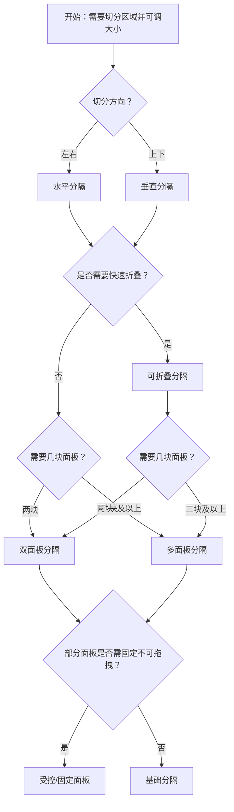

# 1. 简洁易读部份

## 1.0. 组件描述

分隔面板组件用于将指定区域按水平或垂直方向自由切分，并通过拖拽调整各面板大小，满足用户对不同内容区可见面积的灵活需求。

## 1.1. 组件构成

分隔面板由以下基础要素构成，可按需组合使用：

> <!-- 附图占位：建议附上一张示例图，展示分隔面板的三个基础要素（面板、拖拽条、可折叠图标）的构成关系，标注拖拽条位置与折叠方向 -->

&emsp;&emsp;1. **面板** 被分隔的内容区域，每个面板可设置初始大小、最小/最大阈值。

&emsp;&emsp;2. **拖拽条** 位于面板之间的可拖拽分隔线，用户通过拖拽调整两侧面板的宽高比例。

&emsp;&emsp;3. **可折叠图标**（可选） 用于快速收起或展开面板，减少拖拽操作。

---

## 1.2. 组件包含哪些不同类型

### 1.2.1 水平分隔

&emsp;**是什么**：在水平方向上将区域切分为左右两块，通过拖拽条调节左右宽度

> <!-- 附图占位：建议附上一张示例图，展示水平分隔的左右两个面板及中间垂直拖拽条，体现左右分栏的典型形态 -->

&emsp;**简单用法**：适用于左右分栏布局（如列表 + 详情、代码 + 预览）；不设置时默认为水平；可配置各面板的 defaultSize、min、max

&emsp;**典型场景**：文件管理器（树 + 内容）、代码编辑器（代码 + 预览）、后台列表与详情

> <!-- 附图占位：建议附上一张场景图，展示左侧导航树、右侧详情区的水平分隔布局，体现典型的左右分栏用法 -->

&emsp;**替代方案**：若需上下分栏，改用垂直分隔

### 1.2.2 垂直分隔

&emsp;**是什么**：在垂直方向上将区域切分为上下两块，通过拖拽条调节上下高度

> <!-- 附图占位：建议附上一张示例图，展示垂直分隔的上下两个面板及中间水平拖拽条，体现上下分栏的典型形态 -->

&emsp;**简单用法**：必须显式设置方向为垂直；适用于上下分栏（如顶部工具栏 + 主内容、主内容 + 底部输出）

&emsp;**典型场景**：代码编辑器（顶部编辑 + 底部终端）、仪表盘（图表区 + 数据区）

> <!-- 附图占位：建议附上一张场景图，展示顶部编辑区、底部终端/输出区的垂直分隔布局 -->

&emsp;**替代方案**：若需左右分栏，改用水平分隔

### 1.2.3 可折叠分隔

&emsp;**是什么**：在拖拽基础上增加快速折叠能力，可一键收起某侧面板释放空间

> <!-- 附图占位：建议附上一张示例图，展示可折叠分隔在展开与收起两种状态下的形态，以及折叠图标的位置 -->

&emsp;**简单用法**：需为面板配置 collapsible；可设置折叠方向（start/end）；可通过 min 限制折叠后是否能通过拖拽再次展开

&emsp;**典型场景**：侧边栏可收起、底部面板可收起、临时展开的辅助区

> <!-- 附图占位：建议附上一张场景图，展示侧边栏折叠前后主内容区的变化，体现可折叠的节省空间能力 -->

&emsp;**替代方案**：若不需要快速折叠，仅拖拽即可满足时，使用基础分隔

### 1.2.4 多面板分隔

&emsp;**是什么**：将区域切分为三个及以上面板，多个拖拽条独立调节相邻面板

> <!-- 附图占位：建议附上一张示例图，展示三面板或更多面板的布局，多个拖拽条并标注各自作用范围 -->

&emsp;**简单用法**：嵌套多个 Splitter.Panel；每个面板可单独配置大小约束与是否可拖拽；可组合水平与垂直实现复杂分区

&emsp;**典型场景**：三栏布局（树 + 列表 + 详情）、四象限仪表盘、嵌套的左右上下组合

> <!-- 附图占位：建议附上一张场景图，展示三栏或更复杂的分隔组合，体现多面板的灵活切分 -->

&emsp;**替代方案**：若仅需两栏，使用双面板即可

### 1.2.5 受控与固定面板

&emsp;**是什么**：通过受控模式或禁用拖拽，使部分面板尺寸固定、不可调整

> <!-- 附图占位：建议附上一张示例图，展示一侧面板固定宽度、仅另一侧可调，或通过受控值锁定比例的形态 -->

&emsp;**简单用法**：设置 resizable 为 false 可禁用某侧拖拽；受控模式下通过 size 与回调保持外部状态同步；适用于需要锁定某区域大小的场景

&emsp;**典型场景**：侧边栏固定宽度、主内容区自适应；或某些面板仅允许折叠、不允许拖拽改变大小

> <!-- 附图占位：建议附上一张场景图，展示固定侧边栏 + 可调主区的布局，体现受控与固定面板的用法 -->

&emsp;**替代方案**：若全部可调，使用默认配置即可

---

## 1.3. 各类型典型场景案例

### 1.3.1 水平分隔

> <!-- 附图占位：建议附上一张对比图，左侧展示左右分栏合理、拖拽条可见易用（符合规范），右侧展示面板过窄导致内容被挤压或拖拽条难以操作（违反规范） -->

✅ **推荐：** 左右分栏时设置合理的 min/max，保证两侧内容均有可用空间，拖拽条易于识别和操作

❌ **不推荐：** 面板可被拖拽至过窄，导致内容不可用或拖拽条难以点击

### 1.3.2 可折叠分隔

> <!-- 附图占位：建议附上一张对比图，左侧展示折叠图标位置合理、折叠后主区扩展自然（符合规范），右侧展示折叠图标不明显或折叠后布局突兀（违反规范） -->

✅ **推荐：** 折叠图标易发现，折叠/展开有明确反馈，折叠后主内容区平滑扩展

❌ **不推荐：** 折叠图标隐蔽，或折叠后留下难看的空白条

### 1.3.3 多面板分隔

> <!-- 附图占位：建议附上一张对比图，左侧展示多面板时各面板有合理最小宽度、拖拽条不重叠（符合规范），右侧展示面板过多导致单块过窄或拖拽冲突（违反规范） -->

✅ **推荐：** 多面板时控制面板数量，每块都有合理 min，拖拽逻辑清晰

❌ **不推荐：** 切分过细导致单块过窄，或拖拽行为混乱

---

# 2. 选型指南

## 2.1 选择流程

---

# 3. 细致专业部份（交互与排版规则）

## 3.1 多操作的展示与折叠策略

* **面板内操作**：每个面板内的工具栏、操作按钮应独立布局，不跨面板；操作过多时可收纳至「更多」。
* **拖拽与折叠**：拖拽条和折叠图标是主要交互，应避免在拖拽条附近放置易误触的操作。
* **面板切换**：若存在多视图切换（如列表/卡片），应在单一面板内完成，不因切换影响分隔结构。

> <!-- 附图占位：建议附上一张场景图，展示各面板内独立的操作区，以及拖拽条与操作区的空间隔离 -->

## 3.2 危险操作（删除/清空/停用）

* 分隔面板本身不承载危险操作；当某面板内有删除、清空等操作时，应遵循危险操作的视觉弱化与二次确认规则。
* 危险操作建议放在面板内操作区的末尾或「更多」中，与拖拽条保持距离。

> <!-- 附图占位：建议附上一张场景图，展示面板内危险操作的位置与视觉层级 -->

## 3.3 摆放位置（按页面场景划分）

* **全屏主区**：分隔面板常占据页面主内容区，上方为页面标题或全局导航。
* **弹窗/抽屉内**：弹窗或抽屉内也可使用分隔，用于并排展示多块内容（如对比视图）。
* **嵌套**：可与外层 Layout 配合，分隔面板作为主内容区，侧边栏、顶栏独立。

> <!-- 附图占位：建议附上一张场景图，展示分隔面板在页面中的典型位置，以及与外层布局的关系 -->

## 3.4 顺序与对齐逻辑

* **主次面板**：主要浏览内容的面板应分配更大默认比例；辅助面板（如侧边栏、底部输出）可占较小比例。
* **拖拽条位置**：拖拽条应位于两面板交界处，视觉上清晰可辨；宽度或高度需满足可点击区域（通常不低于 6px 触控区域）。
* **双击重置**：若支持双击拖拽条重置为默认大小，应在交互上有所提示或文档说明。

> <!-- 附图占位：建议附上一张示例图，展示主次面板的默认比例分配，以及拖拽条的可视与可操作性 -->

## 3.5 状态与交互反馈

* **拖拽中**：拖拽时应有即时视觉反馈（面板尺寸实时变化），拖拽条可高亮或加宽。
* **折叠/展开**：折叠与展开应有过渡动画，避免突兀；折叠图标方向可随状态变化（如箭头指向展开方向）。
* **禁用拖拽**：当某侧 resizable 为 false 时，相应拖拽条应视觉弱化或隐藏，避免用户尝试无效操作。

> <!-- 附图占位：建议附上一张示例图，展示拖拽中、折叠/展开、禁用拖拽时的视觉反馈 -->

## 3.6 视觉规范与形态选择

* **拖拽条**：宽度/高度适中（如 2px 视觉线 + 更宽触控区），悬停时略有高亮，便于发现与操作。
* **最小/最大阈值**：必须为各面板设置合理 min，防止拖拽至不可用；max 可按需设置，避免单块过大挤压其他块。
* **复杂组合**：水平与垂直组合时，注意嵌套顺序与比例，避免某一块被过度压缩。

> <!-- 附图占位：建议附上一张示例图，展示拖拽条的视觉规范，以及 min/max 约束下的合理范围 -->

---

## 4.0. 常见问题

### 1. 分隔面板和普通左右分栏布局有什么区别？

- **分隔面板**：用户可通过拖拽自由调整左右或上下比例，适合需要灵活分配空间的场景（如编辑器、文件管理器）。
- **普通分栏**：比例为固定或响应式计算，用户无法拖拽调整，适合比例固定的场景。

### 2. 什么时候该用可折叠？

- 当某侧面板（如侧边栏、底部输出区）可暂时收起以释放主内容区空间，且用户需要快速切换时，使用可折叠；若用户主要依赖拖拽微调，可不开启折叠。

### 3. 多面板时如何避免某块过窄？

- 为每个面板设置合理的 min 值，防止拖拽至过窄；同时控制面板数量，一般不超过 3–4 块，否则单块可用空间会显著下降。
