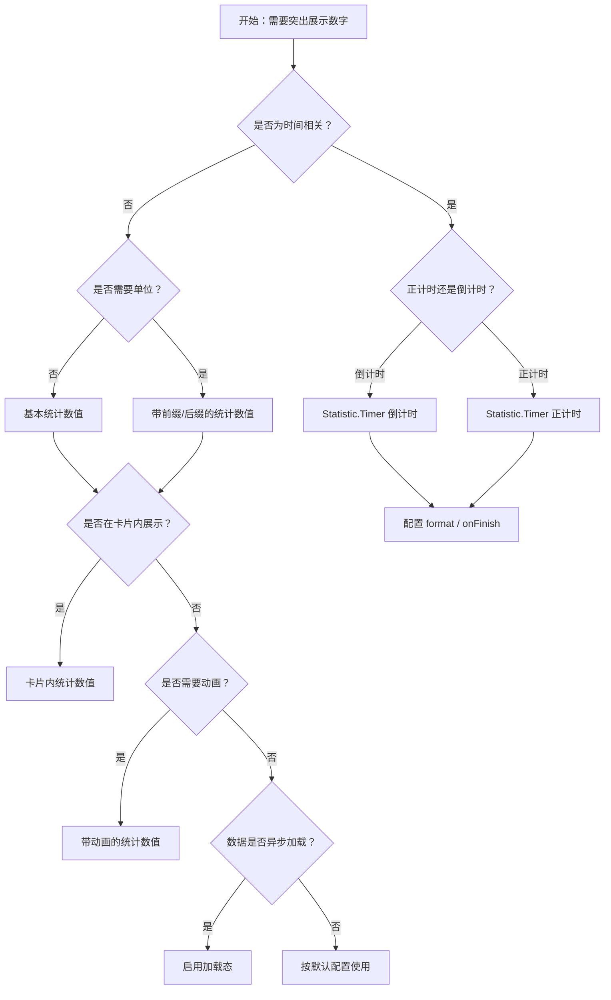

# 1. 简洁易读部份

## 1.0. 组件描述

统计数值组件用于突出展示单个或一组数字，并可通过标题、前缀、后缀传达其语义，帮助用户快速把握关键指标。

## 1.1. 组件构成

统计数值由以下基础要素构成，可按需组合使用：

> <!-- 附图占位：建议附上一张示例图，展示统计数值的四个基础要素（标题、数值、前缀、后缀）的构成关系，标注各要素名称与位置 -->

&emsp;&emsp;1. **标题** 说明数值的含义或维度，置于数值上方，用于建立理解上下文。

&emsp;&emsp;2. **数值** 核心展示区域，字体较大，用于突出关键数字。

&emsp;&emsp;3. **前缀** 置于数值前的符号或单位，如货币符号、百分比符号、图标。

&emsp;&emsp;4. **后缀** 置于数值后的单位或说明，如「人」「次」「元」等。

---

## 1.2. 组件包含哪些不同类型

### 1.2.1 基本统计数值

&emsp;**是什么**：仅包含标题与数值的最简形态，无前缀后缀

> <!-- 附图占位：建议附上一张示例图，展示基本统计数值（标题 + 数值）的视觉层级 -->

&emsp;**简单用法**：适用于语义明确的场景；标题需简短准确；数值需与业务单位一致

&emsp;**典型场景**：活跃用户数、订单数量、访问量

> <!-- 附图占位：建议附上一张场景图，展示 dashboard 中多个基本统计数值的并排布局 -->

&emsp;**替代方案**：若需强调单位或趋势，添加前缀或后缀

### 1.2.2 带单位的统计数值

&emsp;**是什么**：通过前缀或后缀附加单位，明确数值含义

> <!-- 附图占位：建议附上一张示例图，展示带前缀（如¥）与后缀（如「用户」）的统计数值 -->

&emsp;**简单用法**：前缀用于货币、百分比等；后缀用于「人」「次」「件」等；同一页面内单位格式需统一

&emsp;**典型场景**：账户余额、增长率、反馈数量、合并率

> <!-- 附图占位：建议附上一张场景图，展示财务或运营看板中带单位统计数值的呈现方式 -->

&emsp;**替代方案**：若标题已充分表达单位，可省略前缀后缀

### 1.2.3 在卡片中使用的统计数值

&emsp;**是什么**：将统计数值嵌入卡片容器，作为卡片的主要内容或辅助信息

> <!-- 附图占位：建议附上一张示例图，展示统计数值在卡片中的布局，可与图表、操作按钮并存 -->

&emsp;**简单用法**：一个卡片可包含一个主指标或多个相关指标；卡片标题与统计标题可复用或区分层级

&emsp;**典型场景**：Dashboard 卡片、数据概览、对比面板

> <!-- 附图占位：建议附上一张场景图，展示多张卡片并排，每张卡片含标题、统计数值及可选操作区 -->

&emsp;**替代方案**：若无需卡片分组，直接使用独立统计数值即可

### 1.2.4 带动画的统计数值

&emsp;**是什么**：数值变化时具有数字滚动或渐入动画，增强关注度

> <!-- 附图占位：建议附上一张示例图，展示数值从旧值过渡到新值的动画示意 -->

&emsp;**简单用法**：适用于数据定期刷新或用户触发更新的场景；动画不宜过长以免干扰阅读

&emsp;**典型场景**：实时大屏、动态报表、关键指标更新提示

> <!-- 附图占位：建议附上一张场景图，展示大屏或报表中数值更新时的动画效果 -->

&emsp;**替代方案**：若数据更新频率低或无需强调变化，使用静态展示即可

### 1.2.5 计时器（正计时 / 倒计时）

&emsp;**是什么**：以时间格式展示正计时或倒计时，可配置完成回调

> <!-- 附图占位：建议附上一张示例图，展示倒计时与正计时的显示格式（如 HH:mm:ss） -->

&emsp;**简单用法**：倒计时用于限时活动、考试剩余时间等；正计时用于持续时间、会话时长等；需明确时间精度（秒/分钟/天）

&emsp;**典型场景**：秒杀倒计时、考试倒计时、会话时长、任务耗时

> <!-- 附图占位：建议附上一张场景图，展示活动页或考试页中倒计时的摆放与完成后的反馈 -->

&emsp;**替代方案**：若仅需静态时间展示，使用带格式的普通数值即可

### 1.2.6 加载状态

&emsp;**是什么**：数值加载中时显示占位或骨架，避免空白或错误展示

> <!-- 附图占位：建议附上一张示例图，展示加载态下的统计数值占位样式 -->

&emsp;**简单用法**：异步获取数据时必须提供加载态；加载态与空状态、错误状态需区分

&emsp;**典型场景**：接口请求中、数据拉取中

> <!-- 附图占位：建议附上一张场景图，展示页面初始加载时多个统计数值的骨架或占位 -->

&emsp;**替代方案**：若数据同步可用，无需加载态

### 1.2.7 千分位与精度

&emsp;**是什么**：通过千分位分隔符和小数精度控制数值的可读性与准确性

> <!-- 附图占位：建议附上一张示例图，展示带千分位与不同小数精度的数值对比 -->

&emsp;**简单用法**：大数字建议使用千分位；金额、比率等需统一小数位数；避免过度精确造成干扰

&emsp;**典型场景**：金额、人数、百分比、比率

> <!-- 附图占位：建议附上一张场景图，展示财务报表中千分位与两位小数的统一格式 -->

&emsp;**替代方案**：小数字或整数场景可省略千分位

---

## 1.3. 各类型典型场景案例

### 1.3.1 标题与单位

> <!-- 附图占位：建议附上一张对比图，左侧展示标题清晰、单位统一的统计数值（符合规范），右侧展示标题模糊或单位混乱（违反规范） -->

✅ **推荐：** 标题简短准确，单位通过前缀或后缀明确，同一看板内格式一致

❌ **不推荐：** 标题过长或含糊，单位缺失或混用，导致理解困难

### 1.3.2 数值层级与布局

> <!-- 附图占位：建议附上一张对比图，左侧展示主指标突出、次要指标降级的层级（符合规范），右侧展示所有数值同等强调（违反规范） -->

✅ **推荐：** 主指标字体更大、位置更显眼；次要指标适度弱化

❌ **不推荐：** 所有统计数值视觉权重相同，无法引导用户关注重点

---

# 2. 选型指南

## 2.1 选择流程

---

# 3. 细致专业部份（交互与排版规则）

## 3.1 标题与语义

* **简短准确**：标题用名词或短语说明指标含义，避免冗长。
* **层级一致**：同一看板内，主指标与次要指标的标题层级需统一。
* **可选省略**：若上下文已明确，标题可省略，但数值本身需能自解释。

> <!-- 附图占位：建议附上一张示例图，展示合理与不合理的标题文案对比 -->

## 3.2 数值格式与精度

* **千分位**：大数字使用千分位分隔符提升可读性。
* **小数位数**：金额、比率等需统一小数位，避免同一看板内格式不一。
* **精度取舍**：避免无意义的过多小数位，按业务需求设定。

> <!-- 附图占位：建议附上一张对比图，展示统一格式与混乱格式的数值展示 -->

## 3.3 前缀与后缀

* **前缀**：货币符号、百分比符号、图标等置于数值前，与数值保持适当间距。
* **后缀**：单位、说明置于数值后，如「人」「次」「元」。
* **不重复**：若标题已含单位，前缀后缀可省略，避免重复。

> <!-- 附图占位：建议附上一张示例图，展示前缀、后缀与标题的配合方式 -->

## 3.4 布局与层级

* **主次分明**：主指标字体更大、位置更醒目；次要指标适度弱化。
* **并排展示**：多个统计数值并排时，对齐方式与间距保持一致。
* **响应式**：小屏时考虑纵向堆叠或减少并排数量。

> <!-- 附图占位：建议附上一张布局图，展示看板中主指标与次要指标的层级与对齐 -->

## 3.5 加载与空态

* **加载态**：异步数据时必须展示加载态，避免空白或旧数据误导。
* **空态**：无数据时展示「-」或「暂无数据」，与加载态区分。
* **错误态**：请求失败时需明确提示，并可提供重试入口。

> <!-- 附图占位：建议附上一张状态示意图，展示加载、空态、错误态的视觉区分 -->

## 3.6 动画与节奏

* **适度使用**：数值变化动画不宜过长，以不干扰阅读为宜。
* **时机明确**：在数据刷新或用户操作后触发，避免无意义闪烁。
* **性能考虑**：大量统计数值同时动画时，需注意性能影响。

> <!-- 附图占位：建议附上一张时序图，展示数值更新到动画完成的节奏 -->

---

## 4.0. 常见问题

### 1. 统计数值和普通数字展示有什么区别？

统计数值组件通过标题、前缀、后缀、格式化和可选动画，建立完整的指标语义和视觉层级，适合作为看板、概览页的关键指标展示。普通数字展示更灵活但需自行处理格式与层级。

### 2. 何时使用计时器而不是普通数值？

当需要展示实时变化的时长（正计时）或剩余时间（倒计时），且需要完成回调、格式化时间显示时，使用 Statistic.Timer。若仅展示静态时间戳，使用格式化后的普通数值即可。

### 3. 多个统计数值如何布局？

主指标可单独一行或置于显眼位置；次要指标可并排于次要区域。保持对齐、间距、单位格式一致，形成清晰的阅读节奏。
