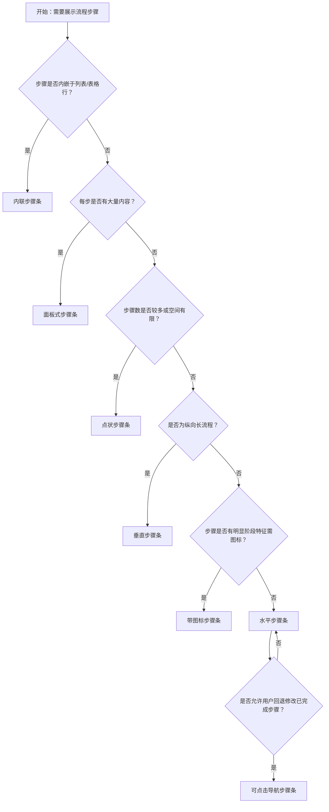

# 1. 简洁易读部份

## 1.0. 组件描述

步骤条用于引导用户按照流程完成任务，将复杂或有先后关系的任务分解为一系列步骤，从而简化任务认知并明确当前进度。

## 1.1. 组件构成

步骤条由以下基础要素构成，可按需组合使用：

> <!-- 附图占位：建议附上一张示例图，展示步骤条的基础要素（步骤节点/图标、连接线、标题、描述、内容区）的构成关系，标注各要素名称与位置 -->

&emsp;&emsp;1. **步骤节点** 标识单个步骤，可为数字、图标或圆点，表示步骤序号或状态。

&emsp;&emsp;2. **连接线** 连接相邻步骤节点，表示流程顺序与进度走向。

&emsp;&emsp;3. **标题** 概括该步骤的语义，必须简短清晰。

&emsp;&emsp;4. **描述** 补充说明步骤细节或状态，可为空。

&emsp;&emsp;5. **内容区** 展示当前步骤的详细表单或说明，可与步骤条分离或内嵌。

---

## 1.2. 组件包含哪些不同类型

### 1.2.1 水平步骤条

&emsp;**是什么**：步骤节点水平排列，连接线横向连接，标题与描述在节点右侧或下方

> <!-- 附图占位：建议附上一张示例图，展示水平步骤条的形态（1—2—3 横向排列、连接线、标题在右侧），体现水平流程的视觉结构 -->

&emsp;**简单用法**：步骤数不宜过多（建议 3–7 步）；适合流程清晰、步骤并列展示的场景；小屏下可自动切换为垂直

&emsp;**典型场景**：申请流程、订单流程、向导类任务、表单分步填写

> <!-- 附图占位：建议附上一张场景图，展示分步申请表单顶部水平步骤条（填写信息—上传资料—提交审核）的布局，体现流程分解与当前进度 -->

&emsp;**替代方案**：若步骤过多或空间有限，改用垂直步骤条或点状步骤条

### 1.2.2 垂直步骤条

&emsp;**是什么**：步骤节点垂直排列，连接线纵向连接，标题与描述在节点右侧或下方

> <!-- 附图占位：建议附上一张示例图，展示垂直步骤条的形态（1、2、3 纵向排列、纵向连接线），体现垂直流程的视觉结构 -->

&emsp;**简单用法**：适合步骤较多、每步内容较长的场景；可节省横向空间；阅读顺序自上而下

&emsp;**典型场景**：长流程审批、时间线式进度、左侧步骤右侧内容的布局

> <!-- 附图占位：建议附上一张场景图，展示左侧垂直步骤条与右侧步骤内容配合的布局，体现垂直结构对长流程的适配 -->

&emsp;**替代方案**：若步骤少且需一目了然，改用水平步骤条

### 1.2.3 带图标步骤条

&emsp;**是什么**：步骤节点使用自定义图标替代默认数字，增强语义识别

> <!-- 附图占位：建议附上一张示例图，展示带图标步骤条的形态（登录图标、验证图标、支付图标、完成图标），体现图标对步骤语义的强化 -->

&emsp;**简单用法**：每步图标需与步骤语义一致；完成态可用对勾等图标；进行态与等待态需视觉区分

&emsp;**典型场景**：登录—验证—支付—完成、多阶段任务、有明显阶段特征的流程

> <!-- 附图占位：建议附上一张场景图，展示支付流程中「登录」「验证」「支付」「完成」的图标步骤条，体现图标与阶段语义的对应 -->

&emsp;**替代方案**：若步骤语义清晰无需图标，使用默认数字步骤条即可

### 1.2.4 点状步骤条

&emsp;**是什么**：步骤节点以圆点展示，连接线简化，标题与描述可置于节点下方垂直排列

> <!-- 附图占位：建议附上一张示例图，展示点状步骤条的形态（圆点 + 细连接线 + 标题在下方），体现点状的简洁形态 -->

&emsp;**简单用法**：视觉更轻量；适合步骤较多、需节省空间的场景；标题可垂直置于节点下方

&emsp;**典型场景**：时间线、进度追踪、列表内嵌的流程展示、移动端

> <!-- 附图占位：建议附上一张场景图，展示物流进度、订单状态等点状步骤条的使用，体现轻量与多步骤的适配 -->

&emsp;**替代方案**：若需强调步骤序号，使用默认步骤条

### 1.2.5 面板式步骤条

&emsp;**是什么**：步骤以卡片/面板形式展示，每步包含标题与内容区，可展开收起

> <!-- 附图占位：建议附上一张示例图，展示面板式步骤条的形态（Login、Verification、Pay、Done 等面板块），体现卡片式步骤结构 -->

&emsp;**简单用法**：每步内容较多时使用；步骤之间逻辑独立；可配合可点击切换步骤

&emsp;**典型场景**：多步骤表单、向导式配置、阶段性任务面板

> <!-- 附图占位：建议附上一张场景图，展示配置向导中「登录」「验证」「支付」「完成」四个面板式步骤的布局，体现内容丰富的步骤展示 -->

&emsp;**替代方案**：若每步内容简单，使用水平或垂直步骤条即可

### 1.2.6 可点击导航步骤条

&emsp;**是什么**：步骤条可点击切换，用户可跳转至已完成步骤查看或修改，带箭头等导航提示

> <!-- 附图占位：建议附上一张示例图，展示可点击导航步骤条的形态（步骤可点击、箭头指示、内容区随步骤切换），体现可跳转的交互能力 -->

&emsp;**简单用法**：必须用于允许用户回看或修改已完成步骤的场景；仅已完成或当前步骤可点击；未完成步骤需禁用

&emsp;**典型场景**：分步表单可回退、多步配置可编辑、向导类任务可跳转

> <!-- 附图占位：建议附上一张场景图，展示分步表单中点击「步骤 1」可返回修改、当前在「步骤 3」的交互，体现可跳转步骤的用途 -->

&emsp;**替代方案**：若流程不允许回退，使用不可点击的展示型步骤条

### 1.2.7 内联步骤条

&emsp;**是什么**：步骤条以紧凑形式内嵌在列表或表格中，用于展示单条记录的流程状态

> <!-- 附图占位：建议附上一张示例图，展示内联步骤条的形态（横向紧凑排列、与列表行或卡片结合），体现内嵌于列表的紧凑形态 -->

&emsp;**简单用法**：用于列表/表格中每条记录的状态展示；步骤数少；强调当前所在步骤

&emsp;**典型场景**：订单列表中的配送进度、工单列表中的处理阶段、列表行内流程状态

> <!-- 附图占位：建议附上一张场景图，展示表格每行内嵌「待审核—已通过—已发货」等步骤状态，体现内联步骤在列表中的使用 -->

&emsp;**替代方案**：若为全局流程而非单条记录状态，使用常规步骤条

---

## 1.3. 各类型典型场景案例

### 1.3.1 水平步骤条

> <!-- 附图占位：建议附上一张对比图，左侧展示 3–5 步流程使用水平步骤条清晰展示（符合规范），右侧展示 10 步以上仍用水平步骤条导致拥挤（违反规范） -->

✅ **推荐：** 步骤数适当时使用水平步骤条，流程一目了然

❌ **不推荐：** 步骤过多时仍使用水平步骤条，导致拥挤难读

### 1.3.2 可点击与不可点击

> <!-- 附图占位：建议附上一张对比图，左侧展示分步表单可点击返回已完成的步骤修改（符合规范），右侧展示不允许回退却提供可点击样式造成误导（违反规范） -->

✅ **推荐：** 允许回退时提供可点击步骤；不允许时禁用或隐藏点击

❌ **不推荐：** 不允许回退的流程却让步骤看起来可点击

### 1.3.3 内联步骤与全局步骤

> <!-- 附图占位：建议附上一张对比图，左侧展示列表行内用内联步骤展示单条状态（符合规范），右侧展示全局流程误用内联步骤（违反规范） -->

✅ **推荐：** 列表内单条记录状态用内联步骤；页面级流程用常规步骤条

❌ **不推荐：** 将页面级流程压缩为列表行内内联步骤，导致信息难以识别

---

# 2. 选型指南

## 2.1 选择流程

---

# 3. 细致专业部份（交互与排版规则）

为了保持流程清晰并符合用户预期，当使用步骤条组件时，请参考以下交互与排版规则：

## 3.1 多操作的展示与折叠策略

* **步骤数量**：建议单条流程 3–7 步；超过 7 步可考虑合并或使用点状/垂直步骤条以节省空间。
* **内容区展示**：每步若有独立内容（如表单），可采用「步骤条在上/左 + 内容在下/右」的布局；内容过多时可折叠次要信息。
* **进度展示**：可配合进度百分比（如当前步骤 50% 完成）增强反馈；错误态需明确标出并可定位修复。

> <!-- 附图占位：建议附上一张场景图，展示步骤条 + 内容区的布局，以及当前步骤与错误步骤的视觉区分 -->

## 3.2 危险操作（删除/清空/停用）

* **步骤中的危险操作**：若某步骤含「清空」「重置」「删除」等操作，需通过二次确认拦截，并避免与「下一步」等主操作视觉混淆。
* **流程中断**：若用户执行危险操作导致流程中断，需明确提示当前状态及后续可采取的恢复动作。
* **不可逆步骤**：对于不可逆步骤（如提交、支付），需在进入前明确提示，步骤条可配合禁用「上一步」或灰色不可回退状态。

> <!-- 附图占位：建议附上一张场景图，展示含「清空重填」的步骤中二次确认与主操作区分的布局 -->

## 3.3 摆放位置（按页面场景划分）

* **页面顶部**：步骤条置于页面顶部、主标题下方，适用于全页流程（如申请、开户）。
* **内容区左侧**：垂直步骤条置于内容区左侧，步骤内容在右侧展开，适用于长流程配置。
* **弹窗/抽屉内**：步骤条置于弹窗顶部或抽屉顶部，配合简洁步骤与紧凑布局。
* **列表行内**：内联步骤条置于表格或列表的某一列，与单条记录对齐。

> <!-- 附图占位：建议附上一张场景图，展示步骤条在页面顶部、内容区左侧、弹窗内、列表行内四种摆放位置 -->

## 3.4 顺序与对齐逻辑

* **步骤顺序**：必须按时间或逻辑顺序排列，不可颠倒；当前步骤与已完成步骤需明确区分。
* **标题与描述**：标题简短有力；描述可选，用于补充说明或展示子状态（如时间）。
* **连接线**：已完成步骤之间的连接线可高亮；当前步骤与前序之间的连接线可部分高亮或使用进度条；未完成部分保持默认样式。

> <!-- 附图占位：建议附上一张场景图，展示步骤顺序、标题描述、连接线高亮规则的视觉规范 -->

## 3.5 状态与交互反馈

* **等待**：未开始的步骤，视觉弱化（如灰色）。
* **进行中**：当前步骤高亮，可配合脉动或强调色；内容区展示当前步骤表单或说明。
* **已完成**：已完成步骤使用对勾或完成态图标，连接线高亮。
* **错误**：出错的步骤使用错误图标与警示色，需明确提示错误原因及修复入口。
* **禁用**：不可点击的步骤需视觉与交互上均禁用，严禁「点击后报错」代替。

## 3.6 视觉规范与形态选择

* **图标与数字**：默认数字适合通用流程；图标适合有明确阶段特征的流程（如登录、支付）；点状适合轻量、多步骤场景。
* **连接线**：水平步骤条连接线横向；垂直步骤条连接线纵向；线宽与颜色需与节点协调。
* **标签位置**：标题可置于节点右侧（水平）或下方（垂直、点状）；描述在标题下方，字号略小。

> <!-- 附图占位：建议附上一张示例图，展示默认数字、自定义图标、点状三种形态，以及标签放置位置的视觉规范 -->

---

## 4.0. 常见问题

### 1. 水平步骤条和垂直步骤条如何选择？

- **水平步骤条**：适合步骤数少（3–7 步）、每步内容简单、需要一目了然的流程；小屏下会自动切换为垂直。
- **垂直步骤条**：适合步骤多、每步内容较长、或布局上需要纵向排列的场景；可节省横向空间，与右侧内容区配合。

### 2. 步骤条何时需要可点击？

- 当流程允许用户**返回已完成步骤进行查看或修改**时，应支持可点击；仅已完成与当前步骤可点击，未完成步骤禁用。
- 当流程**不允许回退**（如支付后不可改）时，步骤条应为展示型，不可点击或视觉上不暗示可点击。

### 3. 内联步骤条和常规步骤条有什么区别？

- **内联步骤条**：紧凑形态，内嵌于列表或表格行内，用于展示**单条记录**的流程状态（如订单配送阶段、工单处理阶段）。
- **常规步骤条**：用于**页面级或弹窗级**的流程引导，如申请流程、配置向导，步骤与全局流程对应。
