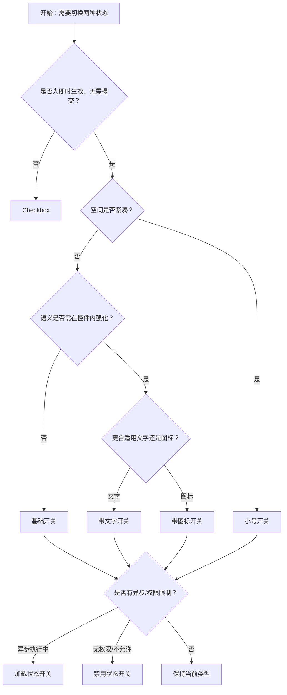

# 1. 简洁易读部份

## 1.0. 组件描述

开关（Switch）用于在两种状态之间切换，点击即直接触发状态改变，适合表示布尔型配置或开关类操作。

## 1.1. 组件构成

开关由以下基础要素构成，可按需组合使用：

> <!-- 附图占位：建议附上一张示例图，展示开关的三个基础要素（轨道、指示器、内容区）的构成关系，标注各要素名称与位置 -->

&emsp;&emsp;1. **轨道** 定义开关的点击区域与整体形态，承载开/关两种状态的背景区分。

&emsp;&emsp;2. **指示器** 为可滑动的圆点或把手，用于标识当前状态并在轨道内移动。

&emsp;&emsp;3. **内容区** 可在轨道内显示文字或图标，用于强化开/关的语义，可为空。

---

## 1.2. 组件包含哪些不同类型

### 1.2.1 基础开关

&emsp;**是什么**：仅由轨道与指示器构成，无额外文字或图标，用于最简洁的开关场景

> <!-- 附图占位：建议附上一张示例图，展示基础开关（无文字、仅轨道与滑动圆点）的关/开两种视觉形态 -->

&emsp;**简单用法**：必须用于语义已通过上下文或标签明确、无需额外文字的场景；点击即切换，无需二次确认；必须确保开关的可点击区域足够大

&emsp;**典型场景**：设置项开关、功能启用/禁用、夜间模式、消息通知开关

> <!-- 附图占位：建议附上一张场景图，展示设置列表中「消息通知」旁的基础开关，体现与标签配合的简洁布局 -->

&emsp;**替代方案**：若语义不够清晰，改用带文字或带图标开关

### 1.2.2 带文字开关

&emsp;**是什么**：在轨道内显示「开/关」「ON/OFF」等文字，用于强化两种状态的语义

> <!-- 附图占位：建议附上一张示例图，展示带文字开关（如「开」「关」或「ON」「OFF」）的视觉形态，体现文字与指示器位置的对应关系 -->

&emsp;**简单用法**：必须用于需要明确区分开/关含义的场景；文字应简短（1–2 字或短词）；开/关两态的文字应在颜色或位置上有所区分

&emsp;**典型场景**：表单中的布尔配置、权限开关、功能启用/停用

> <!-- 附图占位：建议附上一张场景图，展示表单中「自动保存」旁带「开」「关」文字的开关，体现语义强化 -->

&emsp;**替代方案**：若上下文已足够，用基础开关；若需更图形化表达，用带图标开关

### 1.2.3 带图标开关

&emsp;**是什么**：在轨道内用图标代替或辅助文字，表达开/关的业务含义

> <!-- 附图占位：建议附上一张示例图，展示带图标开关（如月亮/太阳表示夜间模式）的视觉形态 -->

&emsp;**简单用法**：图标必须与开/关语义一致且易识别；可单独使用或与文字组合；同一页面内相同图标语义必须一致

&emsp;**典型场景**：夜间模式、静音/有声、可见/隐藏、锁定/解锁

> <!-- 附图占位：建议附上一张场景图，展示主题切换处带月亮/太阳图标的开关，体现图标增强识别的效果 -->

&emsp;**替代方案**：若图标含义不够通用，改用带文字开关

### 1.2.4 小号开关

&emsp;**是什么**：尺寸更小的开关，用于空间紧凑的列表或表格内

> <!-- 附图占位：建议附上一张示例图，展示小号开关与默认尺寸开关的对比，体现尺寸差异 -->

&emsp;**简单用法**：必须用于空间受限、或需与表格行内、紧凑列表配合的场景；必须确保小号开关仍易于点击，避免过小导致误触或难触

&emsp;**典型场景**：表格行内批量开关、紧凑设置项、移动端或侧边栏

> <!-- 附图占位：建议附上一张场景图，展示表格操作列中小号开关的排列，体现紧凑场景下的使用 -->

&emsp;**替代方案**：若空间充足，使用默认尺寸以提升可点击性

### 1.2.5 加载状态开关

&emsp;**是什么**：在开关上显示加载动画，表示操作正在执行中、暂不可再次切换

> <!-- 附图占位：建议附上一张示例图，展示加载中开关（带旋转图标或骨架）的视觉形态 -->

&emsp;**简单用法**：必须用于异步切换（如请求服务端）的场景；加载期间开关应不可再次点击；加载完成后再允许切换

&emsp;**典型场景**：需要与服务端同步的开关、需要校验权限的开关、耗时操作触发的开关

> <!-- 附图占位：建议附上一张场景图，展示「同步到云端」开关点击后进入加载态，体现防重复操作与状态反馈 -->

&emsp;**替代方案**：若为本地即时生效，无需加载态

### 1.2.6 禁用状态开关

&emsp;**是什么**：处于禁用状态的开关，不可点击，用于表示当前不允许修改

> <!-- 附图占位：建议附上一张示例图，展示禁用状态开关（置灰、无悬停反馈）的视觉形态 -->

&emsp;**简单用法**：必须用于无权限、前置条件不满足、或业务限制不允许修改的场景；禁用时需视觉置灰且无点击反馈；应配合文案说明禁用原因（如 Tooltip）

&emsp;**典型场景**：权限不足时的功能开关、依赖未满足的配置项、试用版限制的功能

> <!-- 附图占位：建议附上一张场景图，展示禁用开关旁有「需升级后可用」提示，体现禁用与说明的配合 -->

&emsp;**替代方案**：若非必须展示，可隐藏该配置项而非禁用

---

## 1.3. 各类型典型场景案例

### 1.3.1 开关与 Checkbox 的区别

> <!-- 附图占位：建议附上一张对比图，左侧展示开关用于「即时生效」的配置（如消息通知），右侧展示 Checkbox 用于「勾选后需提交」的表单（如同意条款） -->

✅ **推荐：** 开关用于直接触发状态改变；Checkbox 用于标记选择、需与提交等操作配合

❌ **不推荐：** 在需提交表单才能生效的场景用开关，或在即时生效场景用 Checkbox 且无明确提交入口

### 1.3.2 带内容与纯开关

> <!-- 附图占位：建议附上一张对比图，左侧展示语义模糊时用带文字/图标开关，右侧展示语义清晰时用基础开关 -->

✅ **推荐：** 语义依赖标签即可理解时用基础开关；需在控件内强化语义时用带文字或带图标开关

❌ **不推荐：** 语义不清晰却用纯开关；或语义已足够仍堆砌大量文字图标造成冗余

### 1.3.3 加载与禁用

> <!-- 附图占位：建议附上一张对比图，左侧展示异步操作时用加载态，右侧展示无权限时用禁用态，正确区分两者 -->

✅ **推荐：** 操作执行中用加载态；不允许操作时用禁用态

❌ **不推荐：** 用禁用代替加载，或加载态与禁用态视觉混淆

---

# 2. 选型指南

## 2.1 选择流程

---

# 3. 细致专业部份（交互与排版规则）

## 3.1 开关的展示与布局

* **与标签关系**：开关通常与左侧或上方的标签成对出现，标签说明含义，开关表达状态；标签与开关需视觉对齐。
* **列表内使用**：在设置列表或表格中，开关常置于每行右侧，与内容对齐；同一列表中开关的尺寸应统一。
* **表单内使用**：在 Form 中使用时，需通过 `valuePropName="checked"` 正确绑定；开关应与其他表单项保持一致的间距与对齐。

> <!-- 附图占位：建议附上一张场景图，展示设置列表中开关与标签的排版关系，体现对齐与节奏 -->

## 3.2 状态与交互反馈

* **默认**：当前状态（开/关）通过指示器位置与轨道颜色可明确区分。
* **悬停**：悬停时需有轻微视觉反馈（如颜色加深），提示可点击。
* **点击**：点击后指示器应有平滑过渡动画，状态切换清晰可感知。
* **加载**：加载期间显示加载图标，禁用点击，避免重复提交。
* **禁用**：禁用时整体置灰，无悬停与点击反馈。

## 3.3 危险或不可逆操作

* **二次确认**：若开关涉及不可逆或高风险操作（如删除数据、停用服务），应在切换前增加确认（如弹窗、二次点击）。
* **视觉提示**：高风险开关可配合警示色或图标，但不得与常规开关的「开」状态色混淆。
* **说明文案**：在标签或说明中明确后果，避免用户误触。

> <!-- 附图占位：建议附上一张场景图，展示「停用服务」开关点击后弹出的二次确认弹窗，体现防误触机制 -->

## 3.4 尺寸与可点击性

* **最小尺寸**：开关的点击区域应不少于 44×24 像素（移动端建议更大），保证手指或鼠标易于操作。
* **间距**：与相邻控件保持适当间距，避免误触其他元素。
* **小号开关**：小号开关在表格等紧凑场景使用，但仍需满足最小可点击区域。

## 3.5 键盘与无障碍

* **键盘操作**：开关应支持 Tab 聚焦，Space 或 Enter 切换状态。
* **焦点可见**：聚焦时需有明显焦点环。
* **语义**：具备正确的 role（如 switch）与 aria-checked，便于读屏软件识别状态。

## 3.6 视觉规范

* **开/关色彩**：开状态通常为品牌色或强调色，关状态为中性灰；需确保色彩与品牌规范一致。
* **内容区**：带文字时，开/关两态可分别显示不同文字；带图标时，图标应与状态对应，位置随指示器移动或固定于两端。

---

## 4.0. 常见问题

### 1. Switch 和 Checkbox 如何选择

- **Switch（开关）**：切换即生效，用于表示「开启/关闭」某种功能或状态，如通知开关、夜间模式。用户预期点击后立即改变状态。
- **Checkbox（复选框）**：通常用于勾选/标记，需配合「提交」「保存」等操作才生效，如表单选项、多选列表。

### 2. 在 Form 下 Switch 无法绑定数据怎么办

- Form.Item 默认绑定 `value`，而 Switch 的值属性为 `checked`。需在 Form.Item 上设置 `valuePropName="checked"` 以正确绑定开关状态。
