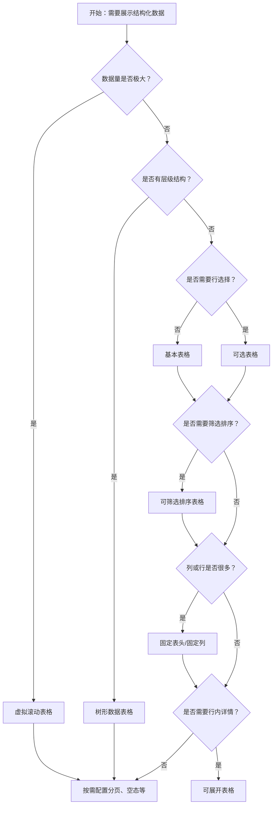

# 1. 简洁易读部份

## 1.0. 组件描述

表格组件用于展示大量结构化的行列数据，支持排序、筛选、分页、选择、展开等复杂交互，是数据密集型页面的核心展示与操作载体。

## 1.1. 组件构成

表格由以下基础要素构成，可按需组合使用：

> <!-- 附图占位：建议附上一张示例图，展示表格的四个基础要素（表头、数据行、操作列、分页）的构成关系，标注各要素名称与位置 -->

&emsp;&emsp;1. **表头** 定义列的标题、排序、筛选入口，建立列与数据的对应关系。

&emsp;&emsp;2. **数据行** 承载单条记录的各列内容，可包含文本、标签、操作按钮等。

&emsp;&emsp;3. **操作列** 每行最右侧的操作区，承载行级操作（如编辑、删除、查看详情）。

&emsp;&emsp;4. **分页** 位于表格底部或顶部，控制数据分片与当前页切换。

---

## 1.2. 组件包含哪些不同类型

### 1.2.1 基本表格

&emsp;**是什么**：仅包含列定义与数据源的简单表格，无选择、筛选、固定列等扩展

> <!-- 附图占位：建议附上一张示例图，展示基本表格的表头、数据行与分页的形态 -->

&emsp;**简单用法**：适用于纯展示场景；列需与数据字段一一对应；每条数据需有唯一 key

&emsp;**典型场景**：数据列表、报表预览、只读记录

> <!-- 附图占位：建议附上一张场景图，展示简单列表页中基本表格的布局 -->

&emsp;**替代方案**：若需批量操作，添加行选择；若需筛选排序，添加对应配置

### 1.2.2 可选表格

&emsp;**是什么**：支持行单选或多选，用于批量操作前勾选目标行

> <!-- 附图占位：建议附上一张示例图，展示表头全选与行内勾选框的形态 -->

&emsp;**简单用法**：多选用复选框，单选用单选；选中行应有明确视觉反馈；批量操作区需与选中状态联动

&emsp;**典型场景**：批量删除、批量导出、批量审核、批量分配

> <!-- 附图占位：建议附上一张场景图，展示选中多行后顶部批量操作栏的显示与联动 -->

&emsp;**替代方案**：若无批量操作，可不启用行选择

### 1.2.3 可筛选排序表格

&emsp;**是什么**：表头支持排序与筛选，用户可按列维度筛选或排序数据

> <!-- 附图占位：建议附上一张示例图，展示表头排序图标与筛选下拉的形态 -->

&emsp;**简单用法**：排序列需明确升序降序含义；筛选项不宜过多，可搜索时提供搜索；本地排序与远程排序需区分

&emsp;**典型场景**：数据探索、报表分析、管理后台列表

> <!-- 附图占位：建议附上一张场景图，展示用户通过表头筛选与排序后的结果反馈 -->

&emsp;**替代方案**：若数据量小或维度固定，可用固定筛选器代替表头筛选

### 1.2.4 固定表头与固定列

&emsp;**是什么**：表头或首尾列在滚动时保持可见，便于在长表或宽表中保持上下文

> <!-- 附图占位：建议附上一张示例图，展示纵向滚动时表头固定、横向滚动时首列固定的效果 -->

&emsp;**简单用法**：纵向数据多时固定表头；横向列多时固定首列或尾列（如操作列）；固定列与滚动区域交界处需有视觉分隔

&emsp;**典型场景**：长列表、宽表、财务清单、对比表

> <!-- 附图占位：建议附上一张场景图，展示用户滚动时表头与固定列始终可见的体验 -->

&emsp;**替代方案**：数据量少、列少时可不固定

### 1.2.5 可展开表格

&emsp;**是什么**：每行可展开查看详情或子表格，用于在不离开列表的前提下查看更多信息

> <!-- 附图占位：建议附上一张示例图，展示行展开后显示详情或嵌套表格的形态 -->

&emsp;**简单用法**：展开内容不宜过长；展开图标位置固定、易识别；可配置默认展开行

&emsp;**典型场景**：订单详情、配置明细、树形数据、主从表

> <!-- 附图占位：建议附上一张场景图，展示订单列表行展开后显示订单明细的布局 -->

&emsp;**替代方案**：若详情复杂，可改用跳转详情页

### 1.2.6 树形数据表格

&emsp;**是什么**：数据具有父子层级，通过缩进与展开收起展示树形结构

> <!-- 附图占位：建议附上一张示例图，展示树形表格的层级缩进与展开图标 -->

&emsp;**简单用法**：父子关系通过 children 字段或配置指定；支持层级展开收起；选择时可配置父子联动或独立

&emsp;**典型场景**：组织架构、分类目录、文件树、权限树

> <!-- 附图占位：建议附上一张场景图，展示组织架构或分类目录的树形表格展示 -->

&emsp;**替代方案**：若层级较浅，可考虑扁平展示配合分组

### 1.2.7 虚拟滚动表格

&emsp;**是什么**：仅渲染可视区域行，用于超大数量数据时的性能优化

> <!-- 附图占位：建议附上一张示意图，展示虚拟滚动仅渲染可视区域行的原理 -->

&emsp;**简单用法**：数据量极大（如万级以上）时启用；需设置滚动区域高度；与固定表头、固定列等组合时需注意兼容

&emsp;**典型场景**：日志列表、全量数据预览、大数据报表

> <!-- 附图占位：建议附上一张场景图，展示万级数据下虚拟滚动表格的流畅滚动效果 -->

&emsp;**替代方案**：数据量适中时使用普通分页即可

---

## 1.3. 各类型典型场景案例

### 1.3.1 列设计与操作列

> <!-- 附图占位：建议附上一张对比图，左侧展示列宽合理、操作列固定右侧（符合规范），右侧展示列过多过密、操作列位置混乱（违反规范） -->

✅ **推荐：** 列顺序按阅读与操作习惯排列，操作列固定最右侧，关键列宽度适中

❌ **不推荐：** 列过多导致横向滚动过多，操作列位置不固定，关键信息被挤压

### 1.3.2 分页与空态

> <!-- 附图占位：建议附上一张对比图，左侧展示有数据时分页可见、无数据时显示空态（符合规范），右侧展示无数据时仍显示分页或空白（违反规范） -->

✅ **推荐：** 有数据时分页可见；无数据时展示空状态与引导操作；单页数据可隐藏分页

❌ **不推荐：** 无数据时空白或误导性分页，用户无法判断是加载中还是无数据

---

# 2. 选型指南

## 2.1 选择流程

---

# 3. 细致专业部份（交互与排版规则）

## 3.1 列的设计与顺序

* **阅读顺序**：按用户阅读与操作习惯排列列顺序，主键、名称等常置于前，操作列置于最后。
* **列宽**：关键列保证最小可读宽度；长文本可省略或换行；操作列宽度固定。
* **省略与 Tooltip**：超长内容可省略，悬停展示完整内容，避免单元格过高。

> <!-- 附图占位：建议附上一张列设计示意图，展示合理列顺序与宽度的示例 -->

## 3.2 排序与筛选

* **排序**：排序列需明确升序降序含义；支持单列或多列排序时，表头状态需清晰。
* **筛选**：筛选项过多时可提供搜索；筛选后需明确反馈（如高亮筛选图标、显示筛选条件）。
* **本地与远程**：本地排序筛选在前端完成；远程模式需在变化时发起请求并更新数据。

> <!-- 附图占位：建议附上一张流程图，展示用户触发排序/筛选到数据更新的闭环 -->

## 3.3 选择与批量操作

* **选择反馈**：选中行需有明确背景或边框区分；全选与单选逻辑一致。
* **批量操作区**：选中后展示批量操作栏，操作项与选中行权限一致；危险操作需二次确认。
* **跨页选择**：若支持跨页选择，需明确说明并处理分页切换时的选中保持策略。

> <!-- 附图占位：建议附上一张场景图，展示选中多行后批量操作栏的展示与操作流程 -->

## 3.4 固定表头与固定列

* **表头固定**：纵向滚动时表头始终可见，需设置滚动区域高度。
* **列固定**：首列或尾列固定时，与滚动区域交界处需有分隔线或阴影，避免视觉断裂。
* **组合使用**：同时固定表头与列时，角落单元格的样式需协调。

> <!-- 附图占位：建议附上一张布局图，展示固定表头与固定列的配合方式 -->

## 3.5 展开与树形

* **展开图标**：位置固定、易识别；展开与收起状态区分明确。
* **展开内容**：不宜过长，避免影响主表浏览；可嵌套子表格或描述列表。
* **树形选择**：父子联动或独立选择需根据业务明确，并在界面中可理解。

> <!-- 附图占位：建议附上一张示意图，展示展开行与树形层级的视觉结构 -->

## 3.6 分页与加载

* **分页位置**：通常置于表格底部，可配置顶部或双位置；无数据或单页时可隐藏。
* **每页条数**：提供合理默认值与可选范围，大数量时考虑增大每页条数。
* **加载态**：数据请求中时展示加载态，避免空白或旧数据；与空态、错误态区分。

> <!-- 附图占位：建议附上一张状态图，展示加载、有数据、无数据、错误等状态的视觉区分 -->

---

## 4.0. 常见问题

### 1. 何时使用虚拟滚动？

当数据量极大（如万级以上）且需要一次性加载时，使用虚拟滚动可提升性能。数据量适中时，分页即可满足需求，无需虚拟滚动。

### 2. 筛选或排序后为何会回到第一页？

这是常见设计：筛选或排序会改变数据集，从第一页重新展示可避免用户困惑。若业务要求保留当前页，需在服务端与前端协同处理。

### 3. 固定列穿透到最上层怎么办？

固定列通过较高 z-index 实现浮层效果，可能与弹窗、抽屉等组件层级冲突。可调整表格容器的 stacking context，或将浮层渲染到表格根节点外，避免被遮挡。
