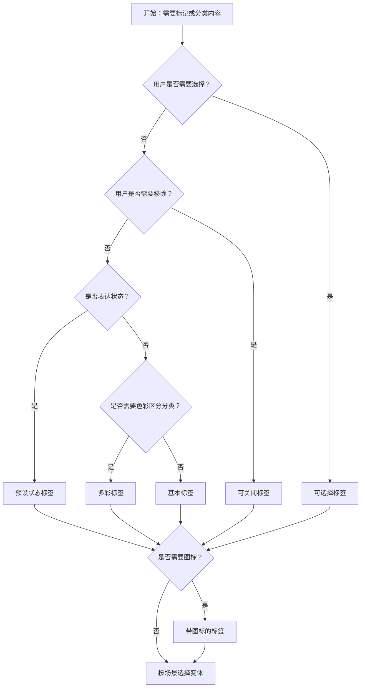

# 1. 简洁易读部份

## 1.0. 组件描述

标签组件用于对内容进行标记和分类，通过紧凑的视觉形态传达属性、状态或维度，支持预设颜色、可关闭、可选择等变体，是信息组织与筛选的轻量载体。

## 1.1. 组件构成

标签由以下基础要素构成，可按需组合使用：

> <!-- 附图占位：建议附上一张示例图，展示标签的三个基础要素（容器、文本、可选关闭按钮）的构成关系，标注各要素名称与位置 -->

&emsp;&emsp;1. **容器** 定义标签的点击区域、背景色与边框，承载不同变体与状态。

&emsp;&emsp;2. **文本** 表达标记或分类的语义，需简短可辨。

&emsp;&emsp;3. **可选关闭按钮** 用于可关闭标签，点击后移除该标签；可选图标用于增强识别。

---

## 1.2. 组件包含哪些不同类型

### 1.2.1 基本标签

&emsp;**是什么**：仅包含文本的默认形态，无关闭、选择等交互

> <!-- 附图占位：建议附上一张示例图，展示基本标签（默认灰底、短文本）的视觉形态 -->

&emsp;**简单用法**：适用于纯展示的分类或属性标记；文案需简短；同一组内风格一致

&emsp;**典型场景**：文章分类、商品属性、状态标识、技术栈

> <!-- 附图占位：建议附上一张场景图，展示文章或商品详情中多个基本标签的并排展示 -->

&emsp;**替代方案**：若需用户移除，改用可关闭标签；若需用户选择，改用可选择标签

### 1.2.2 预设状态标签

&emsp;**是什么**：通过预设颜色（success、processing、warning、error、default）传达状态语义

> <!-- 附图占位：建议附上一张示例图，展示五种预设状态标签的色彩与语义对应 -->

&emsp;**简单用法**：success 用于成功、完成；processing 用于进行中；warning 用于警告；error 用于错误、失败；default 用于中性

&emsp;**典型场景**：订单状态、审核状态、任务状态、告警级别

> <!-- 附图占位：建议附上一张场景图，展示订单列表或任务列表中不同状态标签的使用 -->

&emsp;**替代方案**：若需更多色彩区分，使用多彩标签或自定义颜色

### 1.2.3 多彩标签

&emsp;**是什么**：使用预设或自定义颜色区分不同分类或属性，无固定状态语义

> <!-- 附图占位：建议附上一张示例图，展示多种色彩的标签，如 magenta、red、volcano、orange 等 -->

&emsp;**简单用法**：色彩需与文本形成足够对比；同一维度内色彩不宜过多，避免杂乱

&emsp;**典型场景**：分类标签、技术栈、兴趣标签、多维度筛选

> <!-- 附图占位：建议附上一张场景图，展示筛选或分类场景中多彩标签的并排使用 -->

&emsp;**替代方案**：若强调状态语义，使用预设状态标签；若需极简，使用默认灰色

### 1.2.4 可关闭标签

&emsp;**是什么**：标签带有关闭按钮，用户点击后可移除该标签

> <!-- 附图占位：建议附上一张示例图，展示带关闭图标的标签及悬停反馈 -->

&emsp;**简单用法**：适用于用户可编辑的标签集合；关闭前可拦截（如二次确认）；动态列表可配合添加入口

&emsp;**典型场景**：已选筛选条件、用户输入标签、可编辑分类

> <!-- 附图占位：建议附上一张场景图，展示筛选条件以可关闭标签展示、用户点击关闭后筛选结果更新 -->

&emsp;**替代方案**：若标签不可移除，使用基本标签

### 1.2.5 可选择标签

&emsp;**是什么**：标签可点击切换选中态，用于单选或多选筛选、选项确认

> <!-- 附图占位：建议附上一张示例图，展示未选中与选中状态的标签视觉对比 -->

&emsp;**简单用法**：单选时仅一项选中；多选时可多项选中；选中态需与未选中态明确区分

&emsp;**典型场景**：筛选条件选择、多选标签组、兴趣选择

> <!-- 附图占位：建议附上一张场景图，展示筛选栏中可选择标签组的交互流程 -->

&emsp;**替代方案**：若无需选择交互，使用基本标签；若选项结构复杂，考虑 Checkbox 或 Radio

### 1.2.6 带图标的标签

&emsp;**是什么**：标签内包含图标，用于增强识别或表达类型

> <!-- 附图占位：建议附上一张示例图，展示带图标的标签（图标在左、文字在右） -->

&emsp;**简单用法**：图标需与标签语义一致；图标与文字间距适中；同一组内图标风格统一

&emsp;**典型场景**：社交平台、技术栈、链接类型、文件类型

> <!-- 附图占位：建议附上一张场景图，展示技术栈或链接类型用图标标签区分的示例 -->

&emsp;**替代方案**：若图标无额外信息价值，可仅用文字

### 1.2.7 变体：filled / solid / outlined

&emsp;**是什么**：通过填充程度区分标签风格，filled 为填充背景，solid 为实心，outlined 为描边

> <!-- 附图占位：建议附上一张示例图，展示 filled、solid、outlined 三种变体的视觉对比 -->

&emsp;**简单用法**：filled 为默认，背景淡色；solid 背景实色、文字浅色，适合强调；outlined 仅描边，视觉更轻

&emsp;**典型场景**：不同视觉层级、深色背景适配、轻量化展示

> <!-- 附图占位：建议附上一张场景图，展示同一页面中不同变体标签的层级区分 -->

&emsp;**替代方案**：无特殊风格需求时使用默认 filled

---

## 1.3. 各类型典型场景案例

### 1.3.1 状态与色彩语义

> <!-- 附图占位：建议附上一张对比图，左侧展示状态标签颜色与语义一致（符合规范），右侧展示用色彩做无意义区分（违反规范） -->

✅ **推荐：** 预设状态标签严格对应语义；多彩标签用于分类区分，不混淆状态含义

❌ **不推荐：** 用 success 色表示失败，或用过多杂乱色彩导致信息过载

### 1.3.2 可关闭与可选择

> <!-- 附图占位：建议附上一张对比图，左侧展示筛选条件用可关闭标签、筛选项用可选择标签（符合规范），右侧展示两者混用或误用（违反规范） -->

✅ **推荐：** 已选条件用可关闭标签便于移除；可选筛选项用可选择标签；语义清晰不混淆

❌ **不推荐：** 可关闭与可选择混用导致用户不清楚点击效果

---

# 2. 选型指南

## 2.1 选择流程

---

# 3. 细致专业部份（交互与排版规则）

## 3.1 文案与语义

* **简短明确**：标签文案宜简短，一至几个词为佳，避免长句。
* **语义一致**：同一组标签表达同一维度，不混用不同维度（如状态与分类混在一起需谨慎）。
* **可扫描**：用户应能快速扫描理解标签含义。

> <!-- 附图占位：建议附上一张示例图，展示合理与不合理的标签文案对比 -->

## 3.2 色彩与对比度

* **状态色彩**：success / processing / warning / error 与业务语义严格对应。
* **对比度**：文字与背景需满足可读性要求，尤其小字号时。
* **数量控制**：同一视野内色彩种类不宜过多，避免视觉噪音。

> <!-- 附图占位：建议附上一张对比图，展示色彩使用合理与过度的对比 -->

## 3.3 布局与 spacing

* **并排展示**：多个标签并排时，间距一致，可换行或横向滚动。
* **与内容关系**：标签通常紧跟其所标记的内容，或置于筛选区、摘要区。
* **溢出处理**：标签过多时可「+N」折叠或分页，避免撑爆布局。

> <!-- 附图占位：建议附上一张布局图，展示标签在列表、卡片、筛选区的典型摆放 -->

## 3.4 可关闭与可选择

* **可关闭**：关闭前可拦截（如确认弹窗）；关闭后需有明确反馈（如列表更新）。
* **可选择**：选中态与未选中态视觉区分明确；多选时需有「全选」「清空」等辅助操作（若适用）。
* **不混用**：同一标签不同时具备关闭与选择，避免交互歧义。

> <!-- 附图占位：建议附上一张交互流程图，展示可关闭与可选择标签的用户操作闭环 -->

## 3.5 变体选择

* **filled**：默认，适合多数场景，背景淡色。
* **solid**：实心，适合需要强视觉强调的场景。
* **outlined**：描边，适合轻量化、辅助信息展示。
* **一致原则**：同一区域内变体风格统一。

> <!-- 附图占位：建议附上一张对比图，展示三种变体在不同背景下的适用性 -->

## 3.6 图标与链接

* **图标**：与语义一致，不喧宾夺主；位置通常为文字左侧。
* **链接形态**：标签可配置为链接（href），用于跳转至筛选页或详情页，此时需符合链接的视觉与交互预期。

> <!-- 附图占位：建议附上一张示例图，展示带图标标签与可点击链接标签的使用方式 -->

---

## 4.0. 常见问题

### 1. 预设状态标签和多彩标签有什么区别？

预设状态标签（success、processing、warning、error、default）有固定语义，用于表达状态或结果。多彩标签（如 magenta、red、volcano）无固定语义，用于区分不同分类或属性，不暗示成功或失败。

### 2. 可关闭标签和可选择标签如何选择？

可关闭标签用于「已选条件」「可移除的标记」，用户通过关闭来移除。可选择标签用于「筛选项」「多选选项」，用户通过点击切换选中态来筛选或确认。两者场景不同，不混用。

### 3. 标签过多时如何布局？

可限制单行展示数量，多余部分折叠为「+N」点击展开；或使用横向滚动；或分组、分区域展示。避免无限制堆叠导致布局混乱。
