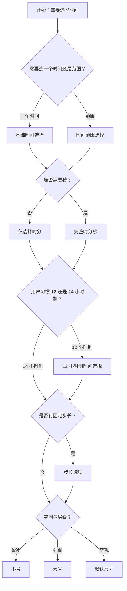

# 1. 简洁易读部份

## 1.0. 组件描述

时间选择框（TimePicker）用于输入或选择时间，用户点击标准输入框后弹出时间面板，可进行选择或输入，适用于需要精确到时分秒的时间录入场景。

## 1.1. 组件构成

时间选择框由以下基础要素构成，可按需组合使用：

> <!-- 附图占位：建议附上一张示例图，展示时间选择框的四个基础要素（输入框、弹出层、时间列、确认区）的构成关系，标注各要素名称与位置 -->

&emsp;&emsp;1. **输入框** 展示已选时间或占位提示，作为触发面板的入口。

&emsp;&emsp;2. **弹出层** 承载时间选择面板，包含时分秒等列与可选操作。

&emsp;&emsp;3. **时间列** 用于选择时、分、秒等维度，支持滚动或点击选择。

&emsp;&emsp;4. **确认区** 可包含确认按钮、此刻按钮等，用于确认选择或快捷填入。

---

## 1.2. 组件包含哪些不同类型

### 1.2.1 基础时间选择

&emsp;**是什么**：选择一个时间点，默认格式为 HH:mm:ss，点击输入框弹出时间面板进行选择

> <!-- 附图占位：建议附上一张示例图，展示基础时间选择框（输入框 + 时分秒三列）的视觉形态 -->

&emsp;**简单用法**：必须用于只需要选择一个时间点的场景；默认 24 小时制；选择后失去焦点即代表确认，或根据 `needConfirm` 需点击确认

&emsp;**典型场景**：日程开始时间、预约时间、打卡时间、营业时间

> <!-- 附图占位：建议附上一张场景图，展示日程表单中「开始时间」时间选择框的布局，体现选择单一时间点的典型用法 -->

&emsp;**替代方案**：若需选择时间范围，改用时间范围选择器

### 1.2.2 时间范围选择

&emsp;**是什么**：通过 RangePicker 选择起止两个时间点，用于确定时间段

> <!-- 附图占位：建议附上一张示例图，展示时间范围选择器（两个输入框或一个区间输入框 + 双列选择）的视觉形态 -->

&emsp;**简单用法**：必须用于需要同时确定开始与结束时间的场景；起止时间可自动排序（前小后大）；两端可分别限制可选时间（disabledTime）

&emsp;**典型场景**：营业时间段、会议时段、可用时段、排班时间段

> <!-- 附图占位：建议附上一张场景图，展示排班设置中「工作时间 09:00–18:00」时间范围选择，体现起止时间同时选择的场景 -->

&emsp;**替代方案**：若只需一个时间点，改用基础时间选择

### 1.2.3 不同尺寸时间选择

&emsp;**是什么**：支持 large、medium、small 三种尺寸，适应不同表单密度与视觉层级

> <!-- 附图占位：建议附上一张示例图，展示大、中、小三种尺寸时间选择框的对比，体现尺寸差异 -->

&emsp;**简单用法**：大号用于强调或主表单；默认中号用于常规表单；小号用于紧凑列表或表格内；同一表单内尺寸应统一

&emsp;**典型场景**：主表单用大号、表格行内用小号、常规表单用中号

> <!-- 附图占位：建议附上一张场景图，展示同一页面中不同区域采用不同尺寸时间选择框的布局，体现尺寸与场景的对应 -->

&emsp;**替代方案**：无特殊需求时使用默认尺寸

### 1.2.4 选择确认模式

&emsp;**是什么**：通过 `needConfirm` 控制是否需点击「确认」按钮才完成选择，否则失去焦点即代表选择

> <!-- 附图占位：建议附上一张示例图，展示需要确认时面板底部有「确认」「取消」按钮的形态 -->

&emsp;**简单用法**：需要确认时，用户必须点击确认才提交；不需要确认时，选择后失焦即提交；根据业务对「误触」的容忍度选择

&emsp;**典型场景**：重要时间配置用确认模式；快速录入用失焦即选

> <!-- 附图占位：建议附上一张场景图，展示预约系统中重要时间选择采用确认按钮，体现防误触的设计 -->

&emsp;**替代方案**：根据业务对精确性与操作效率的需求权衡

### 1.2.5 12 小时制时间选择

&emsp;**是什么**：使用 12 小时制显示与选择，带 AM/PM 标识，格式通常为 h:mm:ss a

> <!-- 附图占位：建议附上一张示例图，展示 12 小时制时间选择器（含 AM/PM 列）的视觉形态 -->

&emsp;**简单用法**：必须用于用户习惯 12 小时制的场景（如部分地区）；AM/PM 必须清晰标识；格式与展示需一致

&emsp;**典型场景**：面向北美等地区的产品、日常作息时间、会议时间

> <!-- 附图占位：建议附上一张场景图，展示 12 小时制时间选择在预约表单中的使用，体现 AM/PM 的清晰展示 -->

&emsp;**替代方案**：若用户群体习惯 24 小时制，使用默认格式

### 1.2.6 仅选择时分

&emsp;**是什么**：通过 format 省略秒，面板中仅显示时、分两列，适用于不需要秒级精度的场景

> <!-- 附图占位：建议附上一张示例图，展示仅时分两列的时间选择面板，体现无秒列的简洁形态 -->

&emsp;**简单用法**：必须用于业务不需要秒的场景；format 如 HH:mm；减少一列可简化选择、提升效率

&emsp;**典型场景**：会议时间、营业时间、打卡时间（精确到分钟）

> <!-- 附图占位：建议附上一张场景图，展示会议室预约中仅选择时分的用法，体现简化选择的场景 -->

&emsp;**替代方案**：若需要秒级精度，使用完整时分秒

### 1.2.7 步长选项

&emsp;**是什么**：通过 hourStep、minuteStep、secondStep 设置各列的步长，如每 15 分钟或每 30 分钟一个选项

> <!-- 附图占位：建议附上一张示例图，展示步长为 15 分钟时，分钟列仅显示 00、15、30、45 的形态 -->

&emsp;**简单用法**：必须用于业务有固定间隔要求的场景；步长应能被 60 整除（分钟、秒）或符合业务规则；可减少选项数量、加快选择

&emsp;**典型场景**：预约时段（每 30 分钟）、排班间隔（每 15 分钟）、课程时间（每 45 分钟）

> <!-- 附图占位：建议附上一张场景图，展示预约系统中 30 分钟步长的时间选择，体现固定间隔的业务需求 -->

&emsp;**替代方案**：若无需固定间隔，使用默认步长 1

---

## 1.3. 各类型典型场景案例

### 1.3.1 单点与范围

> <!-- 附图占位：建议附上一张对比图，左侧展示单点选择用于开始时间，右侧展示范围选择用于营业时段 -->

✅ **推荐：** 只需一个时间点用基础时间选择；需要起止时间段用时间范围选择

❌ **不推荐：** 用两个独立时间选择框拼成「范围」却无联动与校验；或单点场景误用范围选择

### 1.3.2 格式与精度

> <!-- 附图占位：建议附上一张对比图，左侧展示不需要秒时仅显示时分，右侧展示需要秒时显示完整时分秒 -->

✅ **推荐：** 根据业务精度选择 format，不必要的信息不展示

❌ **不推荐：** 业务只需分钟却强制选择秒；或需要秒却隐藏秒列

### 1.3.3 确认与失焦

> <!-- 附图占位：建议附上一张对比图，左侧展示重要配置用确认模式，右侧展示快速录入用失焦即选 -->

✅ **推荐：** 重要时间配置使用确认模式防误触；快速录入场景可用失焦即选提升效率

❌ **不推荐：** 关键业务时间无确认易误触；或简单录入强加确认导致操作繁琐

---

# 2. 选型指南

## 2.1 选择流程

---

# 3. 细致专业部份（交互与排版规则）

## 3.1 输入框与弹出层

* **输入框展示**：已选时间须按 format 正确展示；空值时显示 placeholder；清除按钮在需要时显示，且易于识别。
* **弹出位置**：面板默认在输入框下方，可根据空间自动调整；避免面板超出视口或被遮挡。
* **面板尺寸**：时间列高度适中，支持滚动；列宽保证数字与 AM/PM 等内容完整显示。

> <!-- 附图占位：建议附上一张场景图，展示时间选择框输入框、弹出层、时间列的结构与对齐 -->

## 3.2 时间列的交互

* **选择方式**：支持点击选中与滚动选择；滚动即改变时需配合确认，避免误触即提交。
* **禁用时间**：通过 disabledTime 限制不可选的小时、分钟、秒；禁用项须视觉置灰且不可选。
* **此刻按钮**：若展示「此刻」，点击后填入当前时间，用于快捷选择。

## 3.3 确认与失焦逻辑

* **needConfirm 为 true**：用户选择后需点击确认才提交；取消或点击外部关闭则不改变原值。
* **needConfirm 为 false**：选择后失焦即提交；适用于快速录入、对误触容忍度较高的场景。
* **changeOnScroll**：若开启滚动即改变，建议配合 needConfirm，避免滚动中误触即提交。

## 3.4 与 DatePicker 的配合

* **仅时间**：当业务只需时间、不需日期时，使用 TimePicker。
* **日期+时间**：当需同时选择日期与时间，使用 DatePicker 的 `showTime` 或类似能力，而非两个独立控件拼凑。

> <!-- 附图占位：建议附上一张对比图，展示仅时间场景用 TimePicker、日期时间场景用 DatePicker 的选型差异 -->

## 3.5 校验与状态

* **校验状态**：支持 error、warning 等状态，用于表单校验提示；错误时输入框边框与提示需一致。
* **禁用**：禁用时输入框不可点击，面板不可弹出。
* **只读**：若设为只读，可避免移动端弹出虚拟键盘，适合纯选择场景。

## 3.6 键盘与无障碍

* **键盘操作**：支持 Tab 聚焦，Enter 打开/确认，Esc 关闭；时间列支持方向键选择。
* **焦点管理**：打开时焦点进入面板，关闭时焦点回到输入框。
* **读屏**：输入框与选项具备合适的 ARIA 属性，便于读屏软件描述当前值与可选范围。

---

## 4.0. 常见问题

### 1. TimePicker 和 DatePicker 如何配合使用

- **仅需时间**：使用 TimePicker，如营业时间、会议开始时间。
- **需日期+时间**：使用 DatePicker 的 showTime 或类似能力，在日期选择基础上附加时间选择，保持同一入口与数据模型。

### 2. 12 小时制和 24 小时制如何选择

- **24 小时制**：通用、无歧义，适合大多数后台与工具类产品。
- **12 小时制**：适合面向习惯 12 小时制的地区用户，如日常预约、作息设置；使用时必须清晰标识 AM/PM。
