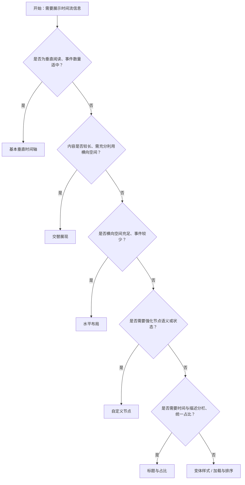

# 1. 简洁易读部份

## 1.0. 组件描述

时间轴组件用于垂直或水平展示按时间先后排列的信息流，通过节点与连接线串联事件，帮助用户理解时间顺序与流程脉络。

## 1.1. 组件构成

时间轴由以下基础要素构成，可按需组合使用：

> <!-- 附图占位：建议附上一张示例图，展示时间轴的三个基础要素（节点、连接线、内容区块）的构成关系，标注各要素名称与位置 -->

&emsp;&emsp;1. **节点** 定义时间点的视觉标记，可为圆点、图标或自定义元素，承载颜色与状态信息。

&emsp;&emsp;2. **连接线** 串联各节点，体现时间流的延续性与顺序，默认位于节点一侧。

&emsp;&emsp;3. **内容区块** 承载标题、时间标签与详细描述，可置于节点同侧或交替分布。

---

## 1.2. 组件包含哪些不同类型

### 1.2.1 基本垂直时间轴

&emsp;**是什么**：默认的垂直排列样式，节点与内容位于轴线同一侧，适用于大多数按时间展示的场景

> <!-- 附图占位：建议附上一张示例图，展示基本垂直时间轴（圆点节点、单侧内容）的视觉形态 -->

&emsp;**简单用法**：适用于事件数量适中、内容长度不一的场景；节点顺序可正序或倒序；连接线贯穿首尾节点

&emsp;**典型场景**：订单进度、操作日志、项目里程碑、活动时间线

> <!-- 附图占位：建议附上一张场景图，展示订单详情页中的物流时间轴，体现事件按时间排列的典型用法 -->

&emsp;**替代方案**：若内容较长且希望节省纵向空间，改用交替展现或水平布局

### 1.2.2 变体样式（填充 / 描边）

&emsp;**是什么**：通过样式变体区分节点的视觉权重，填充态更突出，描边态更轻盈

> <!-- 附图占位：建议附上一张对比图，展示 filled 与 outlined 两种变体在节点形态上的差异 -->

&emsp;**简单用法**：填充变体用于强调重要节点；描边变体为默认，适用于常规展示；同一时间轴内可混用不同颜色以区分状态

&emsp;**典型场景**：流程中已完成与进行中的区分、关键节点高亮、状态阶段标识

> <!-- 附图占位：建议附上一张场景图，展示审批流程中「已通过」为绿色填充、「待审核」为蓝色描边的状态区分 -->

&emsp;**替代方案**：若仅需局部突出，可仅对少数节点使用自定义图标或颜色

### 1.2.3 交替展现

&emsp;**是什么**：内容在时间轴线两侧轮流分布，形成左右交替的阅读节奏

> <!-- 附图占位：建议附上一张示例图，展示交替时间轴（内容左-右-左-右分布）的视觉形态 -->

&emsp;**简单用法**：适用于内容较长、希望充分利用横向空间的场景；节点仍居中，仅内容左右交替；视觉上更易区分相邻事件

&emsp;**典型场景**：产品迭代历程、项目大事记、双栏时间线展示

> <!-- 附图占位：建议附上一张场景图，展示产品更新日志中左右交替呈现的版本记录，体现交替布局的阅读体验 -->

&emsp;**替代方案**：若内容较短或追求紧凑，改用基本垂直布局

### 1.2.4 水平布局

&emsp;**是什么**：时间轴水平排列，节点与连接线横向延展，适配宽屏或横向流程

> <!-- 附图占位：建议附上一张示例图，展示水平时间轴（节点横向排布、连接线水平贯穿）的视觉形态 -->

&emsp;**简单用法**：适用于横向空间充足、事件数量不多的场景；标题可单独占位以控制每段空间；需注意超长内容可能挤压布局

&emsp;**典型场景**：阶段进度总览、横向流程步骤、大屏展示

> <!-- 附图占位：建议附上一张场景图，展示大屏看板中横向展示的项目阶段时间轴 -->

&emsp;**替代方案**：若事件较多或需详细描述，改用垂直布局

### 1.2.5 自定义节点

&emsp;**是什么**：将默认圆点替换为图标、图片或自定义元素，增强语义或品牌表达

> <!-- 附图占位：建议附上一张示例图，展示自定义节点（如勾选图标、状态图标）与默认圆点的对比 -->

&emsp;**简单用法**：必须用于强化节点语义（如完成用勾选、警告用感叹号）；图标风格需与整体一致；可单独为某一节点设置，也可全局统一

&emsp;**典型场景**：状态时间轴（成功/失败/进行中）、带图标的操作记录、品牌化展示

> <!-- 附图占位：建议附上一张场景图，展示操作日志中不同类型操作使用不同图标的自定义节点 -->

&emsp;**替代方案**：若仅需颜色区分，使用内置颜色即可；若需更丰富结构，可结合标题与内容分层

### 1.2.6 标题与占比

&emsp;**是什么**：将时间或标签单独作为标题展示，并可控制标题区域占用的空间比例

> <!-- 附图占位：建议附上一张示例图，展示标题单独占位与内容分离的布局，以及 titleSpan 对占比的影响 -->

&emsp;**简单用法**：标题用于承载时间或标签，内容承载描述；占比可调节标题与内容的视觉权重；适用于需要清晰时间-内容分离的场景

&emsp;**典型场景**：带精确时间戳的日志、左右分栏的时间与描述、需要统一标题宽度的对齐排版

> <!-- 附图占位：建议附上一张场景图，展示活动时间轴中左侧固定宽度时间、右侧可变长度描述的布局 -->

&emsp;**替代方案**：若时间与描述混排即可，可不单独设置标题

### 1.2.7 加载与排序

&emsp;**是什么**：支持末节点加载态与整体排序方向控制，适配进行中流程与正倒序切换

> <!-- 附图占位：建议附上一张示例图，展示末节点加载态（旋转图标）与正序/倒序切换效果 -->

&emsp;**简单用法**：加载态用于表示流程尚未结束；正序为时间从早到晚，倒序为从晚到早；适用于需动态更新或切换时间方向的场景

&emsp;**典型场景**：物流跟踪（最后一站加载中）、动态追加的日志流、可切换正倒序的 timeline

> <!-- 附图占位：建议附上一张场景图，展示物流时间轴末节点为「运输中」加载态的场景 -->

&emsp;**替代方案**：若流程已完整且无需排序切换，使用基本布局即可

---

## 1.3. 各类型典型场景案例

### 1.3.1 基本垂直时间轴

> <!-- 附图占位：建议附上一张对比图，左侧展示事件按时间清晰排列的基本时间轴（符合规范），右侧展示时间轴与其他列表组件混用导致结构混乱（违反规范） -->

✅ **推荐：** 用基本垂直时间轴承载按时间排列的离散事件

❌ **不推荐：** 将时间轴与无序列表混用，导致时间关系不清晰

### 1.3.2 交替与水平布局

> <!-- 附图占位：建议附上一张对比图，左侧展示内容较长时使用交替布局充分利用空间（符合规范），右侧展示窄屏强行使用水平布局导致阅读困难（违反规范） -->

✅ **推荐：** 内容较长且横向空间充足时使用交替或水平布局

❌ **不推荐：** 在窄屏或内容很短时强行使用水平布局

### 1.3.3 自定义节点

> <!-- 附图占位：建议附上一张对比图，左侧展示图标与状态语义一致的自定义节点（符合规范），右侧展示为追求花哨而滥用无关图标（违反规范） -->

✅ **推荐：** 自定义节点图标需与节点语义强相关

❌ **不推荐：** 使用与状态无关的装饰性图标，干扰理解

### 1.3.4 加载态与末节点

> <!-- 附图占位：建议附上一张对比图，左侧展示流程进行中时末节点为加载态（符合规范），右侧展示已完成的流程仍显示加载态造成困惑（违反规范） -->

✅ **推荐：** 仅在实际进行中、尚未完成的流程末节点使用加载态

❌ **不推荐：** 流程已完成或静态展示时仍显示加载态

---

# 2. 选型指南

## 2.1 选择流程

---

# 3. 细致专业部份（交互与排版规则）

## 3.1 节点数量与内容长度

时间轴的可读性受节点数量与单条内容长度影响，需注意：

* **节点数量**：单屏内建议不超过 8–10 个节点，过多时应考虑分页、折叠或改用其他展示方式。
* **内容长度**：单条内容不宜过长，超过 3 行建议折叠或摘要展示，点击展开详情。
* **混合策略**：可对重点节点展开详细内容，次要节点仅展示标题或摘要。

> <!-- 附图占位：建议附上一张场景图，展示时间轴中部分节点可展开详情的折叠策略 -->

## 3.2 节点样式与语义

**颜色与状态对应：**

* **蓝色**：默认、进行中、常规状态。
* **绿色**：完成、成功、已通过。
* **红色**：失败、错误、已拒绝。
* **灰色**：未开始、禁用、次要信息。

**自定义图标的使用原则：**

* 图标必须与节点语义一致，避免装饰性图标干扰理解。
* 同一类型状态在同一时间轴内应使用统一图标。
* 图标尺寸需与节点容器协调，不宜过大或过小。

> <!-- 附图占位：建议附上一张示例图，展示不同状态对应颜色与图标的对照关系 -->

## 3.3 标题与内容的排版

* **标题**：用于时间、阶段名称或简短标签，应短小精炼，便于扫读。
* **内容**：用于详细描述，可与标题分行或分栏，保持层级清晰。
* **占比控制**：当使用标题占比时，需保证内容区有足够空间，避免挤压或换行过多。
* **对齐**：同一侧的标题与内容应对齐，交替布局时两侧的视觉重心应平衡。

> <!-- 附图占位：建议附上一张场景图，展示标题与内容分栏、对齐良好的时间轴布局 -->

## 3.4 加载态与动态更新

* **加载态位置**：仅用于末节点，表示流程尚未结束、后续将有新数据。
* **加载态展示**：使用旋转或脉冲等轻量动效，不宜过度抢眼。
* **动态追加**：新事件追加时，应平滑插入，避免整屏跳动；若采用倒序，新事件出现在顶部。
* **完成态切换**：流程结束时，末节点应从加载态切换为完成态，避免长期停留在加载中。

> <!-- 附图占位：建议附上一张场景图，展示物流时间轴从加载态到完成态的切换过程 -->

## 3.5 响应式与布局适配

* **垂直布局**：在移动端为主要选择，单列展示，节点与内容上下堆叠。
* **水平布局**：仅在宽屏、事件数量较少时使用；小屏应自动切换为垂直或可横向滑动。
* **交替布局**：中屏及以上可使用，小屏可退化为单侧布局以节省空间。
* **标题占比**：在小屏上可适当缩小标题占比，优先保证内容可读。

> <!-- 附图占位：建议附上一张对比图，展示同一时间轴在桌面端与移动端的布局适配 -->

## 3.6 无障碍与可访问性

* **顺序**：节点顺序应与 DOM 顺序一致，便于屏幕阅读器按时间顺序朗读。
* **状态描述**：加载态、完成态等需通过 aria 或可见文案明确说明。
* **对比度**：节点颜色与背景的对比度需满足可访问性标准。
* **键盘**：若时间轴可交互（如展开折叠），需支持键盘聚焦与操作。

---

## 4.0. 常见问题

### 1. 时间轴与步骤条（Steps）的区别是什么？

- **时间轴（Timeline）**：强调**时间顺序**与**事件流**，节点通常代表某一时刻发生的事件，内容多为描述性信息，适用于日志、进度跟踪、历史记录等场景。

- **步骤条（Steps）**：强调**流程阶段**与**完成状态**，节点代表步骤，用户通常需要逐步完成，适用于表单分步、任务流程等场景。

### 2. 何时使用垂直布局，何时使用水平布局？

- **垂直布局**：适用于大多数场景，尤其是事件数量较多、单条内容较长、或纵向滚动为主的页面。
- **水平布局**：适用于事件数量较少（一般不超过 5–6 个）、横向空间充足、且需要在一屏内展示完整时间线的场景，如大屏或宽屏看板。

### 3. 交替展现与基本垂直如何选择？

- **基本垂直**：内容较短、结构统一、追求简洁时使用。
- **交替展现**：内容较长、希望利用左右空间、或需要明显区分相邻事件时使用。交替布局会增加视觉节奏感，但也会占用更多横向空间。
