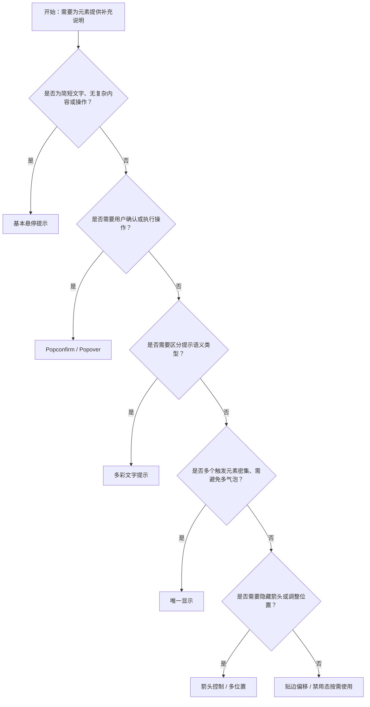

# 1. 简洁易读部份

## 1.0. 组件描述

文字提示（Tooltip）组件用于在用户悬停、聚焦或点击触发元素时，显示简短的补充说明，不承载复杂文本或操作，用于增强可发现性与可理解性。

## 1.1. 组件构成

文字提示由以下基础要素构成，可按需组合使用：

> <!-- 附图占位：建议附上一张示例图，展示文字提示的三个基础要素（触发元素、气泡容器、箭头）的构成关系，标注各要素名称与位置 -->

&emsp;&emsp;1. **触发元素** 用户与之交互的按钮、文字、图标等，悬停或聚焦时唤起提示。

&emsp;&emsp;2. **气泡容器** 承载提示文字的区域，具有明确的边界与内边距，不遮挡过多界面。

&emsp;&emsp;3. **箭头** 连接气泡与触发元素，指向触发源，增强关联性（可隐藏）。

---

## 1.2. 组件包含哪些不同类型

### 1.2.1 基本悬停提示

&emsp;**是什么**：鼠标移入触发元素时显示，移出时隐藏，是最常见、无特殊条件的默认用法

> <!-- 附图占位：建议附上一张示例图，展示基本悬停提示（箭头指向触发按钮的气泡）的视觉形态 -->

&emsp;**简单用法**：必须用于简短补充说明；不承载复杂内容或操作；可替代系统默认的 title 属性，提供更统一的视觉与交互

&emsp;**典型场景**：图标按钮说明、缩写词解释、截断文本的完整展示、操作提示

> <!-- 附图占位：建议附上一张场景图，展示工具栏中图标按钮悬停时显示「保存」「设置」等文字提示 -->

&emsp;**替代方案**：若需承载较多内容或操作，改用 Popover；若需确认类交互，改用 Popconfirm

### 1.2.2 多位置展示

&emsp;**是什么**：气泡可出现在触发元素的上、下、左、右及对角线方向，共十二个方向可选

> <!-- 附图占位：建议附上一张示例图，展示十二个方向的文字提示位置示意 -->

&emsp;**简单用法**：根据触发元素在界面中的位置选择合适方向，避免被遮挡或超出视口；空间不足时可自动反向调整

&emsp;**典型场景**：靠近边缘的按钮、表格内单元格、不同布局下的图标

> <!-- 附图占位：建议附上一张场景图，展示表格右上角操作图标使用 topLeft 方向以避免被裁剪 -->

&emsp;**替代方案**：默认 top 适用于多数场景，仅在需要时调整

### 1.2.3 箭头控制

&emsp;**是什么**：可显示、隐藏箭头，或控制箭头是否指向触发元素中心

> <!-- 附图占位：建议附上一张示例图，展示有箭头、无箭头及箭头居中三种形态的对比 -->

&emsp;**简单用法**：默认显示箭头以增强关联；在紧凑布局或视觉风格需求下可隐藏；箭头指向中心可提升精确指向感

&emsp;**典型场景**：简约风格界面隐藏箭头、精确指向小图标时箭头居中

> <!-- 附图占位：建议附上一张场景图，展示极简界面中无箭头 Tooltip 的使用 -->

&emsp;**替代方案**：多数场景保留默认箭头即可

### 1.2.4 贴边偏移

&emsp;**是什么**：当气泡贴边或接近视口边缘时，自动偏移并调整箭头位置，避免超出屏幕

> <!-- 附图占位：建议附上一张示例图，展示 Tooltip 贴边时的自动偏移与箭头跟随效果 -->

&emsp;**简单用法**：系统默认支持，无需额外配置；单一方向（如 top）贴边时会做位移，边缘对齐方向（如 topLeft）则仅翻转

&emsp;**典型场景**：靠近页面边缘的触发元素、滚动容器内的元素

> <!-- 附图占位：建议附上一张场景图，展示页面右下角按钮的 Tooltip 自动向内偏移避免裁切 -->

&emsp;**替代方案**：若仍被遮挡，可调整 placement 或触发元素位置

### 1.2.5 多彩文字提示

&emsp;**是什么**：通过预设或自定义背景色增强提示的语义或视觉层级

> <!-- 附图占位：建议附上一张示例图，展示不同预设色彩（如成功绿、警告黄、错误红）的文字提示 -->

&emsp;**简单用法**：用于区分提示的语义类型（成功、警告、错误等）；色彩应与内容语义一致；文字颜色随背景自适应以保证可读性

&emsp;**典型场景**：状态说明、校验结果提示、操作反馈的轻量展示

> <!-- 附图占位：建议附上一张场景图，展示表单校验失败时红色 Tooltip 提示错误信息 -->

&emsp;**替代方案**：若仅为装饰，保持默认色；若需更强反馈，改用 Message 或 Notification

### 1.2.6 禁用态

&emsp;**是什么**：通过设置空标题或空字符串可完全禁用某元素的 Tooltip

> <!-- 附图占位：建议附上一张示例图，展示同一按钮在禁用态下不显示 Tooltip 的对比 -->

&emsp;**简单用法**：当元素不可用或不需要提示时，将 title 设为 null 或空字符串；禁用按钮等场景下避免展示无意义的提示

&emsp;**典型场景**：表单未完成时禁用提交按钮、权限不足时的操作入口、条件不满足的灰显元素

> <!-- 附图占位：建议附上一张场景图，展示禁用按钮不触发 Tooltip、可用按钮正常显示提示的对比 -->

&emsp;**替代方案**：若禁用时仍需说明原因，可保留 Tooltip 并展示「暂无权限」等文案

### 1.2.7 唯一显示（平滑过渡）

&emsp;**是什么**：通过全局配置使同一时间仅显示一个 Tooltip，切换时实现平滑过渡，避免多个气泡同时存在

> <!-- 附图占位：建议附上一张示例图，展示多个按钮密集排列时，悬停切换仅显示一个 Tooltip 的平滑效果 -->

&emsp;**简单用法**：适用于多个可触发元素密集排列的场景；需通过 ConfigProvider 全局配置；配置后部分属性（如 getContainer、arrow）可能失效

&emsp;**典型场景**：工具栏、图标组、表格操作列等密集区域

> <!-- 附图占位：建议附上一张场景图，展示工具栏中快速悬停切换时 Tooltip 的平滑过渡 -->

&emsp;**替代方案**：若无需唯一性，使用默认多实例即可

---

## 1.3. 各类型典型场景案例

### 1.3.1 基本悬停提示

> <!-- 附图占位：建议附上一张对比图，左侧展示图标按钮配简短 Tooltip（符合规范），右侧展示 Tooltip 承载大段文字或操作按钮（违反规范） -->

✅ **推荐：** 用 Tooltip 承载简短、补充性说明

❌ **不推荐：** 在 Tooltip 中放置复杂内容、多行段落或操作按钮

### 1.3.2 触发方式选择

> <!-- 附图占位：建议附上一张对比图，左侧展示常规操作用 hover、需键盘访问时加入 focus（符合规范），右侧展示在需持续阅读的场景用 hover 导致易误触（违反规范） -->

✅ **推荐：** 按场景选择 hover、focus、click 等触发方式

❌ **不推荐：** 在需键盘无障碍访问的场景仅使用 hover，导致键盘用户无法获得提示

### 1.3.3 位置与遮挡

> <!-- 附图占位：建议附上一张对比图，左侧展示根据触发元素位置选择合适的 placement 避免遮挡（符合规范），右侧展示 Tooltip 被裁剪或遮挡重要信息（违反规范） -->

✅ **推荐：** 根据触发元素在页面中的位置选择 placement，确保气泡完整可见

❌ **不推荐：** 忽略边缘与遮挡，导致 Tooltip 超出视口或被其他元素盖住

### 1.3.4 多彩提示的语义

> <!-- 附图占位：建议附上一张对比图，左侧展示色彩与提示语义一致（成功绿、错误红）（符合规范），右侧展示随意使用色彩导致语义混淆（违反规范） -->

✅ **推荐：** 多彩 Tooltip 的色彩与内容语义一致

❌ **不推荐：** 为装饰而随意使用色彩，导致用户误解提示类型

---

# 2. 选型指南

## 2.1 选择流程

---

# 3. 细致专业部份（交互与排版规则）

## 3.1 内容与长度

* **长度限制**：Tooltip 内容应简短，建议单行或最多 2–3 行，避免大段文字影响阅读与关闭时机。
* **最大宽度**：默认存在最大宽度限制，超长文本会自动换行，需保证换行后仍可读。
* **动态内容**：若内容依赖数据变化，需注意关闭时的缓存策略；必要时使用 fresh 属性保持内容实时更新。
* **禁用场景**：当元素禁用或不需要提示时，务必通过 title 置空禁用，避免无效或误导性提示。

> <!-- 附图占位：建议附上一张示例图，展示 Tooltip 内容长度适中与过长的对比 -->

## 3.2 触发方式与时机

* **hover**：默认触发方式，适合大多数补充说明场景，移入显示、移出隐藏。
* **focus**：需支持键盘无障碍时，将 trigger 设置为包含 focus；可配合 hover 使用。
* **click**：适用于需用户主动唤起的场景，点击显示、点击外部或再次点击关闭；注意与 Popover 的区分。
* **延时**：鼠标移入与移出均有默认延时，避免快速扫过时闪动；可根据产品节奏微调。

> <!-- 附图占位：建议附上一张场景图，展示 hover 与 focus 触发方式在不同场景下的选择 -->

## 3.3 位置与自适应

* **默认位置**：placement 默认为 top，适用于多数场景。
* **空间不足**：当指定方向空间不足时，会自动反向（如 top 改为 bottom）；单一方向会做贴边位移，边缘对齐方向仅翻转。
* **滚动与容器**：若触发元素位于可滚动容器内，需注意 getPopupContainer 的配置，避免气泡随滚动错位或裁剪。
* **层级**：通过 zIndex 控制 Tooltip 与其他浮层的层级关系，确保不被遮挡。

> <!-- 附图占位：建议附上一张场景图，展示 Tooltip 在不同位置与容器下的自适应行为 -->

## 3.4 与 Popover、Popconfirm 的区分

* **Tooltip**：纯说明性，无操作，悬停即显，内容简短。
* **Popover**：可承载更多内容、标题、操作按钮，通常需点击触发。
* **Popconfirm**：用于确认类操作，需用户点击确认或取消，具有明确的操作意图。

选择时以「是否有操作」「内容是否复杂」为判断依据，避免在 Tooltip 中塞入本应由 Popover 承载的内容。

> <!-- 附图占位：建议附上一张对比图，展示 Tooltip、Popover、Popconfirm 三者在内容与交互上的差异 -->

## 3.5 自定义子组件与事件透传

* **子元素要求**：Tooltip 的子元素必须能接收 onMouseEnter、onMouseLeave、onFocus、onClick 等事件；自定义组件需通过 forwardRef 透传 ref。
* **HOC 与包装**：包装自定义组件时，需确保事件与 ref 正确透传，否则可能出现 findDOMNode 警告或 Tooltip 无法正常工作。
* **原生标签**：若子元素为原生 HTML 标签，通常无需额外处理；使用 React 组件时需按文档要求透传。

> <!-- 附图占位：建议附上一张示例图，展示自定义组件正确透传事件与 ref 后的 Tooltip 使用 -->

## 3.6 无障碍与可访问性

* **键盘访问**：默认 trigger 为 hover 时不响应键盘聚焦，需支持键盘用户时可设置 trigger 包含 focus。
* **屏幕阅读器**：Tooltip 内容应能被屏幕阅读器朗读；避免仅依赖视觉提示表达关键信息。
* **对比度**：多彩 Tooltip 的文字与背景对比度需满足可访问性标准。
* **勿滥用**：Tooltip 为补充说明，不应将关键信息仅放在 Tooltip 中，主体内容应直接在界面上可见。

---

## 4.0. 常见问题

### 1. Tooltip 与 Popover 的区别是什么？

- **Tooltip**：用于简短的**补充说明**，鼠标移入即显、移出即隐，不承载复杂内容或操作，适合图标说明、截断文本的完整展示等。
- **Popover**：可承载**较多内容**、标题、操作按钮等，通常需点击触发，适合需要用户停留并阅读或执行操作的场景。

### 2. 为何有时自定义组件包裹后 Tooltip 无法生效？

- Tooltip 依赖子元素能够接收 `onMouseEnter`、`onMouseLeave`、`onFocus`、`onClick` 等事件，以及能够接收 `ref`。若使用自定义组件包裹，需通过 `React.forwardRef` 将 `ref` 透传到实际 DOM 元素，并确保事件能够正确绑定，否则 Tooltip 无法正确计算位置与显隐。

### 3. 为何 Tooltip 内容在关闭时不会更新？

- Tooltip 默认在关闭时会缓存内容，以避免内容切换时的闪烁。若需在关闭时也更新内容（例如依赖实时数据的场景），可设置 `fresh` 属性，使内容始终保持最新。
