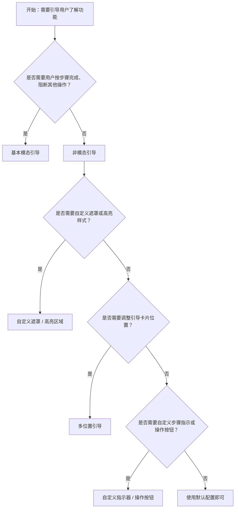

# 1. 简洁易读部份

## 1.0. 组件描述

漫游式引导（Tour）组件用于分步引导用户了解产品功能，通过高亮目标元素并配合引导卡片，帮助用户按顺序认识界面中的关键区域与操作入口。

## 1.1. 组件构成

漫游式引导由以下基础要素构成，可按需组合使用：

> <!-- 附图占位：建议附上一张示例图，展示漫游式引导的三个基础要素（高亮区域、引导卡片、遮罩）的构成关系，标注各要素名称与位置 -->

&emsp;&emsp;1. **高亮区域** 标识当前步骤的目标元素，通过遮罩镂空或边框突出，引导用户注意力。

&emsp;&emsp;2. **引导卡片** 承载步骤标题、描述、封面图或视频，以及上一步、下一步、关闭等操作按钮。

&emsp;&emsp;3. **遮罩** 半透明覆盖层，弱化非目标区域，强化高亮区域的焦点；可关闭以实现非模态引导。

---

## 1.2. 组件包含哪些不同类型

### 1.2.1 基本模态引导

&emsp;**是什么**：带遮罩的分步引导，高亮目标元素，引导卡片指向该元素，用户需按步骤推进或关闭

> <!-- 附图占位：建议附上一张示例图，展示基本模态引导（遮罩、高亮区域、指向目标的气泡卡片）的视觉形态 -->

&emsp;**简单用法**：适用于新用户首次进入或重点功能上线；步骤数不宜过多，建议 3–7 步；必须提供跳过或关闭入口

&emsp;**典型场景**：产品新功能引导、首次使用向导、关键流程介绍

> <!-- 附图占位：建议附上一张场景图，展示新功能上线时的分步引导流程 -->

&emsp;**替代方案**：若希望用户仍可操作界面，改用非模态引导

### 1.2.2 非模态引导

&emsp;**是什么**：关闭遮罩，仅保留高亮与引导卡片，用户可自由操作界面其他区域

> <!-- 附图占位：建议附上一张示例图，展示非模态引导（无遮罩、界面可交互）与模态引导的对比 -->

&emsp;**简单用法**：适用于熟悉用户或轻量提示；建议与 type="primary" 组合以强化引导卡片本身的存在感；高亮区域仍可配置是否禁用交互

&emsp;**典型场景**：功能更新提示、可选的新特性介绍、不强制阻断操作的引导

> <!-- 附图占位：建议附上一张场景图，展示非模态引导下用户可点击其他区域的交互效果 -->

&emsp;**替代方案**：若需强制用户跟随步骤，使用模态引导

### 1.2.3 多位置引导

&emsp;**是什么**：引导卡片可相对于目标元素出现在上、下、左、右及对角线等十二个方向；目标为空时居中于屏幕

> <!-- 附图占位：建议附上一张示例图，展示引导卡片在不同 placement 下的位置关系 -->

&emsp;**简单用法**：根据目标元素在页面中的位置与剩余空间选择合适方向；避免引导卡片被裁剪或遮挡；无目标时可用于全屏介绍页

&emsp;**典型场景**：顶部导航、侧边栏、底部操作栏等不同区域的引导

> <!-- 附图占位：建议附上一张场景图，展示针对不同位置元素使用不同 placement 的引导 -->

&emsp;**替代方案**：默认 bottom 适用于多数场景，仅在需要时调整

### 1.2.4 自定义遮罩样式

&emsp;**是什么**：可调整遮罩的颜色、透明度、样式等，以匹配产品视觉或品牌

> <!-- 附图占位：建议附上一张示例图，展示不同遮罩颜色与透明度的效果 -->

&emsp;**简单用法**：通过 mask 传入配置对象，调整 color、style 等；需保证高亮区域与遮罩的对比度足够，确保焦点清晰

&emsp;**典型场景**：品牌色遮罩、深色模式适配、特殊活动主题

> <!-- 附图占位：建议附上一张场景图，展示使用品牌色的自定义遮罩 -->

&emsp;**替代方案**：默认遮罩适用于大多数场景

### 1.2.5 自定义指示器

&emsp;**是什么**：将默认的圆点步骤指示器替换为自定义样式，如数字、文字、进度条等

> <!-- 附图占位：建议附上一张示例图，展示自定义指示器（如 1/5、2/5）与默认圆点的对比 -->

&emsp;**简单用法**：通过 indicatorsRender 传入函数，接收当前步骤与总步数；可展示「第 2 步，共 5 步」等更明确的信息

&emsp;**典型场景**：步骤较多的引导、需要明确进度感的场景、品牌化展示

> <!-- 附图占位：建议附上一张场景图，展示自定义数字指示器的引导卡片 -->

&emsp;**替代方案**：默认圆点指示器适用于多数场景

### 1.2.6 自定义操作按钮

&emsp;**是什么**：将默认的「上一步」「下一步」「关闭」等操作按钮替换为自定义内容或布局

> <!-- 附图占位：建议附上一张示例图，展示自定义操作按钮（如「跳过全部」「马上体验」）的布局 -->

&emsp;**简单用法**：通过 actionsRender 传入函数，可完全控制底部操作区的渲染；需保留关闭、跳过等关键操作

&emsp;**典型场景**：品牌化按钮文案、增加「跳过全部」、调整按钮顺序与样式

> <!-- 附图占位：建议附上一张场景图，展示自定义操作按钮的引导卡片 -->

&emsp;**替代方案**：默认操作按钮适用于多数场景

### 1.2.7 自定义高亮区域样式

&emsp;**是什么**：通过 gap 参数控制高亮区域的边距、圆角，使高亮框与目标元素之间的间距与形态可调

> <!-- 附图占位：建议附上一张示例图，展示不同 offset、radius 下高亮区域的视觉差异 -->

&emsp;**简单用法**：offset 控制高亮框与元素的间距，radius 控制圆角；可根据目标元素形状与风格调整

&emsp;**典型场景**：圆角按钮、卡片、不规则形状元素的高亮适配

> <!-- 附图占位：建议附上一张场景图，展示圆角高亮与直角高亮的对比 -->

&emsp;**替代方案**：默认高亮样式适用于多数场景

---

## 1.3. 各类型典型场景案例

### 1.3.1 基本模态引导

> <!-- 附图占位：建议附上一张对比图，左侧展示步骤清晰、有关闭入口的引导（符合规范），右侧展示步骤过多、无跳过导致用户被迫全部看完（违反规范） -->

✅ **推荐：** 步骤控制在 3–7 步，并提供跳过或关闭入口

❌ **不推荐：** 步骤过多且无跳过，强制用户完成全部步骤

### 1.3.2 模态与非模态选择

> <!-- 附图占位：建议附上一张对比图，左侧展示新用户使用模态引导、老用户使用非模态提示（符合规范），右侧展示轻量更新使用强模态造成打扰（违反规范） -->

✅ **推荐：** 按用户类型与引导目的选择模态或非模态

❌ **不推荐：** 对轻量提示使用强模态，或对首次用户使用非模态导致遗漏关键信息

### 1.3.3 高亮与滚动

> <!-- 附图占位：建议附上一张对比图，左侧展示目标元素自动滚动到视窗内再高亮（符合规范），右侧展示目标在视窗外仍高亮导致用户找不到（违反规范） -->

✅ **推荐：** 确保当前步骤目标元素在视窗内可见后再展示引导

❌ **不推荐：** 目标元素在视窗外或需大量滚动才能看到时仍展示引导

### 1.3.4 引导时机

> <!-- 附图占位：建议附上一张对比图，左侧展示用户进入相关页面或完成前置操作后触发引导（符合规范），右侧展示用户刚进入就弹出多个引导造成打扰（违反规范） -->

✅ **推荐：** 在合适的时机触发引导，避免频繁打扰

❌ **不推荐：** 用户进入即弹出一连串引导，或在非相关页面触发

---

# 2. 选型指南

## 2.1 选择流程

---

# 3. 细致专业部份（交互与排版规则）

## 3.1 步骤设计与数量

* **步骤数量**：建议 3–7 步，过少难以建立认知，过多易导致疲劳与放弃。
* **步骤顺序**：按用户实际操作流程或界面视觉流线排序，避免跳来跳去。
* **单步内容**：每步聚焦一个目标与一个核心信息，标题简短、描述精炼，避免冗长。
* **跳过与关闭**：必须提供关闭或跳过入口；可提供「跳过全部」以减少重复打扰。

> <!-- 附图占位：建议附上一张场景图，展示步骤数量适中、顺序合理的引导流程 -->

## 3.2 高亮与目标元素

* **目标唯一**：每个步骤应有明确且唯一的目标元素，避免高亮区域模糊或包含多个不相关元素。
* **滚动到视窗**：目标元素应在视窗内可见再展示引导；支持自动滚动到视窗内的能力。
* **高亮样式**：高亮框与遮罩的对比度需足够，确保用户能快速定位；可通过 gap 微调边距与圆角。
* **禁用交互**：模态模式下可禁用高亮区域外的交互；非模态下可按需配置高亮区域内是否可点击。

> <!-- 附图占位：建议附上一张场景图，展示高亮区域与目标元素精确对应的效果 -->

## 3.3 引导卡片的内容与排版

* **标题**：简短有力，概括当前步骤的核心信息，建议不超过一行。
* **描述**：补充说明，2–3 行为宜，避免大段文字。
* **封面**：可选，用于展示截图或动效，增强理解；需控制尺寸，避免挤压文字。
* **操作区**：上一步、下一步、关闭等按钮布局清晰；最后一步可改为「完成」「开始使用」等收尾文案。

> <!-- 附图占位：建议附上一张示例图，展示引导卡片内标题、描述、操作的排版规范 -->

## 3.4 触发时机与频率

* **首次触发**：可在用户首次进入相关页面、完成某项前置任务后自动触发，或通过「新功能介绍」入口手动触发。
* **重复展示**：用户跳过或关闭后，应根据业务规则决定是否再次展示；可结合本地存储记录完成状态。
* **避免打扰**：不在用户进行关键操作（如填写表单、编辑内容）时突然弹出引导；可预留「稍后提醒」选项。

> <!-- 附图占位：建议附上一张场景图，展示引导在合适时机触发的流程 -->

## 3.5 无障碍与可访问性

* **键盘操作**：支持键盘切换步骤、关闭引导；需配置 keyboard 以启用快捷键。
* **焦点管理**：引导打开时焦点应落在引导卡片内，关闭后焦点应回到合理位置（如触发元素）。
* **屏幕阅读器**：引导内容应可被朗读；高亮与步骤变化需有适当的 ARIA 提示。
* **层级**：通过 zIndex 确保引导浮层位于其他内容之上，避免被遮挡。

> <!-- 附图占位：建议附上一张示例图，展示引导的键盘与焦点流程 -->

## 3.6 响应式与容器

* **弹层容器**：可通过 getPopupContainer 指定引导浮层的挂载节点，避免在复杂布局下出现层级或滚动问题。
* **小屏适配**：在移动端需注意引导卡片尺寸与位置，避免超出视口或遮挡过多内容。
* **无目标步骤**：当某步 target 为空时，引导卡片居中于屏幕，适用于全屏介绍页或过渡页。

> <!-- 附图占位：建议附上一张对比图，展示桌面端与移动端引导的适配差异 -->

---

## 4.0. 常见问题

### 1. Tour 与 Tooltip 的区别是什么？

- **Tour**：**分步引导**，按顺序高亮多个目标，带有遮罩与步骤推进，用于新功能或流程介绍，用户需逐步完成或跳过。
- **Tooltip**：**单次提示**，悬停即显，无步骤、无遮罩，用于对单个元素的简短补充说明。

### 2. 何时使用模态引导，何时使用非模态？

- **模态引导**：适用于首次用户、关键流程、需要用户集中注意力的场景；遮罩会阻断其他操作，确保用户按步骤完成。
- **非模态引导**：适用于熟悉用户、轻量提示、不希望打断操作的场景；无遮罩，用户可自由点击其他区域，引导卡片与高亮仍存在。

### 3. 引导步骤数量多少合适？

- 建议 **3–7 步**。过少难以建立完整认知，过多易导致疲劳与中途放弃。若功能点较多，可拆成多个引导流程，或提供「跳过全部」与「稍后提醒」选项，避免一次性强推过多内容。
