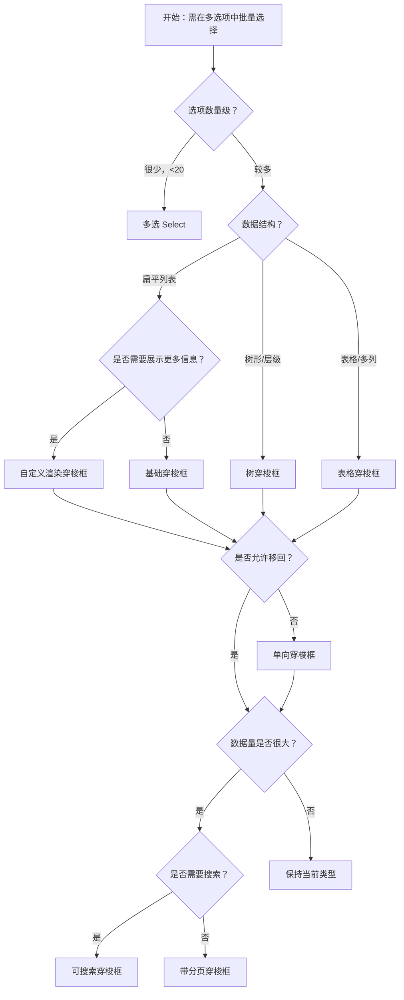

# 1. 简洁易读部份

## 1.0. 组件描述

穿梭框（Transfer）是一种双栏穿梭选择框，用于在多个可选项中进行多选。相比 Select 和 TreeSelect，穿梭框占据更大空间，可展示可选项的更多信息，通过直观的左右两栏与操作按钮完成选择。

## 1.1. 组件构成

穿梭框由以下基础要素构成，可按需组合使用：

> <!-- 附图占位：建议附上一张示例图，展示穿梭框的五个基础要素（左栏、右栏、操作按钮、标题、列表项）的构成关系，标注各要素名称与位置 -->

&emsp;&emsp;1. **左栏（Source）** 展示待选数据源，用户在此勾选待转移项。

&emsp;&emsp;2. **右栏（Target）** 展示已选数据，用户可勾选后移回左栏。

&emsp;&emsp;3. **操作按钮** 用于将勾选项在左右栏之间转移，通常为「右移」「左移」。

&emsp;&emsp;4. **标题** 用于区分左右栏的语义，如「待选」「已选」「可选成员」「已选成员」。

&emsp;&emsp;5. **列表项** 每行展示一个可选项，可含复选框、文本及自定义内容。

---

## 1.2. 组件包含哪些不同类型

### 1.2.1 基础穿梭框

&emsp;**是什么**：标准的双栏穿梭框，左栏为待选、右栏为已选，通过中间操作按钮转移

> <!-- 附图占位：建议附上一张示例图，展示基础穿梭框（左栏、右栏、>/< 操作按钮）的视觉形态 -->

&emsp;**简单用法**：必须用于需在多选项中批量选择、且需清晰区分「待选/已选」的场景；数据量不宜过大，否则考虑分页或搜索；须通过 titles 明确左右栏含义

&emsp;**典型场景**：权限分配、成员选择、角色配置、数据字段映射

> <!-- 附图占位：建议附上一张场景图，展示权限配置中「可选权限」与「已选权限」的穿梭框布局，体现批量转移的典型用法 -->

&emsp;**替代方案**：若选项较少且层级扁平，可考虑多选 Select；若为树形结构，改用树穿梭框

### 1.2.2 可搜索穿梭框

&emsp;**是什么**：左右栏均带搜索框，可根据关键词过滤列表项，便于在大量选项中快速定位

> <!-- 附图占位：建议附上一张示例图，展示带搜索框的穿梭框，左右栏顶部有搜索输入框 -->

&emsp;**简单用法**：必须用于选项数量较多、需通过关键词筛选的场景；搜索为客户端过滤或服务端查询，需与数据加载策略一致；搜索不影响已选/待选的语义分区

&emsp;**典型场景**：大量用户选择、大量权限项、大量商品或标签的分配

> <!-- 附图占位：建议附上一张场景图，展示几百个可选成员时通过搜索快速筛选的用法，体现搜索在穿梭框中的必要性 -->

&emsp;**替代方案**：若选项少于约 50 项，可不提供搜索；若数据极大，可配合分页

### 1.2.3 单向穿梭框

&emsp;**是什么**：仅展示从左到右的转移，不提供「移回左栏」的操作，适用于「只能选不能退」的场景

> <!-- 附图占位：建议附上一张示例图，展示单向穿梭框（仅右移按钮、无左移）的形态 -->

&emsp;**简单用法**：必须用于业务上不允许「取消已选」、或选中的项会进入后续流程不可退回的场景；须在界面或说明中明确「不可撤销」

&emsp;**典型场景**：审批流程选人、一次性分配、提交后不可修改的选择

> <!-- 附图占位：建议附上一张场景图，展示审批流程中「选择审批人」单向穿梭框，体现只能选入、不可退回的流程约束 -->

&emsp;**替代方案**：若允许用户调整已选项，用标准双向往返穿梭框

### 1.2.4 带分页穿梭框

&emsp;**是什么**：左右栏列表支持分页，用于大数据量场景，避免一次性渲染过多项

> <!-- 附图占位：建议附上一张示例图，展示列表底部有分页控件的穿梭框形态 -->

&emsp;**简单用法**：必须用于选项数量很大（如数百上千）的场景；分页需与勾选、转移逻辑协调；转移后目标栏的项可移出当前页，需考虑页码与选中态的同步

&emsp;**典型场景**：全量用户选择、大量商品/权限的分配、数据迁移时的字段映射

> <!-- 附图占位：建议附上一张场景图，展示数千条数据下分页穿梭的用法，体现大数据量下的性能与体验优化 -->

&emsp;**替代方案**：若数据量小，用基础穿梭框；若需复杂筛选，可结合搜索与分页

### 1.2.5 自定义渲染穿梭框

&emsp;**是什么**：通过 render 自定义每行内容的展示，可展示头像、描述、标签等更多信息

> <!-- 附图占位：建议附上一张示例图，展示自定义行内包含头像、姓名、部门等信息的穿梭框 -->

&emsp;**简单用法**：必须用于需要展示更多字段以帮助用户识别的场景；自定义内容需保持可读性与勾选区域清晰；禁止在行内放置过于复杂或可点击的控件干扰勾选

&emsp;**典型场景**：成员选择（含头像、部门）、商品选择（含图片、价格）、权限选择（含说明）

> <!-- 附图占位：建议附上一张场景图，展示成员穿梭框每行含头像与部门信息，体现自定义渲染增强识别能力 -->

&emsp;**替代方案**：若仅需标题即可区分，用基础穿梭框；若需表格结构，考虑表格穿梭框

### 1.2.6 表格穿梭框

&emsp;**是什么**：左右栏以表格形式展示，支持多列（如名称、类型、描述），适用于结构化数据的选择

> <!-- 附图占位：建议附上一张示例图，展示表格形态的穿梭框，含列标题与多列数据 -->

&emsp;**简单用法**：必须用于需要多列信息辅助选择的结构化数据；列宽与列数需控制，避免过宽或列过多；复选框列固定，便于批量勾选

&emsp;**典型场景**：数据字段映射、API 参数选择、配置项选择（含类型、说明）

> <!-- 附图占位：建议附上一张场景图，展示数据同步中源字段与目标字段的表格穿梭，体现多列信息的必要性 -->

&emsp;**替代方案**：若为简单列表，用基础或自定义渲染穿梭框；若为树形，用树穿梭框

### 1.2.7 树穿梭框

&emsp;**是什么**：左右栏以树形结构展示，支持层级展开与折叠，适用于具有父子关系的选项

> <!-- 附图占位：建议附上一张示例图，展示树形结构的穿梭框，含展开/折叠与父子层级 -->

&emsp;**简单用法**：必须用于数据具有层级关系（如部门、分类、菜单）的场景；父子选中关系需明确（联选、独立选）；须支持展开折叠以浏览层级

&emsp;**典型场景**：部门/组织选择、菜单权限、分类目录分配、层级数据迁移

> <!-- 附图占位：建议附上一张场景图，展示部门树穿梭框，体现层级数据在穿梭框中的适用场景 -->

&emsp;**替代方案**：若数据为扁平列表，用基础穿梭框；若层级极深且需复杂勾选逻辑，需谨慎设计

---

## 1.3. 各类型典型场景案例

### 1.3.1 穿梭框与多选 Select

> <!-- 附图占位：建议附上一张对比图，左侧展示选项多、需展示更多信息时用穿梭框，右侧展示选项少、空间有限时用多选 Select -->

✅ **推荐：** 选项多且需展示更多信息、或需清晰区分待选/已选时用穿梭框；选项少、空间紧时用多选 Select

❌ **不推荐：** 选项很少却用穿梭框占用大量空间；或选项很多且需详情却只用下拉多选

### 1.3.2 搜索与分页

> <!-- 附图占位：建议附上一张对比图，左侧展示数据量大时提供搜索或分页，右侧展示无搜索无分页导致大量滚动 -->

✅ **推荐：** 选项超过约 50 项时提供搜索；超过数百项时考虑分页或虚拟滚动

❌ **不推荐：** 数据量极大却无搜索、无分页，导致列表过长、难以定位

### 1.3.3 数据结构与展示形式

> <!-- 附图占位：建议附上一张对比图，左侧展示层级数据用树穿梭框，右侧展示表格式数据用表格穿梭框 -->

✅ **推荐：** 层级数据用树穿梭框；表格式多列数据用表格穿梭框；简单列表用基础或自定义穿梭框

❌ **不推荐：** 层级数据用扁平列表；或简单列表强行用表格、树形增加复杂度

---

# 2. 选型指南

## 2.1 选择流程

---

# 3. 细致专业部份（交互与排版规则）

## 3.1 左右栏与操作按钮

* **栏标题**：左右栏须有清晰标题，说明「待选」「已选」或业务语义；标题可展示数量（如「可选 18 项」「已选 5 项」）。
* **操作按钮**：默认「右移」「左移」；单向穿梭时仅保留右移；按钮在无勾选项时应禁用；可自定义按钮文案与图标。
* **全选**：顶部全选框用于快速全选/取消全选当前栏可见项；需与分页、搜索逻辑协调。

> <!-- 附图占位：建议附上一张场景图，展示穿梭框的标题、全选、操作按钮的布局与状态 -->

## 3.2 勾选与转移逻辑

* **勾选**：勾选不立刻转移，需点击操作按钮才执行；支持跨页勾选时，转移后需正确更新两侧列表。
* **禁用项**：部分项可设为禁用（如已无配额、无权限），禁用项不可勾选、不可转移。
* **受控**：穿梭框仅支持受控使用，需通过 targetKeys 与 onChange 维护已选列表。

## 3.3 搜索与过滤

* **搜索范围**：搜索仅过滤当前栏列表，不改变已选/待选分区；可为客户端过滤或触发服务端查询。
* **搜索与勾选**：搜索结果中的勾选、全选应与过滤后列表一致；转移后若目标栏有分页，需考虑选中项所在页的展示。

## 3.4 分页与大数据

* **分页配置**：可配置每页条数、是否简洁模式等；左右栏可独立分页。
* **勾选同步**：跨页勾选时，转移后目标栏需正确反映新加入的项；若目标栏当前页已满，可自动跳转到新项所在页或最后一页。
* **异步加载**：若采用异步加载，转移时可不立刻从源移除，而以禁用代替，以保持页码稳定。

## 3.5 自定义与扩展

* **footer**：可为每栏底部增加自定义内容（如统计、提示）。
* **列表样式**：可自定义列表高度、宽度，以适应布局；两栏宽度可一致或按需调整。
* **校验状态**：支持 error、warning，用于表单校验时的高亮提示。

## 3.6 无障碍与键盘

* **焦点**：支持 Tab 在左右栏、操作按钮、搜索框间切换。
* **键盘**：列表项支持方向键与 Space 勾选；操作按钮支持 Enter 触发。
* **语义**：列表与操作按钮需具备合适的 ARIA 属性，便于读屏软件描述。

---

## 4.0. 常见问题

### 1. Transfer 和 Select 多选如何选择

- **Transfer（穿梭框）**：适合选项较多、需展示更多信息、且需清晰区分「待选/已选」的场景；占据更大空间，可同时看到两侧列表。
- **Select 多选**：适合选项较少、空间有限、或下拉形式即可满足的场景；无法同时展示待选与已选两栏。

### 2. 穿梭框数据需要唯一 key 吗

- 是的。dataSource 中每项需有唯一 key，用于标识、勾选与转移。若数据主键不是 `key`，需通过 rowKey 指定主键字段。
