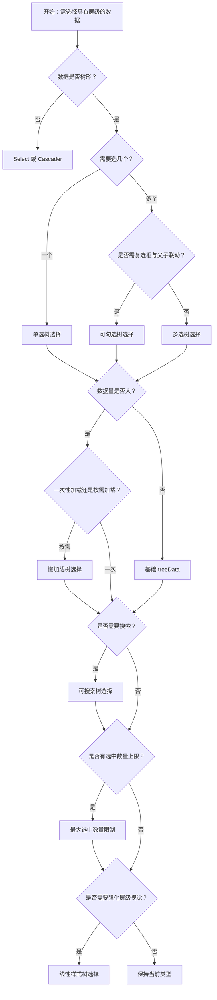

# 1. 简洁易读部份

## 1.0. 组件描述

树选择（TreeSelect）是一种树形选择控件，当可选择的数据具有层级结构时使用，例如公司层级、学科系统、分类目录等，支持单选或多选，可展开折叠浏览树形结构。

## 1.1. 组件构成

树选择由以下基础要素构成，可按需组合使用：

> <!-- 附图占位：建议附上一张示例图，展示树选择的四个基础要素（输入框、下拉箭头、弹出层、树节点）的构成关系，标注各要素名称与位置 -->

&emsp;&emsp;1. **输入框** 展示已选项或占位提示，作为触发下拉的入口。

&emsp;&emsp;2. **下拉箭头** 提示可展开，与输入框配合形成选择器形态。

&emsp;&emsp;3. **弹出层** 承载树形列表，支持展开折叠与滚动。

&emsp;&emsp;4. **树节点** 每个节点可含展开图标、标题、可选复选框等，支持父子层级。

---

## 1.2. 组件包含哪些不同类型

### 1.2.1 单选树选择

&emsp;**是什么**：在树形结构中只允许选择一个节点，选中后展示该节点标题，适用于层级中的唯一选择

> <!-- 附图占位：建议附上一张示例图，展示单选树选择（输入框内显示一个选中节点标题）的视觉形态 -->

&emsp;**简单用法**：必须用于只需选择一个层级的场景；可限制只选叶子节点或允许选父节点，根据业务决定；选中后下拉收起，输入框展示选中项

&emsp;**典型场景**：部门选择、分类选择、地区选择、组织架构中的单点定位

> <!-- 附图占位：建议附上一张场景图，展示表单中「所属部门」单选树选择的布局，体现层级中选一的典型用法 -->

&emsp;**替代方案**：若需多选，改用多选树选择；若为扁平列表，用 Select

### 1.2.2 多选树选择

&emsp;**是什么**：在树形结构中允许选择多个节点，选中项以标签形式回填到输入框内

> <!-- 附图占位：建议附上一张示例图，展示多选树选择（输入框内多个标签、可删除）的视觉形态 -->

&emsp;**简单用法**：必须用于需要选择多个层级节点的场景；选中项以标签展示，超出时折叠为「+N」；可配置最多展示标签数、最大选中数量

&emsp;**典型场景**：多部门选择、多分类、多权限节点、多地区

> <!-- 附图占位：建议附上一张场景图，展示权限配置中多选树选择勾选多个菜单节点的用法 -->

&emsp;**替代方案**：若只需单选，用单选树选择；若选项无层级，用 Select 多选

### 1.2.3 可勾选树选择

&emsp;**是什么**：通过 treeCheckable 显示复选框，支持父子联动或独立勾选，选中策略可配置

> <!-- 附图占位：建议附上一张示例图，展示可勾选树选择（每节点前有复选框、父子可联动）的形态 -->

&emsp;**简单用法**：必须用于需要明确「勾选」语义、且可能涉及父子联动的场景；showCheckedStrategy 控制回填方式（全部显示、仅父、仅子）；treeCheckStrictly 可解除父子关联实现完全独立勾选

&emsp;**典型场景**：菜单权限勾选、分类多选（含父子）、部门多选（可选整个子树）

> <!-- 附图占位：建议附上一张场景图，展示权限树中勾选父节点自动勾选子节点的联动效果 -->

&emsp;**替代方案**：若无需复选框语义，用多选树选择；若需完全独立勾选，开启 treeCheckStrictly

### 1.2.4 可搜索树选择

&emsp;**是什么**：弹出层内带搜索框，可根据输入过滤树节点，便于在深层级中快速定位

> <!-- 附图占位：建议附上一张示例图，展示可搜索树选择（弹出层顶部有搜索框、过滤后展示匹配节点）的形态 -->

&emsp;**简单用法**：必须用于层级较深或节点较多的场景；搜索可匹配节点标题，匹配时自动展开路径；多选模式下可配置选择后是否清空搜索

&emsp;**典型场景**：大型组织架构、深层分类、大量菜单项的选择

> <!-- 附图占位：建议附上一张场景图，展示在几百个节点中通过搜索快速定位的用法 -->

&emsp;**替代方案**：若节点很少，可不提供搜索；若为扁平数据，用 Select 的搜索

### 1.2.5 懒加载树选择

&emsp;**是什么**：通过 loadData 按需加载子节点，展开时才请求数据，适用于大型树或动态数据

> <!-- 附图占位：建议附上一张示例图，展示懒加载树选择（展开节点时显示加载态、加载完成后展示子节点）的形态 -->

&emsp;**简单用法**：必须用于数据量大、不宜一次性加载全部层级的场景；展开时加载子节点，加载中显示 loading；需处理加载失败与重试

&emsp;**典型场景**：大型组织树、文件系统、动态分类、接口分页加载的树

> <!-- 附图占位：建议附上一张场景图，展示组织树展开部门时异步加载子部门的流程 -->

&emsp;**替代方案**：若数据量小，直接用 treeData 一次性传入；若数据静态，可预加载

### 1.2.6 线性样式树选择

&emsp;**是什么**：通过 treeLine 展示树节点的连接线，增强层级的视觉表达

> <!-- 附图占位：建议附上一张示例图，展示带连接线的树选择，体现父子层级的线条关系 -->

&emsp;**简单用法**：适用于层级较多、需强化父子关系的场景；线条样式可有多种（如实线、虚线、仅子节点有叶图标）；需与整体视觉风格一致

&emsp;**典型场景**：组织架构、目录树、依赖关系树

> <!-- 附图占位：建议附上一张场景图，展示带连接线的部门树选择，体现层级关系的清晰展示 -->

&emsp;**替代方案**：若层级简单，可不用线条；若风格要求极简，可关闭 treeLine

### 1.2.7 最大选中数量限制

&emsp;**是什么**：通过 maxCount 限制最多可选节点数，超出后不可再选，用于控制选择范围

> <!-- 附图占位：建议附上一张示例图，展示达到最大选中数时其余节点置灰不可选的形态 -->

&emsp;**简单用法**：必须用于业务有明确数量上限的场景；达到上限时未选节点须置灰或禁用；可搭配标签折叠（maxTagCount）控制输入框内展示

&emsp;**典型场景**：最多选 N 个部门、最多 N 个分类、名额限制下的多选

> <!-- 附图占位：建议附上一张场景图，展示「最多选 3 个」时达到限制后的交互与提示 -->

&emsp;**替代方案**：若无数量限制，不设置 maxCount

---

## 1.3. 各类型典型场景案例

### 1.3.1 树选择与 Select / Cascader

> <!-- 附图占位：建议附上一张对比图，左侧展示有层级且需回填完整路径用 TreeSelect，右侧展示纯层级选择用 Cascader -->

✅ **推荐：** 有层级且需展示/回填树形选中项用 TreeSelect；纯级联选择、无需展开树用 Cascader；扁平选项用 Select

❌ **不推荐：** 扁平数据用 TreeSelect 增加无意义层级；或树形数据用 Cascader 却无法展示树结构

### 1.3.2 单选与多选

> <!-- 附图占位：建议附上一张对比图，左侧展示只需一个部门用单选树选择，右侧展示需多个部门用多选树选择 -->

✅ **推荐：** 只需一个层级节点用单选；需多个节点用多选或可勾选树选择

❌ **不推荐：** 需多选却限制为单选；或只需单选却用多选增加操作成本

### 1.3.3 搜索与懒加载

> <!-- 附图占位：建议附上一张对比图，左侧展示节点多时提供搜索，右侧展示数据量大时使用懒加载 -->

✅ **推荐：** 节点较多时提供搜索；数据量大或动态加载时使用懒加载

❌ **不推荐：** 大量节点无搜索难以定位；或一次加载全部导致性能问题

---

# 2. 选型指南

## 2.1 选择流程

---

# 3. 细致专业部份（交互与排版规则）

## 3.1 输入框与弹出层

* **输入框展示**：单选时显示选中节点标题；多选时以标签展示，超出可折叠；空值显示 placeholder。
* **清除**：支持一键清除已选，需在输入框内提供清除图标；清除后恢复 placeholder。
* **弹出位置**：下拉默认在输入框下方，可根据空间自动调整；避免被遮挡或超出视口。

## 3.2 树节点的展开与选择

* **展开**：点击展开图标或节点标题（可配置 treeExpandAction）展开子节点；懒加载时展开触发 loadData。
* **选择**：点击节点或勾选复选框完成选择；单选时选择即关闭；多选时可保持打开继续选。
* **禁用**：节点可设为 disabled 或 disableCheckbox，禁用后不可选。

## 3.3 父子选中关系

* **联动模式**：treeCheckStrictly 为 false 时，选父则联选子，选全子则联选父；半选表示部分子被选。
* **独立模式**：treeCheckStrictly 为 true 时，父子独立勾选，互不影响；适用于「只选父」「只选子」混合场景。
* **回填策略**：showCheckedStrategy 控制标签展示——全部、仅父、仅子；需与业务预期一致。

## 3.4 搜索与过滤

* **过滤逻辑**：搜索可匹配节点标题；匹配到的节点会展开路径便于查看；可自定义 filterTreeNode。
* **搜索与 loadData**：搜索时通常不触发 loadData，以避免频繁请求；若需搜索未加载节点，需在 filterTreeNode 中处理异步加载逻辑。

## 3.5 虚拟滚动与性能

* **虚拟滚动**：默认开启，用于长列表性能优化；若需横向滚动，需关闭虚拟滚动。
* **maxTagCount**：多选时控制输入框内展示的标签数，超出以「+N」等形式折叠；responsive 模式可随宽度自适应。

## 3.6 键盘与无障碍

* **键盘**：支持 Tab 聚焦，Enter 或方向键打开；树内支持方向键导航、Enter 选择、Space 勾选。
* **焦点**：打开时焦点进入树或搜索框，关闭时回到输入框。
* **读屏**：树节点与选项需具备合适的 ARIA 属性，便于读屏软件描述层级与选中态。

---

## 4.0. 常见问题

### 1. TreeSelect 和 Cascader 如何选择

- **TreeSelect**：适合需要展示完整树形结构、支持展开折叠、多选或复杂勾选逻辑的场景；输入框回填选中节点，可保持树形可见。
- **Cascader**：适合级联选择、一列一列选到底的场景；通常不展示完整树，而是级联面板。

### 2. 搜索时 loadData 为什么不会触发

- 为避免搜索输入时频繁触发异步加载导致网络堵塞，默认在搜索时不调用 loadData。若需在搜索时加载未展开节点，可在 filterTreeNode 中根据匹配结果手动触发加载逻辑。
