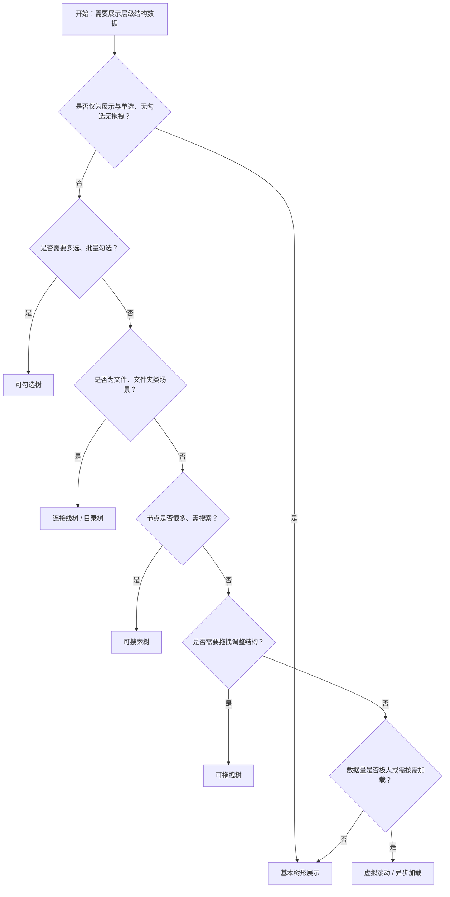

# 1. 简洁易读部份

## 1.0. 组件描述

树形控件（Tree）组件用于展示具有父子层级关系的数据结构，支持展开收起、选择、勾选、拖拽等交互，适用于文件夹、组织架构、分类目录等树形场景。

## 1.1. 组件构成

树形控件由以下基础要素构成，可按需组合使用：

> <!-- 附图占位：建议附上一张示例图，展示树形控件的三个基础要素（节点、展开/折叠图标、连接线）的构成关系，标注各要素名称与位置 -->

&emsp;&emsp;1. **节点** 承载标题、图标等内容的单一行，可包含子节点，支持选中、禁用等状态。

&emsp;&emsp;2. **展开/折叠图标** 控制子节点的显隐，有子节点时显示，点击切换展开与收起状态。

&emsp;&emsp;3. **连接线** 可选，用于连接父子节点，增强层级关系的视觉表达，常用于目录等场景。

---

## 1.2. 组件包含哪些不同类型

### 1.2.1 基本树形展示

&emsp;**是什么**：最基础的树形结构，支持展开收起与节点选中，无勾选、无连接线、无拖拽等额外能力

> <!-- 附图占位：建议附上一张示例图，展示基本树形结构（节点、展开图标、可选中）的视觉形态 -->

&emsp;**简单用法**：适用于纯展示层级或单选场景；可配置默认展开的节点；选中态有明确视觉反馈

&emsp;**典型场景**：导航菜单、分类浏览、简单目录结构

> <!-- 附图占位：建议附上一张场景图，展示侧边栏导航中使用基本树形展示菜单层级 -->

&emsp;**替代方案**：若需多选或批量操作，改用可勾选树；若需文件目录风格，改用连接线或目录树

### 1.2.2 可勾选树

&emsp;**是什么**：节点前增加复选框，支持单选或多选，父子节点可选关联或独立受控

> <!-- 附图占位：建议附上一张示例图，展示可勾选树（复选框、父子联动）的视觉形态 -->

&emsp;**简单用法**：适用于批量选择、权限配置、多级勾选等场景；默认父子关联时，勾选父节点会联动子节点；可设置 checkStrictly 实现父子独立

&emsp;**典型场景**：权限树、分类多选、部门人员选择

> <!-- 附图占位：建议附上一张场景图，展示权限配置中用勾选树选择菜单权限 -->

&emsp;**替代方案**：若仅需单选，使用基本树；若需严格独立勾选，开启 checkStrictly

### 1.2.3 连接线树

&emsp;**是什么**：节点之间显示连接线，更直观体现父子关系，常用于文件目录等结构

> <!-- 附图占位：建议附上一张示例图，展示带连接线的树形结构 -->

&emsp;**简单用法**：通过 showLine 开启；可配置叶子节点的图标样式；视觉上更接近文件管理器

&emsp;**典型场景**：文件目录、文件夹结构、层级分明的分类

> <!-- 附图占位：建议附上一张场景图，展示文件管理器中带连接线的目录树 -->

&emsp;**替代方案**：若层级关系简单或追求简洁，使用无连接线的基本树

### 1.2.4 目录树

&emsp;**是什么**：内置的目录树形态，针对文件目录场景优化，支持复选与双击展开等

> <!-- 附图占位：建议附上一张示例图，展示目录树（文件夹图标、目录风格）的视觉形态 -->

&emsp;**简单用法**：适用于文件、文件夹类场景；可配置点击或双击展开；多选时支持 ctrl/command 复选

&emsp;**典型场景**：文件选择器、项目文件树、资源管理器

> <!-- 附图占位：建议附上一张场景图，展示文件选择器中的目录树 -->

&emsp;**替代方案**：若为通用层级结构非文件场景，使用基本树或连接线树

### 1.2.5 可搜索树

&emsp;**是什么**：配合搜索输入框，按关键词筛选树节点，匹配项高亮显示

> <!-- 附图占位：建议附上一张示例图，展示可搜索树（输入框、匹配项高亮、未匹配节点折叠）的交互效果 -->

&emsp;**简单用法**：树节点较多时使用；搜索时自动展开匹配路径、折叠未匹配分支；需配合 filterTreeNode 实现筛选逻辑

&emsp;**典型场景**：大型组织架构、多级分类、长列表树形数据

> <!-- 附图占位：建议附上一张场景图，展示组织架构树中的搜索筛选效果 -->

&emsp;**替代方案**：若节点数量较少，可直接浏览；若结构复杂，可结合异步加载

### 1.2.6 可拖拽树

&emsp;**是什么**：支持通过拖拽调整节点位置，可拖入其他节点内部或前后位置

> <!-- 附图占位：建议附上一张示例图，展示可拖拽树的拖拽过程与放置反馈 -->

&emsp;**简单用法**：适用于需用户自定义排序或调整层级的场景；可配置 allowDrop 限制放置规则；需提供清晰的拖拽与放置视觉反馈

&emsp;**典型场景**：菜单排序、分类管理、可调结构的配置

> <!-- 附图占位：建议附上一张场景图，展示菜单配置中通过拖拽调整顺序的树 -->

&emsp;**替代方案**：若结构固定无需调整，使用不可拖拽的基本树

### 1.2.7 虚拟滚动与异步加载

&emsp;**是什么**：节点数量极大时使用虚拟滚动仅渲染可视区域；或点击展开时异步加载子节点数据

> <!-- 附图占位：建议附上一张示例图，展示虚拟滚动树与异步加载（展开时加载）的交互 -->

&emsp;**简单用法**：虚拟滚动需设置高度，适用于数千级节点；异步加载适用于按需拉取子节点的场景，如大型组织架构；需处理加载态与错误态

&emsp;**典型场景**：超大树形数据、按需加载的层级、性能敏感场景

> <!-- 附图占位：建议附上一张场景图，展示大型组织架构树异步加载子部门的流程 -->

&emsp;**替代方案**：若数据量小，直接使用基本树；若数据量中等，可考虑分页或懒加载策略

---

## 1.3. 各类型典型场景案例

### 1.3.1 基本树形展示

> <!-- 附图占位：建议附上一张对比图，左侧展示层级清晰、选中态明确的基本树（符合规范），右侧展示树与扁平列表混用导致结构混乱（违反规范） -->

✅ **推荐：** 用树形控件展示具有明确父子层级关系的数据

❌ **不推荐：** 将扁平结构强行用树展示，或无层级的列表使用树形控件

### 1.3.2 可勾选与父子关联

> <!-- 附图占位：建议附上一张对比图，左侧展示父子关联符合业务逻辑的勾选树（符合规范），右侧展示关联关系混乱导致用户困惑（违反规范） -->

✅ **推荐：** 根据业务确定父子勾选是否联动，并保持一致性

❌ **不推荐：** 在不需联动的场景使用联动，或需联动的场景使用 checkStrictly 导致操作繁琐

### 1.3.3 连接线与目录风格

> <!-- 附图占位：建议附上一张对比图，左侧展示文件目录等场景使用连接线或目录树（符合规范），右侧展示普通分类使用过度装饰的目录风格（违反规范） -->

✅ **推荐：** 文件、文件夹类场景使用连接线或目录树

❌ **不推荐：** 普通分类树滥用目录风格，造成语义混淆

### 1.3.4 搜索与数据量

> <!-- 附图占位：建议附上一张对比图，左侧展示节点过多时提供搜索能力（符合规范），右侧展示数百节点无搜索导致查找困难（违反规范） -->

✅ **推荐：** 节点数量较多时提供搜索或筛选能力

❌ **不推荐：** 大型树形结构无搜索，用户难以快速定位

---

# 2. 选型指南

## 2.1 选择流程

---

# 3. 细致专业部份（交互与排版规则）

## 3.1 层级深度与节点数量

* **层级深度**：建议不超过 4–5 层，过深会增加认知负担与操作成本；若层级很多，可考虑扁平化或分页。
* **单层宽度**：单层节点数不宜过多，可配合搜索、懒加载等方式控制；默认展开的节点数量也需控制，避免首屏过长。
* **虚拟滚动**：当节点数量极大（如数千）时，使用虚拟滚动仅渲染可视区域；注意虚拟滚动下横向滚动等能力可能受限。
* **异步加载**：子节点数据量大或需按需拉取时，使用 loadData 实现展开时加载；需处理加载态、空态与错误态。

> <!-- 附图占位：建议附上一张场景图，展示层级深度适中的树与过深树的对比 -->

## 3.2 选择与勾选逻辑

* **选中与勾选**：选中（selectable）为节点高亮，多用于导航；勾选（checkable）为复选框，多用于批量操作。两者可同时启用，但需明确各自含义。
* **父子关联**：默认勾选父节点会联动子节点，勾选全部子节点会联动父节点；checkStrictly 可解除关联，实现完全独立控制。
* **disabled 传导**：勾选传导在遇到 disabled 节点时停止，即 disabled 父节点的子节点不会被父节点勾选联动；disabled 子节点也不会影响父节点勾选状态。此设计避免用户无法直接操作 disabled 父节点却因其子节点勾选而被动选中的矛盾。
* **受控与非受控**：通过 checkedKeys、expandedKeys、selectedKeys 等可实现受控模式，便于与表单、状态管理集成。

> <!-- 附图占位：建议附上一张示例图，展示父子勾选传导与 disabled 节点的关系 -->

## 3.3 展开与折叠

* **默认展开**：defaultExpandAll 仅在初始化时生效；异步加载场景下若需全展开，应在数据加载完成后通过 expandedKeys 受控实现。
* **展开图标**：可自定义展开/折叠图标，保持与整体风格一致；加载中时可显示加载图标。
* **叶子节点**：无子节点的叶子可不显示展开图标，或显示特定样式（如连接线树中的叶子图标）。
* **占据整行**：blockNode 可使节点占据整行，适用于宽列表或需突出节点的场景。

> <!-- 附图占位：建议附上一张场景图，展示展开折叠图标与叶子节点的样式规范 -->

## 3.4 拖拽与放置

* **拖拽范围**：可配置 draggable 为整体开启或按节点判断；可通过 allowDrop 限制放置目标与位置（内部、前、后）。
* **视觉反馈**：拖拽中需有明确的拖动态样式；放置目标需有插入位置或容纳的视觉提示。
* **防误触**：可对关键节点禁用拖拽，或限制只能在同一层级内移动，避免破坏重要结构。
* **撤销与保存**：拖拽后若涉及持久化，需明确保存时机，并考虑提供撤销能力。

> <!-- 附图占位：建议附上一张场景图，展示拖拽过程的视觉反馈与放置提示 -->

## 3.5 搜索与筛选

* **筛选逻辑**：filterTreeNode 返回 true 的节点会显示，需同时控制其父节点展开以保证路径可见。
* **高亮**：匹配关键词的节点应有高亮或 emphasized 样式，便于用户快速定位。
* **清空**：搜索框应支持清空，清空后恢复原始展开状态或保留用户之前的展开选择，按业务决定。
* **性能**：节点较多时，筛选逻辑应高效，避免输入卡顿。

> <!-- 附图占位：建议附上一张场景图，展示搜索筛选与高亮的效果 -->

## 3.6 无障碍与可访问性

* **角色与层级**：树形结构应使用正确的 ARIA 角色（如 tree、treeitem），并标识层级与展开状态。
* **键盘操作**：支持方向键导航、Enter 展开/折叠、Space 勾选等；需保证焦点顺序与视觉顺序一致。
* **屏幕阅读器**：节点标题、层级、展开状态、勾选状态应可被正确朗读。
* **对比度**：选中态、悬停态的对比度需满足可访问性标准。

> <!-- 附图占位：建议附上一张示例图，展示树的键盘导航与焦点流 -->

---

## 4.0. 常见问题

### 1. 树形控件与树选择（TreeSelect）的区别是什么？

- **Tree**：用于**展示与操作**层级数据，支持展开收起、多选、拖拽等，用户可直接在树结构中浏览与交互，适合导航、配置、选择等多场景。
- **TreeSelect**：用于**选择**场景，树结构收纳在下拉框内，用户通过点击展开选择，选择完成后收起，适合表单中的层级选择。

### 2. defaultExpandAll 在异步加载时为何不生效？

- `default` 前缀的属性仅在组件**初始化时**生效。异步加载数据时，树在首次渲染时可能尚无子节点数据，此时 defaultExpandAll 已执行完毕，无法作用于后续加载的节点。可通过受控的 `expandedKeys` 在数据加载完成后设置为全部 key，或先加载完数据再渲染 Tree 来实现全部展开。

### 3. disabled 节点在勾选传导中的关系是什么？

- Tree 通过**传导**方式处理勾选：勾选父节点会向下传导至子节点，勾选子节点会向上传导至父节点。传导在遇到 **disabled** 节点时**停止**。即：若父节点为 disabled，勾选其子节点不会使父节点变为勾选；若某子节点为 disabled，勾选父节点时该 disabled 子节点不会被勾选。这样可避免用户无法直接操作 disabled 节点却因其子节点勾选而出现状态矛盾的交互问题。若需自定义传导逻辑，可使用 `checkStrictly` 实现完全独立控制。
