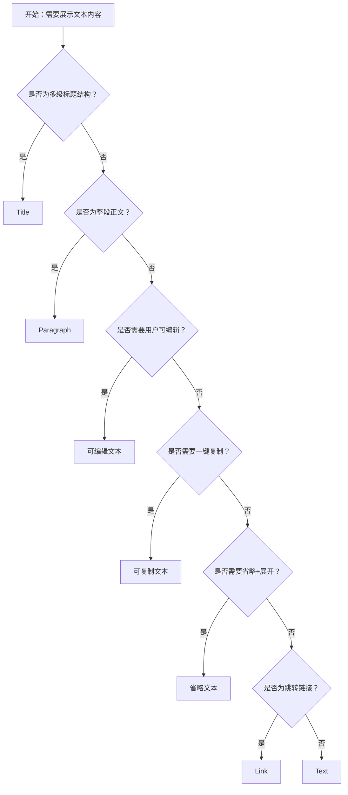

# 1. 简洁易读部份

## 1.0. 组件描述

排版组件用于统一展示标题、段落与文本的格式，并提供基于文本的基础操作（拷贝、省略、可编辑），保证内容的可读性与操作一致性。

## 1.1. 组件构成

排版由以下基础要素构成：

> <!-- 附图占位：建议附上一张示例图，展示排版组件的基础要素（标题层级、段落块、文本样式、操作图标）的构成关系 -->

&emsp;&emsp;1. **标题** 用于建立内容的层级结构，对应 h1–h5 的语义与视觉差异。

&emsp;&emsp;2. **段落** 用于承载整段正文，支持多行排版与块级布局。

&emsp;&emsp;3. **文本** 用于行内或独立短文本，可叠加多种样式（加粗、斜体、删除线、标记、代码等）。

&emsp;&emsp;4. **操作区（可选）** 用于拷贝、编辑等操作，以图标或触发区形式附加在文本旁。

---

## 1.2. 组件包含哪些不同类型

### 1.2.1 文本（Text）

&emsp;**是什么**：最基础的文本展示单元，支持多种样式叠加，用于行内或独立短文本

> <!-- 附图占位：建议附上一张示例图，展示 Text 组件的多种样式（加粗、斜体、删除线、标记、代码、键盘样式）的视觉形态 -->

&emsp;**简单用法**：适用于不需要标题层级的普通文字；可叠加 strong、italic、delete、mark、code、underline、keyboard 等样式；可单独存在或嵌入段落中

&emsp;**典型场景**：表单说明、列表项内容、表格单元格、行内强调或标记

> <!-- 附图占位：建议附上一张场景图，展示 Text 在表单说明、列表项中的使用，体现基础文本的多样式表达 -->

&emsp;**替代方案**：若需建立标题层级，改用 Title；若为整段正文，改用 Paragraph

### 1.2.2 标题（Title）

&emsp;**是什么**：用于建立内容层级的标题组件，支持 h1–h5 五个级别

> <!-- 附图占位：建议附上一张示例图，展示 Title 五个级别（h1–h5）的视觉层级差异 -->

&emsp;**简单用法**：必须用于需要明确层级的标题场景；level 从 1 到 5 对应重要程度递减；同一页面内层级结构需连贯，不可跳级

&emsp;**典型场景**：文章标题、区块标题、卡片标题、弹窗标题

> <!-- 附图占位：建议附上一张场景图，展示页面中 h1 主标题、h2 区块标题、h3 子标题的层级结构 -->

&emsp;**替代方案**：若为普通正文无需层级，改用 Text 或 Paragraph

### 1.2.3 段落（Paragraph）

&emsp;**是什么**：用于承载整段正文的块级文本组件，支持多行排版

> <!-- 附图占位：建议附上一张示例图，展示 Paragraph 组件的块级形态与段落间距 -->

&emsp;**简单用法**：必须用于需要段落语义的正文内容；支持多行、换行与段落间距；可叠加省略、可编辑、可复制等能力

&emsp;**典型场景**：文章正文、描述说明、日志内容、介绍文本

> <!-- 附图占位：建议附上一张场景图，展示 Paragraph 在文章详情、产品描述中的使用 -->

&emsp;**替代方案**：若为单行或短文本，改用 Text

### 1.2.4 可编辑文本

&emsp;**是什么**：支持用户点击后进入编辑状态的文本，编辑完成后可保存

> <!-- 附图占位：建议附上一张示例图，展示可编辑文本的默认态与编辑态（输入框、确认/取消）的切换形态 -->

&emsp;**简单用法**：必须用于允许用户直接修改的文本内容；需提供明确的进入编辑与退出编辑的触发方式；编辑中需有确认与取消的反馈

&emsp;**典型场景**：可编辑的标题、可 inline 修改的列表项、配置项名称

> <!-- 附图占位：建议附上一张场景图，展示可编辑文本在配置页、列表项中的使用流程 -->

&emsp;**替代方案**：若为只读展示，使用普通 Text 或 Paragraph

### 1.2.5 可复制文本

&emsp;**是什么**：附带拷贝功能的文本，用户可一键复制内容到剪贴板

> <!-- 附图占位：建议附上一张示例图，展示可复制文本的形态（文本旁带拷贝图标，悬停或点击后提示「复制」/「复制成功」） -->

&emsp;**简单用法**：必须用于用户需要复制的内容（如订单号、ID、长串文本）；拷贝后需有明确反馈；可选自定义提示文案

&emsp;**典型场景**：订单号、交易号、配置 ID、代码片段、长链接

> <!-- 附图占位：建议附上一张场景图，展示可复制文本在订单详情、配置页中的使用 -->

&emsp;**替代方案**：若内容无需复制，使用普通 Text 或 Paragraph

### 1.2.6 省略文本

&emsp;**是什么**：超出指定行数或宽度时自动省略，并可展开查看完整内容

> <!-- 附图占位：建议附上一张示例图，展示省略文本的省略态与展开态，以及「展开」「收起」触发区 -->

&emsp;**简单用法**：必须用于可能过长的文本，以节省空间；可配置省略行数、是否可展开、后缀等；大量文本时推荐使用 expandable

&emsp;**典型场景**：列表描述、卡片摘要、表格单元格、长路径、长链接

> <!-- 附图占位：建议附上一张场景图，展示省略文本在列表、表格中的使用，体现省略与展开的交互 -->

&emsp;**替代方案**：若内容较短无需省略，使用普通 Text 或 Paragraph

### 1.2.7 链接（Link）

&emsp;**是什么**：用于跳转的文本链接，可单独使用或嵌入段落中

> <!-- 附图占位：建议附上一张示例图，展示 Link 组件的视觉形态（蓝色可点击文字，与普通 Text 区分） -->

&emsp;**简单用法**：必须用于导航到其他页面或打开外部资源；不可用于当前页面的状态改变操作；需符合用户对「点击后跳转」的预期

&emsp;**典型场景**：文档链接、帮助链接、外部引用、跳转详情

> <!-- 附图占位：建议附上一张场景图，展示 Link 在说明区域、引用区域中的使用 -->

&emsp;**替代方案**：若为当前页操作，改用 Button 或 Text+点击

---

## 1.3. 各类型典型场景案例

### 1.3.1 标题层级

> <!-- 附图占位：建议附上一张对比图，左侧展示 h1–h3 层级连贯、结构清晰（符合规范），右侧展示层级跳级或全部同级（违反规范） -->

✅ **推荐：** 标题层级连贯，h1 主标题、h2 区块、h3 子区块，形成清晰结构

❌ **不推荐：** 跳过层级（如 h1 后直接 h4）或所有标题同一级别

### 1.3.2 可编辑与只读

> <!-- 附图占位：建议附上一张对比图，左侧展示可编辑场景使用 editable（符合规范），右侧展示只读内容误用可编辑造成困扰（违反规范） -->

✅ **推荐：** 需用户修改的内容使用可编辑，只读内容使用普通文本

❌ **不推荐：** 只读展示内容设置为可编辑，或关键数据未加权限就开放编辑

### 1.3.3 可复制

> <!-- 附图占位：建议附上一张对比图，左侧展示 ID、订单号等需复制内容使用 copyable（符合规范），右侧展示普通描述文字也加复制（违反规范） -->

✅ **推荐：** 用户需要复制的信息（ID、链接、代码）使用可复制

❌ **不推荐：** 无需复制的普通描述也加复制功能，增加干扰

### 1.3.4 省略与展开

> <!-- 附图占位：建议附上一张对比图，左侧展示长文本使用省略+可展开（符合规范），右侧展示长文本不省略导致布局混乱（违反规范） -->

✅ **推荐：** 可能过长的文本使用省略，并提供展开查看完整内容

❌ **不推荐：** 长文本不省略直接全部展示，导致布局 overflow 或挤压其它内容

### 1.3.5 链接与按钮

> <!-- 附图占位：建议附上一张对比图，左侧展示跳转用 Link、操作用按钮（符合规范），右侧展示当前页操作用 Link 样式（违反规范） -->

✅ **推荐：** 跳转到其他页或外链用 Link，当前页操作用 Button

❌ **不推荐：** 当前页状态改变或提交类操作使用 Link 样式

---

# 2. 选型指南

## 2.1 选择流程

---

# 3. 细致专业部份（交互与排版规则）

## 3.1 多操作的展示与折叠策略（文本层级与操作）

当文本需要附带多种操作（拷贝、编辑、省略）时：

* **主次明确**：同一文本块内，拷贝与编辑等操作以图标形式置于文本旁，不喧宾夺主。
* **操作数量**：单个文本块的附加操作不宜超过 2–3 个（如编辑+复制），过多应收纳到「更多」。
* **省略优先**：当文本过长时，省略为第一优先级，再考虑可复制、可编辑；避免长文本无省略导致布局混乱。
* **层级一致**：同级标题、同级段落的操作方式应保持一致，避免同一页面内规则不统一。

> <!-- 附图占位：建议附上一张场景图，展示文本块旁「编辑」「复制」图标的排列，体现多操作时的主次与数量控制 -->

## 3.2 危险操作（删除/清空/停用）

排版组件本身不直接承载危险操作，但可配合危险状态的文案展示：

* **删除线**：已删除、已作废的内容可使用 delete 样式（删除线）表示无效状态。
* **危险色**：错误提示、危险警告类文本可使用 type="danger" 进行色彩强调。
* **与操作分离**：危险操作（如「删除」「清空」）应由 Button 等组件承载，Typography 负责展示状态或说明文案。
* **不可编辑**：涉及危险操作的数据，在未确认前不宜开放可编辑，避免误改。

> <!-- 附图占位：建议附上一张场景图，展示删除线样式与危险色文本的用法，以及与危险按钮的配合 -->

## 3.3 摆放位置（按页面场景划分）

* **页面主标题**：使用 h1 级别的 Title，置于页面顶部，与全局操作区对齐。
* **区块标题**：使用 h2 或 h3，置于区块顶部左侧，与区块内容左对齐。
* **正文区**：Paragraph 用于正文块，与标题保持适当间距，段落间有明确分隔。
* **表单说明**：Text 或 Paragraph 置于表单项下方或右侧，用于说明、提示。
* **列表/表格**：Text 用于单元格内容，可配合省略、可复制；Title 用于表头或分组标题。
* **弹窗/抽屉**：标题用 Title，正文用 Paragraph，操作说明用 Text。

> <!-- 附图占位：建议附上一张场景图，展示标题、段落、文本在不同页面区块中的标准摆放位置 -->

## 3.4 顺序与对齐逻辑

* **标题顺序**：自上而下按 h1 → h2 → h3 依次递减，不可倒序或跳级。
* **段落顺序**：按阅读顺序自上而下排列，段落间保持统一间距。
* **操作图标**：编辑、复制等图标宜放在文本右侧，与文本基线对齐；多个图标时按使用频率从左到右排列。
* **省略后缀**：省略时的「展开」等后缀应紧跟在省略号后，不单独换行。

## 3.5 状态与交互反馈

* **默认**：文本清晰可读，与背景对比足够。
* **可编辑**：进入编辑态时，输入框获得焦点，原有文本可被修改；确认与取消需有明确反馈。
* **可复制**：点击复制后，需有「复制成功」等提示；图标可短暂切换为「已复制」状态。
* **省略展开**：点击「展开」后，文本完整显示，「收起」可折叠回省略态。
* **禁用**：disabled 状态下文本置灰，不可编辑、不可复制。
* **加载中**：若文本需异步加载，可配合骨架屏或占位符，避免空白。

## 3.6 视觉规范与形态选择

* **字号与层级**：h1 最大，h5 最小；正文与 Text 需满足可读性，小字号不低于 12px。
* **字重**：标题使用加粗，正文使用常规；强调处可用 strong。
* **颜色**：primary 用于链接，danger 用于错误或警告，success 用于成功态，secondary 用于辅助说明。
* **代码样式**：技术内容（如 API、命令）使用 code 样式，与正文区分。
* **删除线与标记**：delete 用于已废弃内容，mark 用于高亮标记，需克制使用。

> <!-- 附图占位：建议附上一张示例图，展示不同 type、不同样式的文本在界面中的层级与搭配 -->

---

## 4.0. 常见问题

### 1. Title、Paragraph、Text 怎么选？

- **Title**：需要建立标题层级时使用，对应 h1–h5。
- **Paragraph**：整段正文、多行内容使用，有块级段落语义。
- **Text**：行内短文本、需叠加多种样式（加粗、斜体、标记等）时使用，最灵活。

### 2. 省略时用 expandable 还是 tooltip？

- **大量文本**：优先使用 expandable，让用户可展开查看完整内容。
- **少量超出**：可使用 tooltip 在悬停时展示完整内容，无需点击展开。
- **表格单元格**：若空间紧张，省略+tooltip 即可；若用户常需复制完整内容，可配合可复制。

### 3. 可编辑文本的确认方式有哪些？

- 常见为：按 Enter 确认，按 ESC 取消；或提供明确的「确认」「取消」按钮。图标触发时，确认图标（如勾选）和取消图标（如关闭）应清晰可辨。编辑中若有字数限制，需提前提示。
