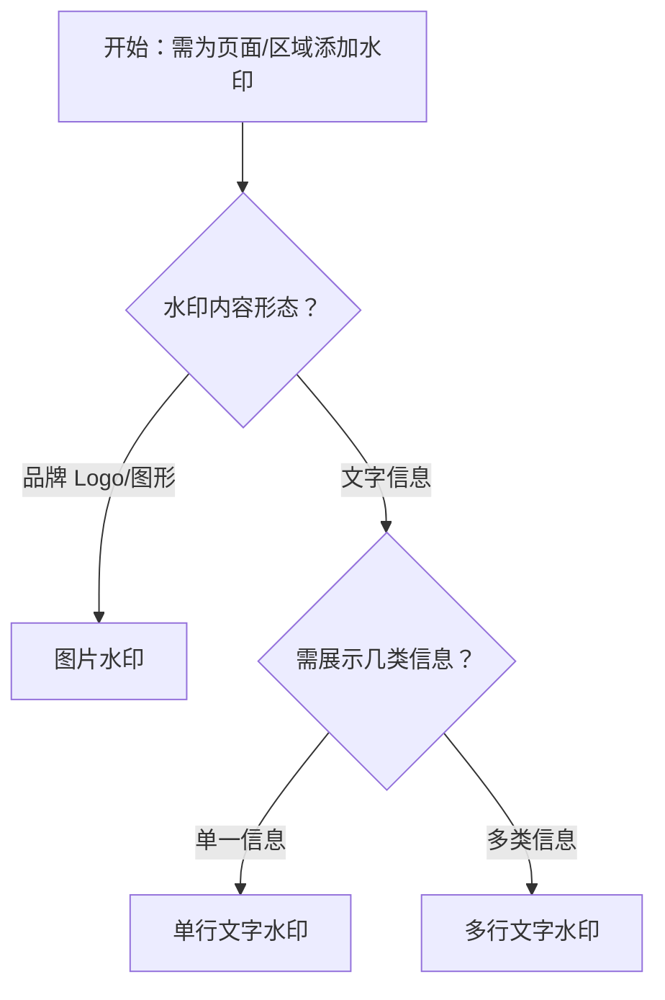

# 1. 简洁易读部份

## 1.0. 组件描述

水印组件用于在页面或指定区域内叠加标识，以文字或图片形式平铺展示，达到版权声明、防泄密、溯源等目的，在保证内容可读的前提下形成持续的视觉标记。

## 1.1. 组件构成

水印由以下基础要素构成，可按需组合使用：

> <!-- 附图占位：建议附上一张示例图，展示水印的平铺区域、单块水印（文字或图片）、旋转角度、间距等构成关系，标注各要素名称与位置 -->

&emsp;&emsp;1. **水印内容** 单块水印的载体，可为文字或图片，承载版权、用户标识、公司名称等信息。

&emsp;&emsp;2. **平铺区域** 水印重复覆盖的容器范围，通常为整个页面或指定区块，通过间距与偏移形成网格排布。

&emsp;&emsp;3. **旋转角度** 单块水印的旋转角度，默认倾斜以区分于正文，同时保持整体协调。

&emsp;&emsp;4. **透明度与颜色** 水印需半透明，确保不干扰正文阅读，又能清晰可辨。

&emsp;&emsp;5. **间距与偏移** 水印块之间的水平与垂直间距，以及相对容器左上角的偏移，影响密度与美观。

---

## 1.2. 组件包含哪些不同类型

### 1.2.1 单行文字水印

&emsp;**是什么**：使用单行文字作为水印内容，如公司名称、用户名、版权信息，平铺于指定区域。

> <!-- 附图占位：建议附上一张示例图，展示单行文字水印（如「Ant Design」）平铺的视觉形态 -->

&emsp;**简单用法**：必须用于需标识版权或归属的场景；文字需简洁、可识别；透明度与字号需平衡可读与干扰

&emsp;**典型场景**：文档预览、报表导出、内部系统页面、合同预览

> <!-- 附图占位：建议附上一张场景图，展示文档预览页面的单行文字水印平铺效果 -->

&emsp;**替代方案**：若需多行信息，改用多行文字水印

### 1.2.2 多行文字水印

&emsp;**是什么**：使用多行文字作为水印内容，如「公司名称 + 用户 + 时间」，单块水印内换行展示。

> <!-- 附图占位：建议附上一张示例图，展示多行文字水印（如两行：公司名 + 用户名）的平铺形态 -->

&emsp;**简单用法**：必须用于需同时展示多种信息的场景；行数不宜过多；每行需保持可读性与整体协调

&emsp;**典型场景**：敏感报表、审计文档、多维度溯源信息

> <!-- 附图占位：建议附上一张场景图，展示报表页面的多行文字水印（公司 + 用户 + 导出时间）效果 -->

&emsp;**替代方案**：若仅需单一信息，使用单行文字水印即可

### 1.2.3 图片水印

&emsp;**是什么**：使用图片（如 Logo、徽标）作为水印内容，平铺于指定区域。

> <!-- 附图占位：建议附上一张示例图，展示图片水印（如 Logo）平铺的视觉形态 -->

&emsp;**简单用法**：必须用于需品牌标识或图形溯源的场景；图片需简洁、辨识度高；建议使用高清图（如 2x、3x）并设置合适宽高以防拉伸

&emsp;**典型场景**：设计稿预览、品牌文档、对外展示页

> <!-- 附图占位：建议附上一张场景图，展示设计稿预览页的 Logo 图片水印效果 -->

&emsp;**替代方案**：若图片加载异常，可同时配置文字水印作为兜底

---

## 1.3. 各类型典型场景案例

### 1.3.1 文字与图片水印的选择

> <!-- 附图占位：建议附上一张对比图，左侧展示版权/用户信息用文字水印（符合规范），右侧展示品牌标识用图片水印（符合规范） -->

✅ **推荐：** 版权、用户名、时间等用文字水印；品牌 Logo 等用图片水印

❌ **不推荐：** 用图片承载长段文字，导致模糊难读；用文字替代 Logo 导致品牌感不足

### 1.3.2 透明度与可读性平衡

> <!-- 附图占位：建议附上一张对比图，左侧展示适度透明的水印不干扰正文（符合规范），右侧展示过深或过浅的水印（违反规范） -->

✅ **推荐：** 水印半透明，可辨识但不抢占正文注意力

❌ **不推荐：** 水印过深影响阅读；水印过浅无法起到标识作用

### 1.3.3 水印与弹出层的关系

> <!-- 附图占位：建议附上一张对比图，左侧展示 Modal、Drawer 继承父级水印（符合规范），右侧展示弹出层无水印导致泄露风险（违反规范） -->

✅ **推荐：** 重要内容的 Modal、Drawer 等应继承或单独施加水印

❌ **不推荐：** 主页面有水印但弹出层无水印，截图时绕过标识

---

# 2. 选型指南

## 2.1 选择流程

---

# 3. 细致专业部份（交互与排版规则）

## 3.1 何时使用水印

* **适用场景**：页面需添加版权或归属标识；防止敏感信息被截图或拍照后无溯源；内部系统、报表、合同等需声明来源。
* **不适用场景**：公开营销页、无需标识的展示页，水印可能干扰视觉；若仅防截图为目的但无溯源需求，可考虑其他手段。

> <!-- 附图占位：建议附上一张对比图，展示适合加水印与不适合加水印的页面类型 -->

## 3.2 文字水印的撰写与样式

* **内容**：公司名称、用户名、日期、版权声明等，需简洁可读。
* **字号与颜色**：字号不宜过大以免干扰正文；颜色通常为灰色系，透明度约 0.1～0.2，保证可辨且不抢眼。
* **字体**：使用系统或项目通用字体，保持与页面风格一致。

> <!-- 附图占位：建议附上一张示例图，展示文字水印的字号、颜色、透明度的合理区间 -->

## 3.3 图片水印的配置与兜底

* **图片质量**：建议使用 2x 或 3x 图，并设置合适宽高，避免拉伸模糊。
* **兜底**：图片加载异常时，可同时配置文字水印作为兜底，确保水印不失效。
* **尺寸**：单块图片水印不宜过大，避免过度遮挡内容。

> <!-- 附图占位：建议附上一张示例图，展示图片水印的尺寸设置与文字兜底的配置方式 -->

## 3.4 平铺参数：间距、偏移与旋转

* **间距**：水印块之间的水平与垂直间距需适中，过密影响阅读，过疏降低覆盖效果。
* **偏移**：相对容器左上角的偏移可微调整体位置，避免与版心重叠。
* **旋转**：默认约 -22° 的倾斜，既能与正文区分，又不过分倾斜影响识别。

> <!-- 附图占位：建议附上一张示例图，展示不同间距、偏移、旋转对水印视觉效果的影响 -->

## 3.5 与 Modal、Drawer 的传导

* **传导机制**：水印可传导至 Modal、Drawer 等弹出层，避免用户通过弹窗内容截图绕过水印。
* **配置**：根据业务需要，可选择在弹出层内继承水印或单独施加，确保敏感内容均有标识。

> <!-- 附图占位：建议附上一张场景图，展示主页面与 Modal 内水印的一致性 -->

## 3.6 安全与防护边界

* **防护目标**：水印主要用于溯源与声明，不能替代权限控制、数据脱敏等安全措施。
* **技术限制**：用户仍可能通过裁剪、覆盖等方式规避水印，需结合业务场景合理预期其作用。
* **overflow 处理**：容器默认 overflow 行为可能影响水印展示，必要时可通过样式覆盖调整，确保水印在预期区域内可见。

> <!-- 附图占位：建议附上一张说明图，展示水印的防护边界与配合其他安全措施的建议 -->

---

## 4.0. 常见问题

### 1. 文字水印和图片水印如何选择？

- **文字水印**：适合版权、用户名、时间、公司名称等可编辑、可变的文本信息，灵活且易于维护。
- **图片水印**：适合品牌 Logo、徽标等图形标识，视觉识别度高，但需注意图片质量与加载兜底。

### 2. 图片水印加载失败怎么办？

可同时配置 `content` 文字水印，当图片加载异常时，文字水印作为兜底，确保页面仍有水印展示，不因图片失败而完全失效。

### 3. 水印会不会影响阅读？

水印通过透明度与颜色控制，应处于「可辨识但不抢占注意力」的区间。若配置得当，对正常阅读影响较小；若感觉干扰明显，可适当降低不透明度或减小字号、拉大间距。
