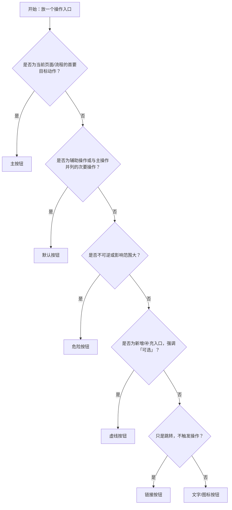

# 1. 简洁易读部份

## 1.0. 组件描述

按钮组件用于明确标识用户可执行的操作入口，并通过视觉层级引导用户做出符合业务优先级的决策。

## 1.1. 组件构成

按钮由以下基础要素构成，可按需组合使用：

> <!-- 附图占位：建议附上一张示例图，展示按钮的三个基础要素（容器、文本、图标）的构成关系，标注各要素名称与位置 -->

&emsp;&emsp;1. **容器** 定义按钮的点击区域与整体形态，用于承载不同按钮类型与状态。

&emsp;&emsp;2. **文本** 表达操作或跳转的语义，可为空（如纯图标按钮），但语义必须可被识别。

&emsp;&emsp;3. **图标** 用于增强识别效率或节省空间，可单独存在或与文本组合使用。

---

## 1.2. 组件包含哪些不同类型

### 1.2.1 主按钮

&emsp;**是什么**：标识页面或流程中最重要的唯一主操作

> <!-- 附图占位：建议附上一张示例图，展示主按钮（实心填充、蓝色背景）的视觉形态，体现其在七种按钮类型中最高的视觉优先级 -->

&emsp;**简单用法**：一个页面或对话框中只能有一个主按钮；必须用于用户当前任务的主要目标操作；必须放置在操作组的首位或最显眼位置

&emsp;**典型场景**：表单提交、确认对话框、流程推进

> <!-- 附图占位：建议附上一张场景图，展示表单底部主按钮（「提交」）与默认按钮（「取消」）组合排列的布局，体现主按钮唯一性与视觉首要位置 -->

&emsp;**替代方案**：若页面有多个同等重要操作，改用默认按钮

### 1.2.2 默认按钮

&emsp;**是什么**：标识常规操作或与主操作并列的次要操作

> <!-- 附图占位：建议附上一张示例图，展示默认按钮（描边样式、白色背景）的视觉形态，与主按钮并排体现两者的层级差异 -->

&emsp;**简单用法**：可与主按钮配合使用；可在同一页面出现多个；必须用于非主流程但仍需强调的操作

&emsp;**典型场景**：重置表单、取消操作、查看详情

> <!-- 附图占位：建议附上一张场景图，展示操作区中「重置」（默认按钮）与「提交」（主按钮）并列的布局，体现默认按钮作为次要操作的配合使用方式 -->

&emsp;**替代方案**：若操作不需要强调，改用文本按钮或链接按钮

### 1.2.3 虚线按钮

&emsp;**是什么**：标识添加或创建类的辅助操作入口

> <!-- 附图占位：建议附上一张示例图，展示虚线按钮（虚线描边、含加号图标与「添加」文字）的视觉形态，体现其「新增/创建」的语义暗示 -->

&emsp;**简单用法**：必须用于引导用户添加内容或创建新项；不可用于删除或确认类操作；常与列表或卡片配合

&emsp;**典型场景**：添加表单项、上传文件区域、创建新条目

> <!-- 附图占位：建议附上一张场景图，展示列表末尾的「+ 添加一行」虚线按钮，体现其在内容扩展场景中引导用户新增条目的使用方式 -->

&emsp;**替代方案**：若不涉及添加创建，改用默认按钮或文本按钮

### 1.2.4 文本按钮

&emsp;**是什么**：提供弱化的操作入口，不干扰主要内容

> <!-- 附图占位：建议附上一张示例图，展示文本按钮（无边框、无背景、深色文字）的视觉形态，与默认按钮对比体现弱化视觉层级 -->

&emsp;**简单用法**：必须用于低优先级或高频重复操作；不可用于首次或关键任务的主操作；必须确保文字足够清晰可点击

&emsp;**典型场景**：表格内批量操作、展开收起、查看更多

> <!-- 附图占位：建议附上一张场景图，展示表格行内「编辑」「删除」等文本按钮的并列排列，体现其在高频轻量操作场景中不干扰主体内容的使用方式 -->

&emsp;**替代方案**：若操作需要跳转到新页面，改用链接按钮

### 1.2.5 链接按钮

&emsp;**是什么**：提供页面跳转或外链访问的入口

> <!-- 附图占位：建议附上一张示例图，展示链接按钮（蓝色文字、无边框）的视觉形态，与文本按钮对比体现其跳转导航的语义差异 -->

&emsp;**简单用法**：必须用于导航到其他页面或打开外部资源；不可用于当前页面的状态改变或数据提交；必须符合用户对「点击后离开当前页」的预期

&emsp;**典型场景**：跳转到详情页、打开帮助文档、访问外部系统

> <!-- 附图占位：建议附上一张场景图，展示列表或详情区域中「查看详情」「查看帮助文档」等链接按钮的使用位置，体现点击后跳转至新页面的导航语义 -->

&emsp;**替代方案**：若操作不涉及跳转，改用文本按钮

### 1.2.6 危险按钮

&emsp;**是什么**：标识会造成不可逆或高风险后果的操作入口

> <!-- 附图占位：建议附上一张示例图，展示危险按钮（红色实心或红色描边）的视觉形态，体现其与常规按钮明显区分的高风险警示语义 -->

&emsp;**简单用法**：必须仅用于删除、清空、停用、重置等高风险操作；必须通过危险样式提示风险；必须配合二次确认或额外校验（如确认弹窗、输入确认信息）

&emsp;**典型场景**：删除数据、清空配置、移除成员、停用服务

> <!-- 附图占位：建议附上一张场景图，展示触发危险操作后弹出的二次确认弹窗，弹窗内含红色警示执行按钮（「确认删除」）与「取消」按钮，体现拦截与风险提示机制 -->

&emsp;**替代方案**：若操作可撤销或风险较低，改用主按钮或默认按钮

### 1.2.7 下拉按钮

&emsp;**是什么**：将一组同类操作收纳到一个入口中，点击后展开可选项

> <!-- 附图占位：建议附上一张示例图，展示下拉按钮展开后的菜单形态（主操作文字 + 右侧下拉箭头 + 展开的选项列表），体现主次操作收纳的视觉结构 -->

&emsp;**简单用法**：必须用于「一个主操作 + 多个相关次操作」或「多个同类操作」的场景；默认项应是最常用或推荐项；下拉项数量不宜过多，且命名需清晰可区分

&emsp;**典型场景**：保存/另存为、创建多种类型对象、更多操作（同类动作集合）

> <!-- 附图占位：建议附上一张场景图，展示工具栏中「新建」下拉按钮展开后显示「新建项目」「新建模板」等同类操作选项的布局，体现多种同类操作收纳至单一入口的使用场景 -->

&emsp;**替代方案**：若选项很少且重要性差异明显，改用主按钮 + 默认按钮；若选项过多或结构复杂，改用菜单或分组操作区

---

## 1.3. 各类型典型场景案例

### 1.3.1 主命令按钮

> <!-- 附图占位：建议附上一张对比图，左侧展示操作区只有一个主按钮（符合规范），右侧展示同一操作区中两个同等强调的主按钮并列（违反规范） -->

✅ **推荐：** 用主按钮承载当前视图最重要的操作

❌ **不推荐：** 同一视图出现多个同等强调的主要操作

### 1.3.2 默认按钮

> <!-- 附图占位：建议附上一张对比图，左侧展示主按钮与默认按钮合理配合的布局（符合规范），右侧展示操作区缺乏明确主操作、全部使用默认按钮强行并列（违反规范） -->

✅ **推荐：** 默认按钮可独立存在，也可与主命令并列

❌ **不推荐：** 不要为了「看起来完整」而在没有明确主操作的场景中强行设置主按钮

### 1.3.3 虚线按钮

> <!-- 附图占位：建议附上一张对比图，左侧展示虚线按钮用于「添加条目」入口（符合规范），右侧展示虚线按钮用于「提交表单」等关键动作（违反规范） -->

✅ **推荐：** 弱强调的「添加/扩展/补充入口」使用虚线按钮

❌ **不推荐：** 用虚线按钮承载提交/确认等关键动作

### 1.3.4 文字和链接按钮

> <!-- 附图占位：建议附上一张对比图，左侧展示行内轻量操作使用文字按钮、跳转操作使用链接按钮并正确区分（符合规范），右侧展示页面级主要操作位置使用文字按钮导致主次层级模糊（违反规范） -->

✅ **推荐：** 行内/轻量入口使用文字按钮或文字链接，按「是否跳转」区分

❌ **不推荐：** 在页面级主要操作位置使用文字按钮，导致主次不清

### 1.3.5 下拉按钮

> <!-- 附图占位：建议附上一张对比图，左侧展示操作数量超过3个时将次要操作收纳至下拉菜单（符合规范），右侧展示同一层级平铺五个以上操作按钮造成选择困难（违反规范） -->

✅ **推荐：** 同一操作区域可见按钮不宜超过 3 个，超出收纳到下拉按钮

❌ **不推荐：** 将大量操作平铺在同一层级，造成选择困难

---

# 2. 选型指南

## 2.1 选择流程

---

# 3. 细致专业部份（交互与排版规则）

为了保持界面清爽并降低用户的误触率，当同一区域出现多个操作时，请参考以下排版和交互规则：

## 3.1 多操作的展示与折叠策略

在列表页（如表格顶部工具栏）或内容详情页中，当操作项过多时，需按以下逻辑决定按钮的去留：

* **可见数量**：同一操作区域内，建议最多同时展示 3 个按钮。
* **优先展示**：与当前页面核心业务强相关的**高频操作**（如：新建、编辑、保存），必须直接展示在界面上。
* **优先折叠**：使用频率极低的**边缘操作**（如：导出日志），以及需要防范误触的**危险操作**（在非核心流程下的删除、停用等），建议收纳进「更多」下拉菜单中。

> <!-- 附图占位：建议附上一张场景图，展示表格工具栏中「新建」「导出」两个直接可见按钮与「更多」下拉菜单的组合布局，体现高频操作直接展示、低频与危险操作收纳折叠的策略 -->

## 3.2 危险操作（删除/清空/停用）

**如何界定「危险操作」？**

* **属于危险**：会修改或删除已保存的数据，或者会影响线上运行状态的操作（例如：删除已有记录、停用节点实例）。
* **不属于危险**：只是移除当前还没保存的临时内容（例如：把刚才点错新增、但还没提交的空白表单行删掉）。

**针对危险操作的处理建议：**

* **视觉层级让渡**：危险操作在与主按钮处于同一操作区时，**其视觉表现绝对不能抢过主按钮（主按钮的优先级必须始终最高）**。需通过幽灵按钮、文字标红等方式进行视觉降级。

> <!-- 附图占位：建议附上一张对比图，展示危险按钮（如「停用」）与主按钮（如「保存」）在同一操作区中的视觉层级关系——危险按钮以幽灵样式或文字标红降级，主按钮视觉始终最突出 -->

* **二次确认与警示**：执行危险操作前必须加上弹窗拦截；且在二次确认弹窗内的最终执行按钮，推荐用警示色（如红色实心）来明确提醒风险。
* **位置靠后**：在同一组按钮里，危险操作通常排在最后或最底端，尽量跟主要操作拉开物理距离。

> <!-- 附图占位：建议附上一张场景图，展示操作区按钮排列顺序，危险按钮（如「删除」）位于末尾位置，与主要操作拉开物理距离，体现位置隔离防误触的原则 -->

## 3.3 摆放位置（按页面场景划分）

为了让用户在不同场景下都能符合直觉地找到按钮，建议根据具体的交互场景来放置：

* **长表单（吸底跟随）**：当表单内容很长、需要翻页滚动时，保存/提交按钮建议固定在浏览器底部悬浮（吸底），确保用户填到哪都能直接提交。

> <!-- 附图占位：建议附上一张场景图，展示长表单页面中「取消」「提交」按钮固定在浏览器视口底部悬浮的布局，体现用户滚动表单时按钮始终可见的吸底跟随效果 -->

* **短表单（内容底部）**：当表单较短时，按钮直接放在表单内容的最后面即可，顺应用户自上而下的浏览视线。

> <!-- 附图占位：建议附上一张场景图，展示短表单内容下方直接放置「取消」「提交」按钮的布局，体现顺应自上而下视线流向的自然排列方式 -->

* **全局操作（页面头部/列表顶部）**：针对整个页面的通用操作（如新建、刷新），通常放在页面标题的右上角或表格上方。

> <!-- 附图占位：建议附上一张场景图，展示页面标题右侧放置「新建」「刷新」等全局操作按钮的布局，体现全局操作入口的标准摆放位置 -->

* **局部区块操作**：只对某个信息卡片生效的按钮，一般放在该区块标题的右侧。

> <!-- 附图占位：建议附上一张场景图，展示信息卡片标题右侧放置「编辑」「更多」等局部操作按钮的布局，体现区块操作入口与区块标题的对应关系 -->

* **表格单行操作**：放在表格每一行最右侧的操作列（Action）。

> <!-- 附图占位：建议附上一张场景图，展示表格每行最右侧操作列（Action Column）放置「编辑」「删除」等文字按钮的布局，体现行级操作入口的标准位置 -->

## 3.4 顺序与对齐逻辑

按钮的排列应顺应用户的「视线流向」与业务逻辑时间线：

* **列表/工具栏（靠右对齐视线）**：当操作区整体靠页面右侧时，主操作应放置在视线的最终落点（最靠近内容边缘）。从左到右的顺序为：**默认按钮 ➔ 默认按钮 ➔ 主按钮 ➔ 更多（下拉图标）**。

> <!-- 附图占位：建议附上一张场景图，展示列表工具栏从左到右「默认按钮 → 默认按钮 → 主按钮 → 更多图标」的排列顺序与整体靠右对齐的布局，体现视线落点引导 -->

* **常规表单底部（按动作流转）**：推荐从左到右顺序为：**取消/重置 ➔ 默认操作 ➔ 主要操作（提交）**。

> <!-- 附图占位：建议附上一张场景图，展示表单底部「取消 → 重置 → 提交（主按钮）」从左到右的排列顺序，体现操作从轻到重、符合业务流转时间线的对齐逻辑 -->

* **分步表单**：严格按照业务流转的时间线从左到右排列：取消/重置 ➔ 上一步 ➔ 下一步/提交（主按钮）。「下一步」与「提交」不应同时出现。

> <!-- 附图占位：建议附上一张场景图，展示分步表单底部「取消 → 上一步 → 下一步（主按钮）」的按钮排列，体现严格按业务时间线从左到右流转、「下一步」与「提交」不同时出现的排列规则 -->

## 3.5 状态与交互反馈

按钮必须提供清晰、可感知的状态与视觉反馈：

* **默认**：可点击性明确，边界清晰。
* **悬停**：提供可点击暗示（如改变底色深浅或增加阴影）。
* **按下**：提供明确的按压物理反馈。
* **禁用**：当条件不满足时必须置灰禁用，**严禁以「点击后报错」代替禁用状态**。
* **加载中**：异步或耗时操作触发后必须进入加载状态，并暂时锁定按钮，阻止用户重复点击提交。
* **成功/失败**：操作完成后，需通过页面变化、全局提示明确告知结果；若失败，需明确原因或下一步处理方式。

## 3.6 视觉规范与形态选择

**文本与图标的表达方式选择：**

* **仅图标**：适用于高频、行业共识强且不依赖上下文推理的操作（如：搜索、设置）。常见于表格行内或工具栏紧凑区域。
  * **要求**：必须提供悬停提示（Tooltip）作为文字说明；同一页面内相同图标语义必须绝对一致。

> <!-- 附图占位：建议附上一张示例图，展示纯图标按钮（如搜索图标、设置图标）在工具栏中的紧凑排列形态，以及悬停时出现文字 Tooltip 的交互效果 -->

* **仅文字**：适用于语义明确且不需要强化识别的常规操作，优先用于空间充足区域。
  * **要求**：文案必须为动词或动宾结构（如「新建项目」、「保存」），避免抽象的名词化表达。

> <!-- 附图占位：建议附上一张示例图，展示纯文字按钮（无图标、文案为「新建项目」「保存」等动宾结构）的形态，体现语义明确、空间充足场景下的简洁表达 -->

* **文字 + 图标**：适用于需要更强可发现性、更快识别的关键操作或新用户引导场景。
  * **要求**：图标不得改变文字原有的语义；图标与文字组合需保持稳定的排列顺序（通常图标在左）与标准间距。

> <!-- 附图占位：文字加图标形态示意图 -->

---

## 4.0. 常见问题

### 1. 文字按钮和链接按钮的区别是什么

- **文字按钮（黑色/灰色）**：点击它是为了在**当前页面**搞点事情（比如展开内容、批量删除），鼠标指上去会显出一个**浅灰色的小方块**。

- **链接按钮（蓝色）**：点击它是为了**跳到别的地方**（比如看详情、开新网页），鼠标指上去通常只是**文字变色**，像个普通的网页链接。
