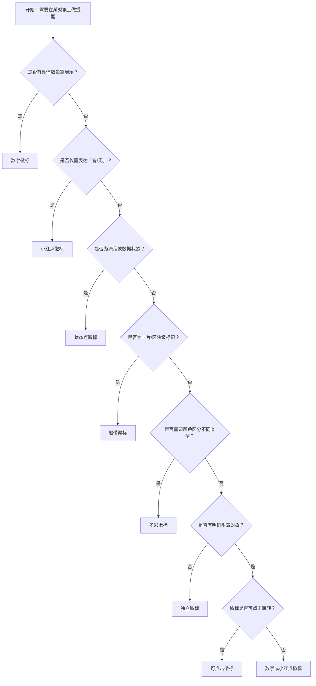

# 1. 简洁易读部份

## 1.0. 组件描述

徽标数组件用于在图标或头像的角位展示需要处理的消息条数、状态或标记，通过醒目的视觉形式吸引用户关注并驱动操作。

## 1.1. 组件构成

徽标由以下基础要素构成，可按需组合使用：


&emsp;&emsp;1. **附着对象** 徽标所依附的宿主元素，通常为图标、头像或可点击入口，定义徽标的展示位置基准。

&emsp;&emsp;2. **指示器** 徽标的主体区域，承载数字、小红点或状态样式，用于传达数量或状态信息。

&emsp;&emsp;3. **数值或形态** 指示器内的具体内容，可为数字、纯点或状态色，定义徽标所传达的语义。

---

## 1.2. 组件包含哪些不同类型

### 1.2.1 数字徽标

&emsp;**是什么**：在角位展示具体数字，用于表达待处理数量或统计信息

<!-- 附图占位：建议附上一张示例图，展示数字徽标（如 5、99、99+）的视觉形态，体现数字在圆角矩形或圆形内的排版 -->
<!-- [▶ 在线演示](https://infrad.shopee.io/playground/?agent_code_id=485) -->
```react
function App() {
  const { Badge, Avatar, Space } = Infrad;
  return (
    <Space size={32} wrap>
      <Badge count={5}><Avatar shape="square" size={48} style={{ background: '#d9d9d9' }} /></Badge>
      <Badge count={99}><Avatar shape="square" size={48} style={{ background: '#d9d9d9' }} /></Badge>
      <Badge count={100}><Avatar shape="square" size={48} style={{ background: '#d9d9d9' }} /></Badge>
      <Badge count={368} overflowCount={999}><Avatar shape="square" size={48} style={{ background: '#d9d9d9' }} /></Badge>
    </Space>
  );
}
```

&emsp;**简单用法**：必须用于有明确数量可展示的场景；数值为 0 时默认不展示（可配置展示）；超过封顶值（如 99）时显示为「99+」等截断形式

&emsp;**典型场景**：消息未读数、待办数量、购物车件数、通知提醒

<!-- 附图占位：建议附上一张场景图，展示导航栏或侧边栏图标上的数字徽标，体现待处理数量的提醒作用 -->
<!-- [▶ 在线演示](https://infrad.shopee.io/playground/?agent_code_id=447) -->
```react
function App() {
  const { Badge, Space } = Infrad;
  const { BellOutlined, MessageOutlined, ShoppingCartOutlined, FileOutlined } = Icons;
  const iconStyle = { fontSize: 24, color: '#555', padding: 8 };
  return (
    <Space size={40}>
      <Badge count={3}><BellOutlined style={iconStyle} /></Badge>
      <Badge count={12}><MessageOutlined style={iconStyle} /></Badge>
      <Badge count={5}><ShoppingCartOutlined style={iconStyle} /></Badge>
      <Badge count={100} overflowCount={99}><FileOutlined style={iconStyle} /></Badge>
    </Space>
  );
}
```

&emsp;**替代方案**：若仅需「有/无」提醒而无具体数量，改用小红点

### 1.2.2 小红点徽标

&emsp;**是什么**：不展示数字，仅显示一个小红点，用于表达「有待处理」的二元状态

<!-- 附图占位：建议附上一张示例图，展示小红点徽标（无数字、纯色圆点）的视觉形态，与数字徽标对比体现简化表达 -->
<!-- [▶ 在线演示](https://infrad.shopee.io/playground/?agent_code_id=470) -->
```react
function App() {
  const { Badge, Avatar, Space } = Infrad;
  return (
    <Space size={40} align="center">
      <Badge dot><Avatar shape="square" size={48} style={{ background: '#d9d9d9' }} /></Badge>
      <Badge dot><Avatar shape="square" size={48} style={{ background: '#d9d9d9', borderRadius: '50%' }} /></Badge>
      <Badge dot><Avatar size={48} style={{ background: '#b0c4de' }} /></Badge>
    </Space>
  );
}
```

&emsp;**简单用法**：必须用于仅需表达「有内容」而非具体数量的场景；不可与数字徽标混用于同一语义；红点需足够醒目但不过度抢眼

&emsp;**典型场景**：新消息提醒、功能更新提示、待办存在标记

<!-- 附图占位：建议附上一张场景图，展示设置图标或功能入口上的小红点，体现二元状态提醒的使用方式 -->
<!-- [▶ 在线演示](https://infrad.shopee.io/playground/?agent_code_id=449) -->
```react
function App() {
  const { Badge, Space } = Infrad;
  const { SettingOutlined, AppstoreOutlined, UserOutlined } = Icons;
  const iconStyle = { fontSize: 24, color: '#555', padding: 8 };
  return (
    <Space size={40}>
      <Badge dot><SettingOutlined style={iconStyle} /></Badge>
      <Badge dot><AppstoreOutlined style={iconStyle} /></Badge>
      <Badge dot><UserOutlined style={iconStyle} /></Badge>
    </Space>
  );
}
```

&emsp;**替代方案**：若需展示具体数量，改用数字徽标

### 1.2.3 状态点徽标

&emsp;**是什么**：以小圆点配合颜色表达状态（如成功、处理中、错误、警告），可附带文字说明

<!-- 附图占位：建议附上一张示例图，展示状态点徽标（成功绿、错误红、处理中蓝、警告黄）的视觉形态及与文字的搭配 -->
<!-- [▶ 在线演示](https://infrad.shopee.io/playground/?agent_code_id=450) -->
```react
function App() {
  const { Badge, Space } = Infrad;
  return (
    <Space direction="vertical" size={12}>
      <Badge status="success" text="已完成" />
      <Badge status="processing" text="处理中" />
      <Badge status="error" text="失败" />
      <Badge status="warning" text="待确认" />
      <Badge status="default" text="未开始" />
    </Space>
  );
}
```

&emsp;**简单用法**：必须用于流程状态、数据状态或系统状态的可视化；颜色语义需符合通用约定；可搭配 status 与 text 展示

&emsp;**典型场景**：订单状态、审核进度、设备在线状态、任务执行结果

<!-- 附图占位：建议附上一张场景图，展示列表项或详情区域中状态点与「已完成」「处理中」等文字并排的布局 -->
<!-- [▶ 在线演示](https://infrad.shopee.io/playground/?agent_code_id=451) -->
```react
function App() {
  const { Badge, Space } = Infrad;
  const rows = [
    { label: '订单 #20240401', status: 'success', text: '已完成' },
    { label: '订单 #20240402', status: 'processing', text: '处理中' },
    { label: '订单 #20240403', status: 'error', text: '已退款' },
    { label: '订单 #20240404', status: 'warning', text: '待确认' },
  ];
  return (
    <div style={{ width: 280 }}>
      {rows.map((r, i) => (
        <div key={i} style={{ display: 'flex', justifyContent: 'space-between', alignItems: 'center', padding: '10px 0', borderBottom: '1px solid #f0f0f0' }}>
          <span style={{ fontSize: 14, color: '#333' }}>{r.label}</span>
          <Badge status={r.status} text={r.text} />
        </div>
      ))}
    </div>
  );
}
```

&emsp;**替代方案**：若需展示数量而非状态，改用数字徽标

### 1.2.4 独立徽标

&emsp;**是什么**：不包裹任何子元素，独立展示的徽标，可自定义布局与样式

<!-- 附图占位：建议附上一张示例图，展示独立徽标（无附着对象、自定位置）的视觉形态 -->
<!-- [▶ 在线演示](https://infrad.shopee.io/playground/?agent_code_id=452) -->
```react
function App() {
  const { Badge, Space } = Infrad;
  return (
    <Space size={32}>
      <Badge count={8} />
      <Badge count={99} />
      <Badge count={100} overflowCount={99} />
      <Badge dot />
    </Space>
  );
}
```

&emsp;**简单用法**：必须用于需要将徽标作为独立视觉元素的场景；右上角独立徽标限定为红色；需明确其与页面其他元素的语义关联

&emsp;**典型场景**：统计角标、独立数量展示、自定义布局的提醒区

<!-- 附图占位：建议附上一张场景图，展示独立徽标在页面某区域角位的使用位置，体现无附着对象的展示方式 -->
<!-- [▶ 在线演示](https://infrad.shopee.io/playground/?agent_code_id=471) -->
```react
function App() {
  const { Badge, Space } = Infrad;
  const stats = [
    { label: '待审批', count: 12, color: '#ff4d4f' },
    { label: '进行中', count: 5, color: '#1677ff' },
    { label: '已完成', count: 368, color: '#52c41a', overflow: 99 },
    { label: '异常', count: 3, color: '#faad14' },
  ];
  return (
    <Space size={16} wrap>
      {stats.map((s, i) => (
        <div key={i} style={{ position: 'relative', width: 120, height: 72, background: '#fafafa', border: '1px solid #f0f0f0', borderRadius: 8, display: 'flex', flexDirection: 'column', alignItems: 'center', justifyContent: 'center', gap: 6 }}>
          <div style={{ position: 'absolute', top: -8, right: -8 }}>
            <Badge count={s.count} color={s.color} overflowCount={s.overflow || 999} />
          </div>
          <div style={{ fontSize: 22, fontWeight: 700, color: s.color }}>{s.count > (s.overflow || 999) ? `${s.overflow}+` : s.count}</div>
          <div style={{ fontSize: 12, color: '#999' }}>{s.label}</div>
        </div>
      ))}
    </Space>
  );
}
```

&emsp;**替代方案**：若有明确附着对象，优先使用包裹式徽标

### 1.2.5 缎带徽标

&emsp;**是什么**：以缎带形态附着于卡片或内容块边缘，用于标记状态或分类

<!-- 附图占位：建议附上一张示例图，展示缎带徽标（斜角缎带、内含文字）的视觉形态，体现与卡片边缘的附着关系 -->
<!-- [▶ 在线演示](https://infrad.shopee.io/playground/?agent_code_id=486) -->
```react
function App() {
  const { Badge, Card } = Infrad;
  return (
    <div style={{ display: 'inline-block' }}>
      <Badge.Ribbon text="促销" color="red">
        <Card size="small" style={{ width: 160 }}>
          <div style={{ height: 48, background: '#f0f0f0', borderRadius: 4, marginBottom: 8 }} />
          <div style={{ fontSize: 13, color: '#333' }}>春季特惠套装</div>
        </Card>
      </Badge.Ribbon>
    </div>
  );
}
```

&emsp;**简单用法**：必须用于卡片、区块级别的状态或分类标记；可设置置于 start 或 end；文字需简短清晰

&emsp;**典型场景**：促销标签、新品标识、状态分类（如「已结束」「进行中」）

<!-- 附图占位：建议附上一张场景图，展示卡片列表中用缎带标记「促销」「新品」的布局，体现区块级标记的使用方式 -->
<!-- [▶ 在线演示](https://infrad.shopee.io/playground/?agent_code_id=455) -->
```react
function App() {
  const { Badge, Card, Space } = Infrad;
  const items = [
    { title: '春季特惠套装', ribbon: '促销', color: 'red' },
    { title: '智能监控摄像头', ribbon: '新品', color: 'blue' },
    { title: '限量联名款背包', ribbon: '限量', color: 'gold' },
  ];
  return (
    <Space size={16} wrap>
      {items.map((item, i) => (
        <Badge.Ribbon key={i} text={item.ribbon} color={item.color}>
          <Card size="small" style={{ width: 160 }} hoverable>
            <div style={{ height: 48, background: '#f0f0f0', borderRadius: 4, marginBottom: 8 }} />
            <div style={{ fontSize: 13, color: '#333' }}>{item.title}</div>
          </Card>
        </Badge.Ribbon>
      ))}
    </Space>
  );
}
```

&emsp;**替代方案**：若为图标或头像角位的小型标记，改用数字或小红点徽标

### 1.2.6 多彩徽标

&emsp;**是什么**：使用预设或自定义颜色区分不同业务语义的徽标

<!-- 附图占位：建议附上一张示例图，展示多彩徽标（红、蓝、绿、金等不同颜色）的视觉形态，体现颜色与语义的对应 -->
<!-- [▶ 在线演示](https://infrad.shopee.io/playground/?agent_code_id=473) -->
```react
function App() {
  const { Badge, Space } = Infrad;
  const { BellOutlined, MessageOutlined, FileOutlined, TeamOutlined, AlertOutlined, SyncOutlined } = Icons;
  const iconStyle = { fontSize: 22, color: '#555' };
  const box = { width: 44, height: 44, background: '#f5f5f5', borderRadius: 8, display: 'flex', alignItems: 'center', justifyContent: 'center' };
  const colors = [
    { icon: <BellOutlined style={iconStyle} />, color: 'red', count: 1, label: '紧急' },
    { icon: <MessageOutlined style={iconStyle} />, color: 'blue', count: 2, label: '跟进中' },
    { icon: <FileOutlined style={iconStyle} />, color: 'green', count: 3, label: '已完成' },
    { icon: <TeamOutlined style={iconStyle} />, color: 'gold', count: 4, label: '待审核' },
    { icon: <AlertOutlined style={iconStyle} />, color: 'purple', count: 5, label: '已归档' },
    { icon: <SyncOutlined style={iconStyle} />, color: 'cyan', count: 6, label: '已同步' },
  ];
  return (
    <Space size={24} wrap>
      {colors.map((c, i) => (
        <div key={i} style={{ textAlign: 'center' }}>
          <Badge color={c.color} count={c.count}>
            <div style={box}>{c.icon}</div>
          </Badge>
          <div style={{ marginTop: 6, fontSize: 12, color: '#666' }}>{c.label}</div>
        </div>
      ))}
    </Space>
  );
}
```

&emsp;**简单用法**：必须用于需要按类型、层级或业务线区分徽标语义的场景；颜色选择需符合可访问性对比度要求；同一页面内颜色语义需一致

&emsp;**典型场景**：多类型消息区分、多业务线统计、优先级标识

<!-- 附图占位：建议附上一张场景图，展示不同入口使用不同颜色徽标区分业务类型的布局 -->
<!-- [▶ 在线演示](https://infrad.shopee.io/playground/?agent_code_id=457) -->
```react
function App() {
  const { Badge, Space } = Infrad;
  const { BellOutlined, MessageOutlined, FileOutlined, TeamOutlined } = Icons;
  const entries = [
    { icon: <BellOutlined />, color: 'red', count: 3, label: '系统通知' },
    { icon: <MessageOutlined />, color: 'blue', count: 12, label: '协作消息' },
    { icon: <FileOutlined />, color: 'gold', count: 5, label: '待审文档' },
    { icon: <TeamOutlined />, color: 'green', count: 2, label: '新成员' },
  ];
  return (
    <Space size={36}>
      {entries.map((e, i) => (
        <div key={i} style={{ textAlign: 'center' }}>
          <Badge count={e.count} color={e.color}>
            <div style={{ width: 40, height: 40, background: '#f5f5f5', borderRadius: 8, display: 'flex', alignItems: 'center', justifyContent: 'center', fontSize: 20, color: '#666' }}>{e.icon}</div>
          </Badge>
          <div style={{ marginTop: 6, fontSize: 11, color: '#999' }}>{e.label}</div>
        </div>
      ))}
    </Space>
  );
}
```

&emsp;**替代方案**：若无需颜色区分，使用默认红色徽标

### 1.2.7 可点击徽标

&emsp;**是什么**：徽标及其附着对象整体可点击，作为跳转或操作的入口

<!-- 附图占位：建议附上一张示例图，展示可点击徽标（用链接包裹）的视觉形态及悬停态，体现可交互性 -->
<!-- [▶ 在线演示](https://infrad.shopee.io/playground/?agent_code_id=458) -->
```react
function App() {
  const { Badge, Space } = Infrad;
  const { BellOutlined } = Icons;
  return (
    <Space size={40}>
      <a href="#ill" onClick={(e) => e.preventDefault()} style={{ color: 'inherit' }}>
        <Badge count={5}>
          <div style={{ width: 40, height: 40, background: '#f5f5f5', borderRadius: 8, display: 'flex', alignItems: 'center', justifyContent: 'center', fontSize: 22, color: '#555', cursor: 'pointer' }}>
            <BellOutlined />
          </div>
        </Badge>
      </a>
      <a href="#ill" onClick={(e) => e.preventDefault()} style={{ color: 'inherit' }}>
        <Badge dot>
          <div style={{ width: 40, height: 40, background: '#f5f5f5', borderRadius: 8, display: 'flex', alignItems: 'center', justifyContent: 'center', fontSize: 22, color: '#555', cursor: 'pointer' }}>
            <BellOutlined />
          </div>
        </Badge>
      </a>
    </Space>
  );
}
```

&emsp;**简单用法**：必须用于徽标所提醒的内容有对应跳转目标的场景；点击需跳转到相关列表或详情；需提供明确的焦点与悬停反馈

&emsp;**典型场景**：消息图标点击进入消息列表、待办徽标点击进入待办页

<!-- 附图占位：建议附上一张场景图，展示用户点击带徽标的图标后跳转到对应页面的交互流程 -->
<!-- [▶ 在线演示](https://infrad.shopee.io/playground/?agent_code_id=459) -->
```react
function App() {
  const { Badge, Space } = Infrad;
  const { BellOutlined, MessageOutlined } = Icons;
  const [active, setActive] = React.useState(null);
  const entries = [
    { key: 'msg', icon: <MessageOutlined />, count: 8, label: '消息列表' },
    { key: 'bell', icon: <BellOutlined />, count: 3, label: '通知中心' },
  ];
  return (
    <div style={{ display: 'flex', gap: 48, alignItems: 'flex-start' }}>
      <Space size={32}>
        {entries.map(e => (
          <a key={e.key} href="#ill" onClick={(ev) => { ev.preventDefault(); setActive(e.key); }} style={{ color: 'inherit' }}>
            <Badge count={e.count}>
              <div style={{ width: 44, height: 44, background: active === e.key ? '#e6f0ff' : '#f5f5f5', borderRadius: 8, display: 'flex', alignItems: 'center', justifyContent: 'center', fontSize: 22, color: active === e.key ? '#2673dd' : '#555', transition: 'all .2s' }}>{e.icon}</div>
            </Badge>
          </a>
        ))}
      </Space>
      {active && (
        <div style={{ border: '1px solid #e8e8e8', borderRadius: 8, padding: '12px 16px', minWidth: 160, fontSize: 13, color: '#333' }}>
          已跳转至：{entries.find(e => e.key === active)?.label}
        </div>
      )}
    </div>
  );
}
```

&emsp;**替代方案**：若徽标仅为提示无跳转，使用静态徽标

---

## 1.3. 各类型典型场景案例

### 1.3.1 数字与小红点

<!-- 附图占位：建议附上一张对比图，左侧展示有具体数量时使用数字徽标（符合规范），右侧展示仅需提醒存在时使用小红点（符合规范） -->
<!-- [▶ 在线演示](https://infrad.shopee.io/playground/?agent_code_id=494) -->
```react
function App() {
  const { Badge, Flex } = Infrad;
  const { BellOutlined, SettingOutlined } = Icons;
  const iconBox = { width: 44, height: 44, background: '#f5f5f5', borderRadius: 8, display: 'flex', alignItems: 'center', justifyContent: 'center', fontSize: 22, color: '#555' };
  const panel = { background: '#fff', border: '1px solid #f0f0f0', padding: 24, height: 160, overflow: 'hidden', display: 'flex', flexDirection: 'column', justifyContent: 'center', gap: 16 };
  return (
    <Flex gap={24} wrap="wrap" style={{ width: '100%' }}>
      <div style={{ flex: 1, minWidth: 200 }}>
        <div style={panel}>
          <div style={{ fontSize: 13, color: '#999', marginBottom: 4 }}>有具体数量 → 数字徽标</div>
          <Badge count={12}><div style={iconBox}><BellOutlined /></div></Badge>
        </div>
        <div style={{ height: 4, background: '#52c41a' }} />
        <div style={{ background: '#f6ffed', border: '1px solid #b7eb8f', borderTop: 'none', padding: '10px 14px', fontWeight: 700, color: '#389e0d' }}>推荐</div>
      </div>
      <div style={{ flex: 1, minWidth: 200 }}>
        <div style={panel}>
          <div style={{ fontSize: 13, color: '#999', marginBottom: 4 }}>仅需有无提醒 → 却强行显示数字</div>
          <Badge count={'?'}><div style={iconBox}><SettingOutlined /></div></Badge>
        </div>
        <div style={{ height: 4, background: '#ff4d4f' }} />
        <div style={{ background: '#fff2f0', border: '1px solid #ffccc7', borderTop: 'none', padding: '10px 14px', fontWeight: 700, color: '#cf1322' }}>不推荐</div>
      </div>
    </Flex>
  );
}
```

✅ **推荐：** 有具体数量时用数字徽标，仅需「有待处理」时用小红点

<hr>

❌ **不推荐：** 无数量信息时强行展示数字 0 或「?」，或本可展示数量却用小红点弱化信息

### 1.3.2 封顶与展示

<!-- 附图占位：建议附上一张对比图，左侧展示超过 99 时使用 99+ 封顶（符合规范），右侧展示超长数字造成拥挤（违反规范） -->
<!-- [▶ 在线演示](https://infrad.shopee.io/playground/?agent_code_id=461) -->
```react
function App() {
  const { Badge, Avatar, Flex } = Infrad;
  const panel = { background: '#fff', border: '1px solid #f0f0f0', padding: 24, height: 160, overflow: 'hidden', display: 'flex', flexDirection: 'column', justifyContent: 'center', gap: 12 };
  return (
    <Flex gap={24} wrap="wrap" style={{ width: '100%' }}>
      <div style={{ flex: 1, minWidth: 200 }}>
        <div style={panel}>
          <Badge count={100} overflowCount={99}><Avatar shape="square" size={48} style={{ background: '#d9d9d9' }} /></Badge>
          <div style={{ fontSize: 12, color: '#999' }}>超过 99 显示 99+</div>
        </div>
        <div style={{ height: 4, background: '#52c41a' }} />
        <div style={{ background: '#f6ffed', border: '1px solid #b7eb8f', borderTop: 'none', padding: '10px 14px', fontWeight: 700, color: '#389e0d' }}>推荐</div>
      </div>
      <div style={{ flex: 1, minWidth: 200 }}>
        <div style={panel}>
          <Badge count={10086} overflowCount={99999}><Avatar shape="square" size={48} style={{ background: '#d9d9d9' }} /></Badge>
          <div style={{ fontSize: 12, color: '#999' }}>完整数字导致徽标过宽</div>
        </div>
        <div style={{ height: 4, background: '#ff4d4f' }} />
        <div style={{ background: '#fff2f0', border: '1px solid #ffccc7', borderTop: 'none', padding: '10px 14px', fontWeight: 700, color: '#cf1322' }}>不推荐</div>
      </div>
    </Flex>
  );
}
```

✅ **推荐：** 数字过大时使用封顶表达（如 99+），保持视觉简洁

<hr>

❌ **不推荐：** 超长数字完整展示，导致徽标过宽或可读性下降

### 1.3.3 缎带与角标

<!-- 附图占位：建议附上一张对比图，左侧展示卡片级标记使用缎带（符合规范），右侧展示图标角位使用缎带造成比例失调（违反规范） -->
<!-- [▶ 在线演示](https://infrad.shopee.io/playground/?agent_code_id=490) -->
```react
function App() {
  const { Badge, Card, Flex } = Infrad;
  const { BellOutlined } = Icons;
  const panel = { background: '#fff', border: '1px solid #f0f0f0', padding: 24, height: 160, overflow: 'hidden', display: 'flex', flexDirection: 'column', alignItems: 'flex-start', justifyContent: 'center', gap: 8 };
  return (
    <Flex gap={24} wrap="wrap" style={{ width: '100%' }}>
      <div style={{ flex: 1, minWidth: 200 }}>
        <div style={panel}>
          <div style={{ fontSize: 12, color: '#999', marginBottom: 4 }}>卡片级标记 → 用缎带</div>
          <Badge.Ribbon text="新品" color="blue">
            <Card size="small" style={{ width: 160 }}>
              <div style={{ height: 40, background: '#f0f0f0', borderRadius: 4, marginBottom: 6 }} />
              <div style={{ fontSize: 12 }}>智能监控摄像头</div>
            </Card>
          </Badge.Ribbon>
        </div>
        <div style={{ height: 4, background: '#52c41a' }} />
        <div style={{ background: '#f6ffed', border: '1px solid #b7eb8f', borderTop: 'none', padding: '10px 14px', fontWeight: 700, color: '#389e0d' }}>推荐</div>
      </div>
      <div style={{ flex: 1, minWidth: 200 }}>
        <div style={panel}>
          <div style={{ fontSize: 12, color: '#999', marginBottom: 4 }}>图标角位 → 错用缎带</div>
          <Badge.Ribbon text="新品">
            <div style={{ width: 44, height: 44, background: '#f5f5f5', borderRadius: 8, display: 'flex', alignItems: 'center', justifyContent: 'center', fontSize: 22, color: '#555' }}><BellOutlined /></div>
          </Badge.Ribbon>
          <div style={{ marginTop: 10, fontSize: 12, color: '#999' }}>图标太小，缎带比例失调</div>
        </div>
        <div style={{ height: 4, background: '#ff4d4f' }} />
        <div style={{ background: '#fff2f0', border: '1px solid #ffccc7', borderTop: 'none', padding: '10px 14px', fontWeight: 700, color: '#cf1322' }}>不推荐</div>
      </div>
    </Flex>
  );
}
```

✅ **推荐：** 卡片或区块级标记使用缎带，图标角位使用数字或小红点

<hr>

❌ **不推荐：** 在图标或头像等小尺寸对象上使用缎带，导致比例失调

---

# 2. 选型指南

## 2.1 选择流程




---

# 3. 细致专业部份（交互与排版规则）

为了保持提醒有效且不干扰主线任务，当使用徽标时，请参考以下排版和交互规则：

## 3.1 展示与隐藏策略

当徽标所代表的数值或状态发生变化时，需按以下逻辑决定展示与隐藏：

* **数值为 0**：默认不展示徽标，避免无意义的视觉干扰；若业务要求「0 也需可见」（如表示已读），可配置显示。
* **封顶表达**：超过约定封顶值（如 99）时，统一使用「99+」等形式，不宜展示过长数字。
* **动态更新**：数值变化时需有平滑过渡，避免突兀闪烁；加载中可考虑骨架或占位。

<!-- 附图占位：建议附上一张场景图，展示消息数量从 5 到 0 时徽标从显示到隐藏的过渡效果 -->
<!-- [▶ 在线演示](https://infrad.shopee.io/playground/?agent_code_id=463) -->
```react
function App() {
  const { Badge, Avatar, Space } = Infrad;
  const [count, setCount] = React.useState(5);
  return (
    <Space direction="vertical" size={16} align="center">
      <Space size={24}>
        <Badge count={count}><Avatar shape="square" size={48} style={{ background: '#d9d9d9' }} /></Badge>
      </Space>
      <Space size={8}>
        <button onClick={() => setCount(c => Math.max(0, c - 1))} style={{ padding: '4px 12px', borderRadius: 4, border: '1px solid #d9d9d9', cursor: 'pointer' }}>-1</button>
        <span style={{ fontSize: 13, color: '#666', minWidth: 60, textAlign: 'center' }}>{count === 0 ? '已隐藏（0）' : `当前: ${count}`}</span>
        <button onClick={() => setCount(c => c + 1)} style={{ padding: '4px 12px', borderRadius: 4, border: '1px solid #d9d9d9', cursor: 'pointer' }}>+1</button>
      </Space>
    </Space>
  );
}
```

## 3.2 位置与偏移

**如何确定徽标位置？**

* **默认**：置于宿主对象右上角，符合从左到右阅读视线落点与「新/待处理」的联想。
* **偏移**：当默认位置与宿主元素重叠或与其它 UI 冲突时，可微调偏移量，格式为 [left, top]。
* **RTL**：在从右到左界面中，位置需随布局方向调整，保持语义一致。

**针对位置的建议：**

* **不遮挡**：徽标不得过度遮挡宿主元素的关键识别区域（如图标主体、头像面部）。
* **对齐一致**：同一页面内多个徽标的位置风格需统一，避免部分偏上、部分偏右等混乱感。


## 3.3 颜色与语义

徽标颜色应与其传达的语义一致：

* **默认红**：用于通用提醒、未读、待处理，符合用户对「需要注意」的共识。
* **状态色**：成功绿、错误红、警告黄、处理中蓝，需符合 Ant Design 状态色规范。
* **多彩区分**：按业务类型使用预设色时，同一类型在同一产品内颜色需一致，避免混淆。


## 3.4 尺寸与可读性

* **常规尺寸**：适用于大部分场景，数字需清晰可读。
* **小尺寸**：用于紧凑布局或小图标上的徽标，需保证最小可识别度。
* **与宿主比例**：徽标大小需与宿主元素成合理比例，过大抢眼、过小难以察觉。

<!-- 附图占位：建议附上一张对比图，展示常规尺寸与小尺寸徽标在不同场景下的使用 -->
<!-- [▶ 在线演示](https://infrad.shopee.io/playground/?agent_code_id=475) -->
```react
function App() {
  const { Badge, Space } = Infrad;
  const box = (size) => ({ width: size, height: size, background: '#d9d9d9', borderRadius: 4, display: 'inline-block' });
  return (
    <Space size={48} align="start">
      <div style={{ textAlign: 'center' }}>
        <Badge count={8}><div style={box(48)} /></Badge>
        <div style={{ marginTop: 8, fontSize: 12, color: '#999' }}>常规尺寸</div>
      </div>
      <div style={{ textAlign: 'center' }}>
        <Badge count={8} size="small"><div style={box(32)} /></Badge>
        <div style={{ marginTop: 8, fontSize: 12, color: '#999' }}>小尺寸（紧凑布局）</div>
      </div>
    </Space>
  );
}
```

## 3.5 可点击与反馈

当徽标区域可点击时：

* **可点击范围**：整个图标 + 徽标区域应作为统一可点击区，避免只有图标可点、徽标不可点。
* **焦点与悬停**：需提供清晰的焦点与悬停反馈，符合无障碍规范。
* **跳转目标**：点击后需跳转到与徽标语义明确相关的页面（如消息徽标→消息列表）。

<!-- 附图占位：建议附上一张场景图，展示可点击徽标的悬停态与点击后的跳转目标 -->
<!-- [▶ 在线演示](https://infrad.shopee.io/playground/?agent_code_id=476) -->
```react
function App() {
  const { Badge, Space } = Infrad;
  const { BellOutlined, MessageOutlined } = Icons;
  const [clicked, setClicked] = React.useState(null);
  const btnBase = { width: 48, height: 48, borderRadius: 10, display: 'flex', alignItems: 'center', justifyContent: 'center', fontSize: 24, cursor: 'pointer', transition: 'background 0.2s, color 0.2s, box-shadow 0.2s' };
  const entries = [
    { key: 'bell', icon: <BellOutlined />, count: 5, label: '消息列表' },
    { key: 'msg', icon: <MessageOutlined />, count: 3, label: '通知中心' },
  ];
  return (
    <Space size={32} align="start">
      {entries.map(e => (
        <Space key={e.key} direction="vertical" align="center" size={8}>
          <a href="#ill" onClick={(ev) => { ev.preventDefault(); setClicked(e.key); }} style={{ color: 'inherit' }}>
            <Badge count={e.count}>
              <div
                style={{ ...btnBase, background: clicked === e.key ? '#e6f0ff' : '#f5f5f5', color: clicked === e.key ? '#2673dd' : '#555', boxShadow: clicked === e.key ? '0 2px 8px rgba(38,115,221,0.2)' : 'none' }}
                onMouseEnter={ev => { ev.currentTarget.style.background = '#e6f0ff'; ev.currentTarget.style.color = '#2673dd'; }}
                onMouseLeave={ev => { ev.currentTarget.style.background = clicked === e.key ? '#e6f0ff' : '#f5f5f5'; ev.currentTarget.style.color = clicked === e.key ? '#2673dd' : '#555'; }}
              >
                {e.icon}
              </div>
            </Badge>
          </a>
          <span style={{ fontSize: 12, color: '#999' }}>{clicked === e.key ? `已跳转：${e.label}` : '可点击徽标'}</span>
        </Space>
      ))}
    </Space>
  );
}
```

## 3.6 缎带使用规范

* **附着对象**：缎带适用于卡片、内容块等较大容器，不适用于图标、头像等小元素。
* **位置**：可置于 start 或 end，随文字方向自动适配；不得遮挡卡片标题或关键内容。
* **文案**：缎带内文字宜简短（如 2–4 字），避免过长导致折行或溢出。

<!-- 附图占位：建议附上一张场景图，展示缎带在卡片上的标准位置与文案长度 -->
<!-- [▶ 在线演示](https://infrad.shopee.io/playground/?agent_code_id=468) -->
```react
function App() {
  const { Badge, Card, Space } = Infrad;
  return (
    <Space size={20} wrap>
      <Badge.Ribbon text="进行中" color="blue" placement="start">
        <Card size="small" style={{ width: 160 }}>
          <div style={{ height: 48, background: '#f0f0f0', borderRadius: 4, marginBottom: 8 }} />
          <div style={{ fontSize: 13, fontWeight: 600 }}>夏季大促活动</div>
          <div style={{ fontSize: 11, color: '#999', marginTop: 4 }}>2024-06-01 至 2024-08-31</div>
        </Card>
      </Badge.Ribbon>
      <Badge.Ribbon text="已结束" color="#999">
        <Card size="small" style={{ width: 160 }}>
          <div style={{ height: 48, background: '#f0f0f0', borderRadius: 4, marginBottom: 8 }} />
          <div style={{ fontSize: 13, fontWeight: 600 }}>春节特惠专场</div>
          <div style={{ fontSize: 11, color: '#999', marginTop: 4 }}>2024-02-01 至 2024-02-15</div>
        </Card>
      </Badge.Ribbon>
    </Space>
  );
}
```

---

## 4.0. 常见问题

### 1. 数字徽标和小红点徽标的区别是什么

- **数字徽标**：展示具体数量（如 5、99+），适用于需要用户了解「有多少」的场景，如未读消息数、购物车件数。
- **小红点徽标**：不展示数字，仅表达「有待处理」的二元状态，适用于只需提醒「有」而不关心具体数量的场景，如功能更新提示。

### 2. 什么时候用缎带、什么时候用角标

- **缎带**：用于卡片、内容块等区块级元素的边缘标记，适合促销、状态、分类等需较强视觉存在感的场景。
- **角标（数字/小红点）**：用于图标、头像等小尺寸对象的角位，适合轻量提醒，不抢占主体注意力。

### 3. 徽标数值为 0 时要不要显示

- 默认**不显示**，避免无意义的「0」造成干扰。若业务需要强调「已读/已处理」等零值状态（如已读消息数为 0 需可见），可配置为显示零值。


<!--
---

# 5. 参考和检索

* 相关组件：
* 检索关键词：


# 6.版本记录

## 6.1变更记录

| 版本  | 日期         | 变更类型 | 变更说明 |
| --- | ---------- | ---- | ---- |
| 1.0.2 | 2026-04-10 | 补充插图 | 创建   |

## 版本信息

| field          | value            |
| -------------- | ---------------- |
| id             | Component / Button |
| type           | Component        |
| title          | Button 按钮        |
| schema_version | Component@1.2    |
| doc_kind       | guide            |
| updated        | 2026-04-10       |

-->
<!--stackedit_data:
eyJoaXN0b3J5IjpbOTQ3NTU2NTI2XX0=
-->