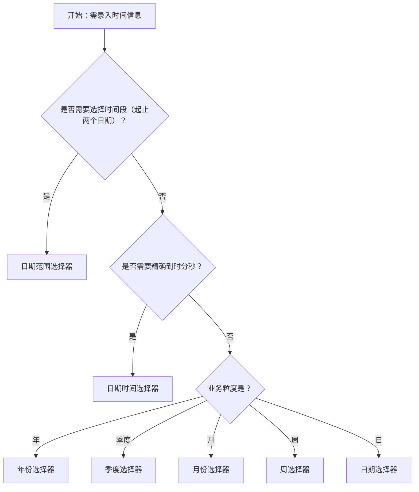

# 1. 简洁易读部份

## 1.0. 组件描述

日期选择框用于让用户输入或选择一个日期，点击输入框即可弹出日期面板，通过点选或输入完成日期录入，适用于需要精确日期的表单场景。

## 1.1. 组件构成

日期选择框由以下基础要素构成，可按需组合使用：
<br>

<br>
&emsp;&emsp;1. **输入框** 展示已选日期或占位提示，支持键盘输入日期；点击可唤起弹出面板。

&emsp;&emsp;2. **日期图标** 用于强化「选择日期」的语义，通常置于输入框右侧后缀位置。

&emsp;&emsp;3. **弹出面板** 承载日历或时间选择界面，用户通过点选完成选择；支持预设范围、自定义页脚等扩展。

---

## 1.2. 组件包含哪些不同类型

### 1.2.1 日期选择器

&emsp;**是什么**：选择具体日（年-月-日），是最常用的日期录入形式
<!-- 附图占位：建议附上一张示例图，展示日期选择器（默认 picker=date）的视觉形态，包含输入框与展开的日期面板 -->
<!-- [▶ 在线演示](https://infrad.shopee.io/playground/?agent_code_id=2418) -->
<sub>🖱️ 点击图片可在线演示</sub>
```react
function App() {
  const { DatePicker } = Infrad;
  const ref = React.useRef(null);
  React.useEffect(() => {
    if (!ref.current) return;
    const fix = () => {
      ref.current.querySelectorAll('.ant-picker-panel table,.ant-picker-panel tr').forEach(el => {
        el.style.border = 'none';
        el.style.background = 'transparent';
      });
      ref.current.querySelectorAll('.ant-picker-panel th,.ant-picker-panel td').forEach(el => {
        el.style.border = 'none';
        el.style.background = 'transparent';
        el.style.padding = '';
      });
      ref.current.querySelectorAll('.ant-picker-dropdown').forEach(el => {
        el.style.top = '36px';
        el.style.left = '0px';
        el.style.bottom = 'auto';
      });
    };
    fix();
    const obs = new MutationObserver(fix);
    obs.observe(ref.current, { childList: true, subtree: true, attributes: true, attributeFilter: ['style'] });
    return () => obs.disconnect();
  }, []);
  return (
    <div style={{ padding: 12 }}>
      <div ref={ref} style={{ position: 'relative', width: 220, minHeight: 380 }}>
        <DatePicker open={true} placeholder="请选择日期" getPopupContainer={() => ref.current} style={{ width: 220 }} />
      </div>
    </div>
  );
}
```
<br>
&emsp;**简单用法**：用于需要精确到某天的业务；可直接点选或输入；失去焦点或选择后即生效（可按需开启确认按钮）

&emsp;**典型场景**：出生日期、预约日期、合同签署日期
<!-- 附图占位：建议附上一张场景图，展示表单中「预约日期」使用日期选择器的布局，体现其作为基础日期录入的典型用法 -->
<!-- [▶ 在线演示](https://infrad.shopee.io/playground/?agent_code_id=2352) -->
<sub>🖱️ 点击图片可在线演示</sub>
```react
function App() {
  const { Form, Input, Button, DatePicker } = Infrad;
  const topbar = { height: 56, background: '#0d2b6b', display: 'flex', alignItems: 'center', padding: '0 16px', justifyContent: 'space-between' };
  const sidebar = { width: 180, background: '#fff', borderRight: '1px solid #f0f0f0', padding: '8px 0', flexShrink: 0 };
  const mi = (active) => ({ padding: '8px 14px', fontSize: 13, color: active ? '#2673dd' : '#555', background: active ? '#e6efff' : 'transparent', cursor: 'pointer' });
  return (
    <div style={{ border: '1px solid #d9d9d9', borderRadius: 2, overflow: 'hidden', height: 380 }}>
      <div style={topbar}>
        <span style={{ color: '#fff', fontSize: 14, fontWeight: 700 }}>预约管理系统</span>
        <div style={{ width: 28, height: 28, borderRadius: '50%', background: '#4a90e2', display: 'flex', alignItems: 'center', justifyContent: 'center', color: '#fff', fontSize: 13, fontWeight: 700 }}>D</div>
      </div>
      <div style={{ display: 'flex', height: 'calc(100% - 56px)' }}>
        <div style={sidebar}>
          <div style={mi(false)}>控制台</div>
          <div style={mi(true)}>预约管理</div>
          <div style={mi(false)}>客户档案</div>
          <div style={mi(false)}>数据报表</div>
        </div>
        <div style={{ flex: 1, background: '#f5f7fa', padding: '16px 20px', overflow: 'auto' }}>
          <div style={{ background: '#fff', borderRadius: 2, border: '1px solid #f0f0f0', padding: '20px 24px' }}>
            <div style={{ fontSize: 15, fontWeight: 600, marginBottom: 16, color: '#000000e0' }}>新增预约</div>
            <Form layout="vertical" style={{ maxWidth: 360 }}>
              <Form.Item label="客户姓名" style={{ marginBottom: 12 }}><Input placeholder="请输入客户姓名" /></Form.Item>
              <Form.Item label="联系电话" style={{ marginBottom: 12 }}><Input placeholder="请输入联系电话" /></Form.Item>
              <Form.Item label="预约日期" style={{ marginBottom: 12 }}><DatePicker placeholder="请选择日期" style={{ width: '100%' }} /></Form.Item>
              <Form.Item label="备注" style={{ marginBottom: 16 }}><Input.TextArea placeholder="请输入备注信息" rows={2} /></Form.Item>
              <Form.Item style={{ marginBottom: 0 }}>
                <Button type="primary">提交预约</Button>
                <Button style={{ marginLeft: 8 }}>取消</Button>
              </Form.Item>
            </Form>
          </div>
        </div>
      </div>
    </div>
  );
}
```
<br>
&emsp;**替代方案**：若只需年到月，改用月份选择器；若需时间段，改用日期范围选择器

### 1.2.2 月份选择器

&emsp;**是什么**：选择年月（年-月），不精确到具体日
<!-- 附图占位：建议附上一张示例图，展示月份选择器的面板形态（按月份陈列），体现其与日期选择器的层级差异 -->
<!-- [▶ 在线演示](https://infrad.shopee.io/playground/?agent_code_id=2419) -->
<sub>🖱️ 点击图片可在线演示</sub>
```react
function App() {
  const { DatePicker } = Infrad;
  const ref = React.useRef(null);
  React.useEffect(() => {
    if (!ref.current) return;
    const fix = () => {
      ref.current.querySelectorAll('.ant-picker-panel table,.ant-picker-panel tr').forEach(el => {
        el.style.border = 'none';
        el.style.background = 'transparent';
      });
      ref.current.querySelectorAll('.ant-picker-panel th,.ant-picker-panel td').forEach(el => {
        el.style.border = 'none';
        el.style.background = 'transparent';
        el.style.padding = '';
      });
      ref.current.querySelectorAll('.ant-picker-dropdown').forEach(el => {
        el.style.top = '36px';
        el.style.left = '0px';
        el.style.bottom = 'auto';
      });
    };
    fix();
    const obs = new MutationObserver(fix);
    obs.observe(ref.current, { childList: true, subtree: true, attributes: true, attributeFilter: ['style'] });
    return () => obs.disconnect();
  }, []);
  return (
    <div style={{ padding: 12 }}>
      <div ref={ref} style={{ position: 'relative', width: 220, minHeight: 360 }}>
        <DatePicker picker="month" open={true} placeholder="请选择月份" getPopupContainer={() => ref.current} style={{ width: 220 }} />
      </div>
    </div>
  );
}
```
<br>
&emsp;**简单用法**：必须用于只关心月份、不关心具体日的场景；格式通常为 YYYY-MM

&emsp;**典型场景**：入职月份、账期、统计周期选择
<!-- 附图占位：建议附上一张场景图，展示筛选区中「统计月份」使用月份选择器的布局 -->
<!-- [▶ 在线演示](https://infrad.shopee.io/playground/?agent_code_id=2353) -->
<sub>🖱️ 点击图片可在线演示</sub>
```react
function App() {
  const { DatePicker, Button, Table } = Infrad;
  const topbar = { height: 56, background: '#0d2b6b', display: 'flex', alignItems: 'center', padding: '0 16px', justifyContent: 'space-between' };
  const sidebar = { width: 180, background: '#fff', borderRight: '1px solid #f0f0f0', padding: '8px 0', flexShrink: 0 };
  const mi = (active) => ({ padding: '8px 14px', fontSize: 13, color: active ? '#2673dd' : '#555', background: active ? '#e6efff' : 'transparent', cursor: 'pointer' });
  const columns = [
    { title: '月份', dataIndex: 'month', width: 100 },
    { title: '收入（元）', dataIndex: 'income', width: 120 },
    { title: '支出（元）', dataIndex: 'expense', width: 120 },
    { title: '净利润（元）', dataIndex: 'profit' },
  ];
  const data = [
    { key: '1', month: '2026-01', income: '128,400', expense: '89,200', profit: '39,200' },
    { key: '2', month: '2026-02', income: '103,600', expense: '72,100', profit: '31,500' },
    { key: '3', month: '2026-03', income: '156,200', expense: '98,400', profit: '57,800' },
  ];
  return (
    <div style={{ border: '1px solid #d9d9d9', borderRadius: 2, overflow: 'hidden', height: 380 }}>
      <div style={topbar}>
        <span style={{ color: '#fff', fontSize: 14, fontWeight: 700 }}>财务管理系统</span>
        <div style={{ width: 28, height: 28, borderRadius: '50%', background: '#4a90e2', display: 'flex', alignItems: 'center', justifyContent: 'center', color: '#fff', fontSize: 13, fontWeight: 700 }}>D</div>
      </div>
      <div style={{ display: 'flex', height: 'calc(100% - 56px)' }}>
        <div style={sidebar}>
          <div style={mi(false)}>控制台</div>
          <div style={mi(true)}>月度报表</div>
          <div style={mi(false)}>年度汇总</div>
          <div style={mi(false)}>费用审批</div>
        </div>
        <div style={{ flex: 1, background: '#f5f7fa', padding: '16px 20px', overflow: 'auto' }}>
          <div style={{ background: '#fff', borderRadius: 2, border: '1px solid #f0f0f0', padding: '16px 20px' }}>
            <div style={{ display: 'flex', alignItems: 'center', gap: 12, marginBottom: 16 }}>
              <DatePicker picker="month" placeholder="选择账期月份" style={{ width: 160 }} />
              <div style={{ flex: 1 }} />
              <Button type="primary">查询</Button>
            </div>
            <Table columns={columns} dataSource={data} pagination={false} size="small" />
          </div>
        </div>
      </div>
    </div>
  );
}
```
<br>
&emsp;**替代方案**：若需精确到日，改用日期选择器；若需季度维度，改用季度选择器

### 1.2.3 年份选择器

&emsp;**是什么**：仅选择年份，层级最粗的时间粒度
<!-- 附图占位：建议附上一张示例图，展示年份选择器的面板形态（按年份陈列），体现其极简选择方式 -->
<!-- [▶ 在线演示](https://infrad.shopee.io/playground/?agent_code_id=2420) -->
<sub>🖱️ 点击图片可在线演示</sub>
```react
function App() {
  const { DatePicker } = Infrad;
  const ref = React.useRef(null);
  React.useEffect(() => {
    if (!ref.current) return;
    const fix = () => {
      ref.current.querySelectorAll('.ant-picker-panel table,.ant-picker-panel tr').forEach(el => {
        el.style.border = 'none';
        el.style.background = 'transparent';
      });
      ref.current.querySelectorAll('.ant-picker-panel th,.ant-picker-panel td').forEach(el => {
        el.style.border = 'none';
        el.style.background = 'transparent';
        el.style.padding = '';
      });
      ref.current.querySelectorAll('.ant-picker-dropdown').forEach(el => {
        el.style.top = '36px';
        el.style.left = '0px';
        el.style.bottom = 'auto';
      });
    };
    fix();
    const obs = new MutationObserver(fix);
    obs.observe(ref.current, { childList: true, subtree: true, attributes: true, attributeFilter: ['style'] });
    return () => obs.disconnect();
  }, []);
  return (
    <div style={{ padding: 12 }}>
      <div ref={ref} style={{ position: 'relative', width: 220, minHeight: 360 }}>
        <DatePicker picker="year" open={true} placeholder="请选择年份" getPopupContainer={() => ref.current} style={{ width: 220 }} />
      </div>
    </div>
  );
}
```
<br>
&emsp;**简单用法**：必须用于只关心年份的场景；格式通常为 YYYY；常用于筛选或统计维度

&emsp;**典型场景**：毕业年份、成立年份、年度报表筛选
<!-- 附图占位：建议附上一张场景图，展示筛选区中「年度」使用年份选择器的布局 -->
<!-- [▶ 在线演示](https://infrad.shopee.io/playground/?agent_code_id=2354) -->
<sub>🖱️ 点击图片可在线演示</sub>
```react
function App() {
  const { DatePicker, Button, Table } = Infrad;
  const topbar = { height: 56, background: '#0d2b6b', display: 'flex', alignItems: 'center', padding: '0 16px', justifyContent: 'space-between' };
  const sidebar = { width: 180, background: '#fff', borderRight: '1px solid #f0f0f0', padding: '8px 0', flexShrink: 0 };
  const mi = (active) => ({ padding: '8px 14px', fontSize: 13, color: active ? '#2673dd' : '#555', background: active ? '#e6efff' : 'transparent', cursor: 'pointer' });
  const columns = [
    { title: '年份', dataIndex: 'year', width: 100 },
    { title: '员工人数', dataIndex: 'headcount', width: 120 },
    { title: '营业收入（万）', dataIndex: 'revenue', width: 140 },
    { title: '同比增长', dataIndex: 'growth' },
  ];
  const data = [
    { key: '1', year: '2024', headcount: 312, revenue: '4,820', growth: '+18.3%' },
    { key: '2', year: '2025', headcount: 368, revenue: '6,150', growth: '+27.6%' },
    { key: '3', year: '2026', headcount: 401, revenue: '2,340', growth: '+15.1%' },
  ];
  return (
    <div style={{ border: '1px solid #d9d9d9', borderRadius: 2, overflow: 'hidden', height: 380 }}>
      <div style={topbar}>
        <span style={{ color: '#fff', fontSize: 14, fontWeight: 700 }}>经营数据平台</span>
        <div style={{ width: 28, height: 28, borderRadius: '50%', background: '#4a90e2', display: 'flex', alignItems: 'center', justifyContent: 'center', color: '#fff', fontSize: 13, fontWeight: 700 }}>D</div>
      </div>
      <div style={{ display: 'flex', height: 'calc(100% - 56px)' }}>
        <div style={sidebar}>
          <div style={mi(false)}>数据概览</div>
          <div style={mi(true)}>年度报表</div>
          <div style={mi(false)}>季度分析</div>
          <div style={mi(false)}>人员统计</div>
        </div>
        <div style={{ flex: 1, background: '#f5f7fa', padding: '16px 20px', overflow: 'auto' }}>
          <div style={{ background: '#fff', borderRadius: 2, border: '1px solid #f0f0f0', padding: '16px 20px' }}>
            <div style={{ display: 'flex', alignItems: 'center', gap: 12, marginBottom: 16 }}>
              <DatePicker picker="year" placeholder="选择年份" style={{ width: 140 }} />
              <div style={{ flex: 1 }} />
              <Button type="primary">查询</Button>
            </div>
            <Table columns={columns} dataSource={data} pagination={false} size="small" />
          </div>
        </div>
      </div>
    </div>
  );
}
```
<br>
&emsp;**替代方案**：若需精确到月或日，改用月份选择器或日期选择器

### 1.2.4 季度选择器

&emsp;**是什么**：选择年份和季度（如 2024-Q1）
<!-- [▶ 在线演示](https://infrad.shopee.io/playground/?agent_code_id=3404) -->
<sub>🖱️ 点击图片可在线演示</sub>
```react
function App() {
  const { DatePicker } = Infrad;
  const ref = React.useRef(null);
  React.useEffect(() => {
    if (!ref.current) return;
    const fix = () => {
      ref.current.querySelectorAll('table,tr').forEach(el => {
        el.style.border = 'none';
        el.style.background = 'transparent';
      });
      ref.current.querySelectorAll('th,td').forEach(el => {
        el.style.border = 'none';
        el.style.background = 'transparent';
        el.style.padding = '';
      });
      ref.current.querySelectorAll('.ant-picker-dropdown').forEach(el => {
        el.style.top = '36px';
        el.style.left = '0px';
        el.style.bottom = 'auto';
      });
    };
    fix();
    const obs = new MutationObserver(fix);
    obs.observe(ref.current, { childList: true, subtree: true, attributes: true, attributeFilter: ['style'] });
    return () => obs.disconnect();
  }, []);
  return (
    <div style={{ padding: 12 }}>
      <div ref={ref} style={{ position: 'relative', width: 220, height: 148 }}>
        <DatePicker picker="quarter" open={true} placeholder="请选择季度" getPopupContainer={() => ref.current} style={{ width: 220 }} />
      </div>
    </div>
  );
}
```
<br>
&emsp;**简单用法**：必须用于按季度统计、汇报或筛选的业务；格式通常为 YYYY-Qn

&emsp;**典型场景**：季度报表、季度目标、财务周期
<!-- 附图占位：建议附上一张场景图，展示筛选区中「统计季度」使用季度选择器的布局 -->
<!-- [▶ 在线演示](https://infrad.shopee.io/playground/?agent_code_id=2355) -->
<sub>🖱️ 点击图片可在线演示</sub>
```react
function App() {
  const { DatePicker, Button, Table, Tag } = Infrad;
  const topbar = { height: 56, background: '#0d2b6b', display: 'flex', alignItems: 'center', padding: '0 16px', justifyContent: 'space-between' };
  const sidebar = { width: 180, background: '#fff', borderRight: '1px solid #f0f0f0', padding: '8px 0', flexShrink: 0 };
  const mi = (active) => ({ padding: '8px 14px', fontSize: 13, color: active ? '#2673dd' : '#555', background: active ? '#e6efff' : 'transparent', cursor: 'pointer' });
  const columns = [
    { title: '季度', dataIndex: 'quarter', width: 100 },
    { title: '销售目标（万）', dataIndex: 'target', width: 130 },
    { title: '实际完成（万）', dataIndex: 'actual', width: 130 },
    { title: '完成状态', dataIndex: 'status', render: (v) => <Tag color={v === '达标' ? 'success' : 'warning'}>{v}</Tag> },
  ];
  const data = [
    { key: '1', quarter: '2026-Q1', target: '500', actual: '528', status: '达标' },
    { key: '2', quarter: '2026-Q2', target: '600', actual: '581', status: '未达标' },
    { key: '3', quarter: '2026-Q3', target: '650', actual: '702', status: '达标' },
  ];
  return (
    <div style={{ border: '1px solid #d9d9d9', borderRadius: 2, overflow: 'hidden', height: 380 }}>
      <div style={topbar}>
        <span style={{ color: '#fff', fontSize: 14, fontWeight: 700 }}>销售目标管理</span>
        <div style={{ width: 28, height: 28, borderRadius: '50%', background: '#4a90e2', display: 'flex', alignItems: 'center', justifyContent: 'center', color: '#fff', fontSize: 13, fontWeight: 700 }}>D</div>
      </div>
      <div style={{ display: 'flex', height: 'calc(100% - 56px)' }}>
        <div style={sidebar}>
          <div style={mi(false)}>目标总览</div>
          <div style={mi(true)}>季度目标</div>
          <div style={mi(false)}>团队排名</div>
          <div style={mi(false)}>历史记录</div>
        </div>
        <div style={{ flex: 1, background: '#f5f7fa', padding: '16px 20px', overflow: 'auto' }}>
          <div style={{ background: '#fff', borderRadius: 2, border: '1px solid #f0f0f0', padding: '16px 20px' }}>
            <div style={{ display: 'flex', alignItems: 'center', gap: 12, marginBottom: 16 }}>
              <DatePicker picker="quarter" placeholder="选择统计季度" style={{ width: 160 }} />
              <div style={{ flex: 1 }} />
              <Button type="primary">查询</Button>
            </div>
            <Table columns={columns} dataSource={data} pagination={false} size="small" />
          </div>
        </div>
      </div>
    </div>
  );
}
```
<br>
&emsp;**替代方案**：若需精确到月，改用月份选择器；若业务无季度概念，改用月份选择器

### 1.2.5 周选择器

&emsp;**是什么**：选择所属周，以周为最小粒度
<!-- 附图占位：建议附上一张示例图，展示周选择器的面板形态（以周为单位高亮），体现周维度的选择方式 -->
<!-- [▶ 在线演示](https://infrad.shopee.io/playground/?agent_code_id=2422) -->
<sub>🖱️ 点击图片可在线演示</sub>
```react
function App() {
  const { DatePicker } = Infrad;
  const ref = React.useRef(null);
  React.useEffect(() => {
    if (!ref.current) return;
    const fix = () => {
      ref.current.querySelectorAll('.ant-picker-panel table,.ant-picker-panel tr').forEach(el => {
        el.style.border = 'none';
        el.style.background = 'transparent';
      });
      ref.current.querySelectorAll('.ant-picker-panel th,.ant-picker-panel td').forEach(el => {
        el.style.border = 'none';
        el.style.background = 'transparent';
        el.style.padding = '';
      });
      ref.current.querySelectorAll('.ant-picker-dropdown').forEach(el => {
        el.style.top = '36px';
        el.style.left = '0px';
        el.style.bottom = 'auto';
      });
    };
    fix();
    const obs = new MutationObserver(fix);
    obs.observe(ref.current, { childList: true, subtree: true, attributes: true, attributeFilter: ['style'] });
    return () => obs.disconnect();
  }, []);
  return (
    <div style={{ padding: 12 }}>
      <div ref={ref} style={{ position: 'relative', width: 220, minHeight: 380 }}>
        <DatePicker picker="week" open={true} placeholder="请选择周" getPopupContainer={() => ref.current} style={{ width: 220 }} />
      </div>
    </div>
  );
}
```
<br>
&emsp;**简单用法**：必须用于以周为统计或计划单位的场景；格式通常为 YYYY-Wn 或类似形式；需注意周起始日与业务是否一致

&emsp;**典型场景**：周报、排班、教学周
<!-- 附图占位：建议附上一张场景图，展示排班或周报选择「所属周」的使用方式 -->
<!-- [▶ 在线演示](https://infrad.shopee.io/playground/?agent_code_id=2356) -->
<sub>🖱️ 点击图片可在线演示</sub>
```react
function App() {
  const { DatePicker, Button, Table } = Infrad;
  const topbar = { height: 56, background: '#0d2b6b', display: 'flex', alignItems: 'center', padding: '0 16px', justifyContent: 'space-between' };
  const sidebar = { width: 180, background: '#fff', borderRight: '1px solid #f0f0f0', padding: '8px 0', flexShrink: 0 };
  const mi = (active) => ({ padding: '8px 14px', fontSize: 13, color: active ? '#2673dd' : '#555', background: active ? '#e6efff' : 'transparent', cursor: 'pointer' });
  const columns = [
    { title: '员工', dataIndex: 'name', width: 90 },
    { title: '周一', dataIndex: 'mon', width: 70 },
    { title: '周二', dataIndex: 'tue', width: 70 },
    { title: '周三', dataIndex: 'wed', width: 70 },
    { title: '周四', dataIndex: 'thu', width: 70 },
    { title: '周五', dataIndex: 'fri' },
  ];
  const data = [
    { key: '1', name: '张伟', mon: '早班', tue: '早班', wed: '休息', thu: '早班', fri: '早班' },
    { key: '2', name: '李敏', mon: '晚班', tue: '休息', wed: '晚班', thu: '晚班', fri: '晚班' },
    { key: '3', name: '王芳', mon: '早班', tue: '早班', wed: '早班', thu: '休息', fri: '早班' },
  ];
  return (
    <div style={{ border: '1px solid #d9d9d9', borderRadius: 2, overflow: 'hidden', height: 380 }}>
      <div style={topbar}>
        <span style={{ color: '#fff', fontSize: 14, fontWeight: 700 }}>排班管理系统</span>
        <div style={{ width: 28, height: 28, borderRadius: '50%', background: '#4a90e2', display: 'flex', alignItems: 'center', justifyContent: 'center', color: '#fff', fontSize: 13, fontWeight: 700 }}>D</div>
      </div>
      <div style={{ display: 'flex', height: 'calc(100% - 56px)' }}>
        <div style={sidebar}>
          <div style={mi(false)}>排班概览</div>
          <div style={mi(true)}>周排班</div>
          <div style={mi(false)}>员工管理</div>
          <div style={mi(false)}>假期设置</div>
        </div>
        <div style={{ flex: 1, background: '#f5f7fa', padding: '16px 20px', overflow: 'auto' }}>
          <div style={{ background: '#fff', borderRadius: 2, border: '1px solid #f0f0f0', padding: '16px 20px' }}>
            <div style={{ display: 'flex', alignItems: 'center', gap: 12, marginBottom: 16 }}>
              <DatePicker picker="week" placeholder="选择所属周" style={{ width: 180 }} />
              <Button type="primary">查看排班</Button>
            </div>
            <Table columns={columns} dataSource={data} pagination={false} size="small" />
          </div>
        </div>
      </div>
    </div>
  );
}
```
<br>
&emsp;**替代方案**：若业务以日或月为主，改用日期选择器或月份选择器

### 1.2.6 日期范围选择器

&emsp;**是什么**：一次性选择起止日期，形成连续时间段
<!-- 附图占位：建议附上一张示例图，展示日期范围选择器的输入框形态（起止日期用分隔符连接）及展开的双面板或范围选择界面 -->
<!-- [▶ 在线演示](https://infrad.shopee.io/playground/?agent_code_id=2423) -->
<sub>🖱️ 点击图片可在线演示</sub>
```react
function App() {
  const { DatePicker } = Infrad;
  const ref = React.useRef(null);
  React.useEffect(() => {
    if (!ref.current) return;
    const fix = () => {
      ref.current.querySelectorAll('.ant-picker-panel table,.ant-picker-panel tr').forEach(el => {
        el.style.border = 'none';
        el.style.background = 'transparent';
      });
      ref.current.querySelectorAll('.ant-picker-panel th,.ant-picker-panel td').forEach(el => {
        el.style.border = 'none';
        el.style.background = 'transparent';
        el.style.padding = '';
      });
      ref.current.querySelectorAll('.ant-picker-dropdown').forEach(el => {
        el.style.top = '36px';
        el.style.left = '0px';
        el.style.bottom = 'auto';
      });
    };
    fix();
    const obs = new MutationObserver(fix);
    obs.observe(ref.current, { childList: true, subtree: true, attributes: true, attributeFilter: ['style'] });
    return () => obs.disconnect();
  }, []);
  return (
    <div style={{ padding: 12 }}>
      <div ref={ref} style={{ position: 'relative', width: 300, minHeight: 396 }}>
        <DatePicker.RangePicker open={true} placeholder={['开始日期', '结束日期']} getPopupContainer={() => ref.current} style={{ width: 300 }} />
      </div>
    </div>
  );
}
```
<br>
&emsp;**简单用法**：必须用于需要「开始日期 + 结束日期」的场景；支持预设范围（如最近 7 天、本月）；可允许部分留空（如「至今」）

&emsp;**典型场景**：筛选时间范围、活动周期、出差日期、合同有效期
<!-- 附图占位：建议附上一张场景图，展示数据筛选区中日期范围选择器与「查询」按钮组合的布局，体现预设范围与起止选择的配合 -->
<!-- [▶ 在线演示](https://infrad.shopee.io/playground/?agent_code_id=2435) -->
<sub>🖱️ 点击图片可在线演示</sub>
```react
function App() {
  const { DatePicker, Button, Table, Tag } = Infrad;
  const topbar = { height: 56, background: '#0d2b6b', display: 'flex', alignItems: 'center', padding: '0 16px', justifyContent: 'space-between' };
  const sidebar = { width: 180, background: '#fff', borderRight: '1px solid #f0f0f0', padding: '8px 0', flexShrink: 0 };
  const mi = (active) => ({ padding: '8px 14px', fontSize: 13, color: active ? '#2673dd' : '#555', background: active ? '#e6efff' : 'transparent', cursor: 'pointer' });
  const columns = [
    { title: '订单号', dataIndex: 'id', width: 80 },
    { title: '下单时间', dataIndex: 'date', width: 110 },
    { title: '金额（元）', dataIndex: 'amount', width: 100 },
    { title: '状态', dataIndex: 'status', render: (v) => <Tag color={v === '已完成' ? 'success' : v === '处理中' ? 'processing' : 'default'}>{v}</Tag> },
  ];
  const data = [
    { key: '1', id: 'ORD-001', date: '2026-04-01', amount: '3,280', status: '已完成' },
    { key: '2', id: 'ORD-002', date: '2026-04-15', amount: '1,560', status: '处理中' },
    { key: '3', id: 'ORD-003', date: '2026-04-22', amount: '8,900', status: '已完成' },
  ];
  return (
    <div style={{ border: '1px solid #d9d9d9', borderRadius: 2, overflow: 'hidden', height: 380 }}>
      <div style={topbar}>
        <span style={{ color: '#fff', fontSize: 14, fontWeight: 700 }}>订单管理系统</span>
        <div style={{ width: 28, height: 28, borderRadius: '50%', background: '#4a90e2', display: 'flex', alignItems: 'center', justifyContent: 'center', color: '#fff', fontSize: 13, fontWeight: 700 }}>D</div>
      </div>
      <div style={{ display: 'flex', height: 'calc(100% - 56px)' }}>
        <div style={sidebar}>
          <div style={mi(false)}>订单概览</div>
          <div style={mi(true)}>订单列表</div>
          <div style={mi(false)}>退款管理</div>
          <div style={mi(false)}>数据统计</div>
        </div>
        <div style={{ flex: 1, background: '#f5f7fa', padding: '16px 20px', overflow: 'auto' }}>
          <div style={{ background: '#fff', borderRadius: 2, border: '1px solid #f0f0f0', padding: '16px 20px' }}>
            <div style={{ display: 'flex', alignItems: 'center', gap: 12, marginBottom: 16 }}>
              <DatePicker.RangePicker placeholder={['开始日期', '结束日期']} style={{ width: 240 }} />
              <div style={{ flex: 1 }} />
              <Button type="primary">查询</Button>
            </div>
            <Table columns={columns} dataSource={data} pagination={false} size="small" />
          </div>
        </div>
      </div>
    </div>
  );
}
```
<br>
&emsp;**替代方案**：若只需单个日期，改用日期选择器

### 1.2.7 日期时间选择器

&emsp;**是什么**：在日期基础上增加时分秒选择，形成完整时间点
<!-- 附图占位：建议附上一张示例图，展示日期时间选择器的面板形态（日期区 + 时间区），体现日期与时间的组合录入 -->
<!-- [▶ 在线演示](https://infrad.shopee.io/playground/?agent_code_id=2424) -->
<sub>🖱️ 点击图片可在线演示</sub>
```react
function App() {
  const { DatePicker } = Infrad;
  const ref = React.useRef(null);
  React.useEffect(() => {
    if (!ref.current) return;
    const fix = () => {
      ref.current.querySelectorAll('.ant-picker-panel table,.ant-picker-panel tr').forEach(el => {
        el.style.border = 'none';
        el.style.background = 'transparent';
      });
      ref.current.querySelectorAll('.ant-picker-panel th,.ant-picker-panel td').forEach(el => {
        el.style.border = 'none';
        el.style.background = 'transparent';
        el.style.padding = '';
      });
      ref.current.querySelectorAll('.ant-picker-dropdown').forEach(el => {
        el.style.top = '36px';
        el.style.left = '0px';
        el.style.bottom = 'auto';
      });
    };
    fix();
    const obs = new MutationObserver(fix);
    obs.observe(ref.current, { childList: true, subtree: true, attributes: true, attributeFilter: ['style'] });
    return () => obs.disconnect();
  }, []);
  return (
    <div style={{ padding: 12 }}>
      <div ref={ref} style={{ position: 'relative', width: 260, minHeight: 428 }}>
        <DatePicker showTime open={true} placeholder="请选择日期时间" getPopupContainer={() => ref.current} style={{ width: 260 }} />
      </div>
    </div>
  );
}
```
<br>
&emsp;**简单用法**：必须用于需要精确到时分秒的场景；需配合确认按钮或明确交互逻辑（选择即确认或需点击确认）；支持禁用部分日期或时间

&emsp;**典型场景**：会议时间、预约时段、任务截止时间、日志时间戳
<!-- 附图占位：建议附上一张场景图，展示预约表单中「预约时间」使用日期时间选择器的布局，体现日期与时间一体化选择 -->
<!-- [▶ 在线演示](https://infrad.shopee.io/playground/?agent_code_id=2358) -->
<sub>🖱️ 点击图片可在线演示</sub>
```react
function App() {
  const { Form, Input, Button, DatePicker, Select } = Infrad;
  const topbar = { height: 56, background: '#0d2b6b', display: 'flex', alignItems: 'center', padding: '0 16px', justifyContent: 'space-between' };
  const sidebar = { width: 180, background: '#fff', borderRight: '1px solid #f0f0f0', padding: '8px 0', flexShrink: 0 };
  const mi = (active) => ({ padding: '8px 14px', fontSize: 13, color: active ? '#2673dd' : '#555', background: active ? '#e6efff' : 'transparent', cursor: 'pointer' });
  return (
    <div style={{ border: '1px solid #d9d9d9', borderRadius: 2, overflow: 'hidden', height: 380 }}>
      <div style={topbar}>
        <span style={{ color: '#fff', fontSize: 14, fontWeight: 700 }}>会议室预约系统</span>
        <div style={{ width: 28, height: 28, borderRadius: '50%', background: '#4a90e2', display: 'flex', alignItems: 'center', justifyContent: 'center', color: '#fff', fontSize: 13, fontWeight: 700 }}>D</div>
      </div>
      <div style={{ display: 'flex', height: 'calc(100% - 56px)' }}>
        <div style={sidebar}>
          <div style={mi(false)}>预约日历</div>
          <div style={mi(true)}>新增预约</div>
          <div style={mi(false)}>我的预约</div>
          <div style={mi(false)}>会议室管理</div>
        </div>
        <div style={{ flex: 1, background: '#f5f7fa', padding: '16px 20px', overflow: 'auto' }}>
          <div style={{ background: '#fff', borderRadius: 2, border: '1px solid #f0f0f0', padding: '20px 24px' }}>
            <div style={{ fontSize: 15, fontWeight: 600, marginBottom: 16, color: '#000000e0' }}>预约会议室</div>
            <Form layout="vertical" style={{ maxWidth: 360 }}>
              <Form.Item label="会议室" style={{ marginBottom: 12 }}>
                <Select placeholder="请选择会议室" style={{ width: '100%' }} options={[{ value: 'A301', label: '研发中心 A-301（10人）' }, { value: 'B201', label: '产品中心 B-201（6人）' }]} />
              </Form.Item>
              <Form.Item label="开始时间" style={{ marginBottom: 12 }}>
                <DatePicker showTime placeholder="请选择开始时间" style={{ width: '100%' }} />
              </Form.Item>
              <Form.Item label="结束时间" style={{ marginBottom: 12 }}>
                <DatePicker showTime placeholder="请选择结束时间" style={{ width: '100%' }} />
              </Form.Item>
              <Form.Item label="会议主题" style={{ marginBottom: 16 }}>
                <Input placeholder="请输入会议主题" />
              </Form.Item>
              <Form.Item style={{ marginBottom: 0 }}>
                <Button type="primary">提交预约</Button>
                <Button style={{ marginLeft: 8 }}>取消</Button>
              </Form.Item>
            </Form>
          </div>
        </div>
      </div>
    </div>
  );
}
```
<br>
&emsp;**替代方案**：若只需日期不需时间，改用日期选择器；若只需时间不需日期，改用 TimePicker

---

## 1.3. 各类型典型场景案例

### 1.3.1 粒度匹配：按业务精度选择选择器
<!-- [▶ 在线演示](https://infrad.shopee.io/playground/?agent_code_id=3603) -->
<sub>🖱️ 点击图片可在线演示</sub>
```react
function App() {
  const { Table, Button, DatePicker } = Infrad;
  const refGood = React.useRef(null);
  const refBad = React.useRef(null);
  const makeObserver = (ref) => {
    const fix = () => {
      if (!ref.current) return;
      const trigger = ref.current.querySelector('.ant-picker');
      const dropdowns = ref.current.querySelectorAll('.ant-picker-dropdown');
      if (!dropdowns.length) return;
      const cRect = ref.current.getBoundingClientRect();
      const tRect = trigger ? trigger.getBoundingClientRect() : null;
      const top = tRect ? tRect.bottom - cRect.top + 4 : 100;
      const left = tRect ? tRect.left - cRect.left : 0;
      dropdowns.forEach(el => {
        el.style.position = 'absolute';
        el.style.top = top + 'px';
        el.style.left = left + 'px';
        el.style.bottom = 'auto';
        el.style.right = 'auto';
        el.style.transform = 'none';
      });
      ref.current.querySelectorAll('table,tr').forEach(el => {
        el.style.border = 'none';
        el.style.background = 'transparent';
      });
      ref.current.querySelectorAll('th,td').forEach(el => {
        el.style.border = 'none';
        el.style.background = 'transparent';
        el.style.padding = '';
      });
    };
    fix();
    const obs = new MutationObserver(fix);
    obs.observe(ref.current, { childList: true, subtree: true, attributes: true, attributeFilter: ['style', 'class'] });
    return obs;
  };
  React.useEffect(() => {
    const obsGood = makeObserver(refGood);
    const obsBad = makeObserver(refBad);
    return () => { obsGood.disconnect(); obsBad.disconnect(); };
  }, []);
  const topbar = { height: 56, background: '#0d2b6b', display: 'flex', alignItems: 'center', padding: '0 16px', justifyContent: 'space-between' };
  const panel = { background: '#fff', border: '1px solid #f0f0f0', borderBottom: 'none', padding: 0, flex: 1, paddingBottom: 240 };
  const wrapper = { flex: 1, minWidth: 0, position: 'relative', display: 'flex', flexDirection: 'column' };
  const columns = [{ title: '统计月份', dataIndex: 'month', width: 90 }, { title: '指标数量', dataIndex: 'count', width: 80 }, { title: '更新时间', dataIndex: 'updated' }];
  const data = [
    { key: '1', month: '2024-03', count: 128, updated: '2024-04-01' },
    { key: '2', month: '2024-02', count: 114, updated: '2024-03-01' },
  ];
  return (
    <div style={{ display: 'flex', gap: 16, alignItems: 'stretch' }}>
      <div style={wrapper} ref={refGood}>
        <div style={panel}>
          <div style={topbar}>
            <span style={{ color: '#fff', fontSize: 14, fontWeight: 700 }}>数据指标平台</span>
            <div style={{ width: 28, height: 28, borderRadius: '50%', background: '#4a90e2', display: 'flex', alignItems: 'center', justifyContent: 'center', color: '#fff' }}>A</div>
          </div>
          <div style={{ padding: 12 }}>
            <div style={{ display: 'flex', alignItems: 'center', gap: 8, marginBottom: 10 }}>
              <DatePicker picker="month" open placeholder="选择统计月份" style={{ width: 160 }} getPopupContainer={() => refGood.current} />
              <div style={{ flex: 1 }} />
              <Button type="primary" size="small">查询</Button>
            </div>
            <Table columns={columns} dataSource={data} pagination={false} size="small" />
          </div>
        </div>
        <div style={{ height: 4, background: '#52c41a' }} />
        <div style={{ background: '#f6ffed', border: '1px solid #b7eb8f', borderTop: 'none', padding: '10px 14px', fontWeight: 700, fontSize: 14, color: '#389e0d' }}>推荐</div>
      </div>
      <div style={wrapper} ref={refBad}>
        <div style={panel}>
          <div style={topbar}>
            <span style={{ color: '#fff', fontSize: 14, fontWeight: 700 }}>数据指标平台</span>
            <div style={{ width: 28, height: 28, borderRadius: '50%', background: '#4a90e2', display: 'flex', alignItems: 'center', justifyContent: 'center', color: '#fff' }}>A</div>
          </div>
          <div style={{ padding: 12 }}>
            <div style={{ display: 'flex', alignItems: 'center', gap: 8, marginBottom: 10 }}>
              <DatePicker open placeholder="请选择日期" style={{ width: 160 }} getPopupContainer={() => refBad.current} />
              <div style={{ flex: 1 }} />
              <Button type="primary" size="small">查询</Button>
            </div>
            <Table columns={columns} dataSource={data} pagination={false} size="small" />
          </div>
        </div>
        <div style={{ height: 4, background: '#ff4d4f' }} />
        <div style={{ background: '#fff2f0', border: '1px solid #ffccc7', borderTop: 'none', padding: '10px 14px', fontWeight: 700, fontSize: 14, color: '#cf1322' }}>不推荐</div>
      </div>
    </div>
  );
}
```
<br>
✅ **推荐：** 业务粒度与选择器粒度一致（月用月份选择器、年用年份选择器、季度用季度选择器）

<hr>

❌ **不推荐：** 业务只需要年月或季度，却使用日期选择器让用户多选一步，增加无效操作

### 1.3.2 范围选择：优先使用日期范围选择器
<!-- [▶ 在线演示](https://infrad.shopee.io/playground/?agent_code_id=3367) -->
<sub>🖱️ 点击图片可在线演示</sub>
```react
function App() {
  const { Flex, Table, Button, DatePicker } = Infrad;
  const topbar = { height: 56, background: '#0d2b6b', display: 'flex', alignItems: 'center', padding: '0 16px', justifyContent: 'space-between' };
  const content = { flex: 1, padding: '16px 20px', background: '#f5f7fa' };
  const card = { background: '#fff', borderRadius: 2, padding: 12 };
  const panel = { background: '#fff', border: '1px solid #f0f0f0', borderBottom: 'none', minHeight: 220, overflow: 'hidden', flex: 1 };
  const side = { flex: 1, minWidth: 0, display: 'flex', flexDirection: 'column' };
  const columns = [{ title: '实例名称', dataIndex: 'name', width: 100 }, { title: '运行状态', dataIndex: 'status', width: 80 }, { title: '创建时间', dataIndex: 'created' }];
  const data = [
    { key: '1', name: 'cluster-prod-01', status: '运行中', created: '2024-03-10' },
    { key: '2', name: 'cluster-dev-02', status: '已停止', created: '2024-02-18' },
  ];
  const renderPage = (isBad) => (
    <div style={{ border: '1px solid #d9d9d9', borderRadius: 2, overflow: 'hidden' }}>
      <div style={topbar}>
        <span style={{ color: '#fff', fontSize: 14, fontWeight: 700 }}>集群管理平台</span>
        <div style={{ width: 28, height: 28, borderRadius: '50%', background: '#4a90e2', display: 'flex', alignItems: 'center', justifyContent: 'center', color: '#fff' }}>A</div>
      </div>
      <div style={content}>
        <div style={card}>
          <Flex align="center" gap={8} style={{ marginBottom: 10 }}>
            {isBad ? (
              <>
                <DatePicker placeholder="开始日期" style={{ width: 120 }} />
                <span style={{ color: '#bfbfbf' }}>~</span>
                <DatePicker placeholder="结束日期" style={{ width: 120 }} />
              </>
            ) : (
              <DatePicker.RangePicker placeholder={['开始日期', '结束日期']} style={{ width: 260 }} />
            )}
            <div style={{ flex: 1 }} />
            <Button type="primary" size="small">查询</Button>
          </Flex>
          <Table columns={columns} dataSource={data} pagination={false} size="small" />
        </div>
      </div>
    </div>
  );
  return (
    <Flex gap={16} style={{ maxWidth: '100%' }}>
      <div style={side}>
        <div style={panel}>{renderPage(false)}</div>
        <div style={{ height: 4, background: '#52c41a' }} />
        <div style={{ background: '#f6ffed', border: '1px solid #b7eb8f', borderTop: 'none', padding: '10px 14px', fontWeight: 700, fontSize: 14, color: '#389e0d' }}>推荐</div>
      </div>
      <div style={side}>
        <div style={panel}>{renderPage(true)}</div>
        <div style={{ height: 4, background: '#ff4d4f' }} />
        <div style={{ background: '#fff2f0', border: '1px solid #ffccc7', borderTop: 'none', padding: '10px 14px', fontWeight: 700, fontSize: 14, color: '#cf1322' }}>不推荐</div>
      </div>
    </Flex>
  );
}
```
<br>
✅ **推荐：** 筛选或录入时间范围时使用日期范围选择器，自动联动校验起止顺序

<hr>

❌ **不推荐：** 用两个独立的日期选择器拼「起止日期」，导致校验与交互割裂


---

# 2. 选型指南

## 2.1 选择流程




---

# 3. 细致专业部份（交互与排版规则）

## 3.1 多操作的展示与折叠策略

日期选择器通常作为单控件使用，不涉及多操作折叠。但在筛选栏中与「查询」「重置」等按钮并存时：

* **输入优先**：日期选择器作为核心筛选条件，应放在按钮前、视线优先落点。
* **预设优先**：若存在「今天」「本周」「本月」等预设，应置于面板内易于发现的位置；范围选择器尤其适合预设。
* **避免堆叠**：同一筛选区不宜同时使用多个不同粒度的日期选择器（如既有日期又有月份），应通过切换或 Tab 区分场景。
<!-- [▶ 在线演示](https://infrad.shopee.io/playground/?agent_code_id=3640) -->
<sub>🖱️ 点击图片可在线演示</sub>
```react
function App() {
  const { DatePicker, Button, Space } = Infrad;
  const ref = React.useRef(null);
  const [value, setValue] = React.useState(null);
  const [presets, setPresets] = React.useState([]);
  const captured = React.useRef(false);

  const fix = () => {
    if (!ref.current) return;
    ref.current.querySelectorAll('table,tr').forEach(el => {
      el.style.border = 'none'; el.style.background = 'transparent';
    });
    ref.current.querySelectorAll('th,td').forEach(el => {
      el.style.border = 'none'; el.style.background = 'transparent'; el.style.padding = '';
    });
  };

  React.useEffect(() => {
    fix();
    const obs = new MutationObserver(fix);
    if (ref.current) obs.observe(ref.current, { childList: true, subtree: true });
  }, []);

  const captureDisabled = (current) => {
    if (current && !captured.current) {
      captured.current = true;
      const now = new Date();
      const today = current.clone()
        .set('year', now.getFullYear())
        .set('month', now.getMonth())
        .set('date', now.getDate());
      setPresets([
        { label: '今天', value: [today.startOf('day'), today.endOf('day')] },
        { label: '本周', value: [today.startOf('week'), today.endOf('week')] },
        { label: '本月', value: [today.startOf('month'), today.endOf('month')] },
      ]);
    }
    return false;
  };

  const topbar = {
    height: 56, background: '#0d2b6b', display: 'flex', alignItems: 'center',
    padding: '0 16px', justifyContent: 'space-between', flexShrink: 0
  };
  const sidebar = {
    width: 180, background: '#fff', borderRight: '1px solid #f0f0f0',
    padding: '12px 0', flexShrink: 0
  };
  const sideItem = (active) => ({
    padding: '8px 16px', fontSize: 13, cursor: 'pointer',
    background: active ? '#e6f7ff' : 'transparent',
    color: active ? '#1890ff' : '#595959', borderRight: active ? '2px solid #1890ff' : 'none'
  });
  const content = {
    flex: 1, padding: '16px 20px', background: '#f5f7fa',
    display: 'flex', flexDirection: 'column', minWidth: 0
  };
  const card = {
    background: '#fff', borderRadius: 2, padding: '14px 16px',
    border: '1px solid #f0f0f0'
  };

  return (
    <div style={{ border: '1px solid #d9d9d9', borderRadius: 2, overflow: 'hidden', fontFamily: 'sans-serif' }}>
      <div style={topbar}>
        <span style={{ color: '#fff', fontSize: 14, fontWeight: 700 }}>订单管理系统</span>
        <div style={{ width: 28, height: 28, borderRadius: '50%', background: '#4a90e2', display: 'flex', alignItems: 'center', justifyContent: 'center', color: '#fff', fontSize: 13 }}>A</div>
      </div>
      <div style={{ display: 'flex', height: 460, minWidth: 900 }}>
        <div style={sidebar}>
          {['概览', '订单列表', '发货管理', '退款记录'].map((item, i) => (
            <div key={item} style={sideItem(i === 1)}>{item}</div>
          ))}
        </div>
        <div style={content}>
          <div style={{ fontSize: 15, fontWeight: 600, marginBottom: 14, color: '#262626' }}>订单列表</div>
          <div style={card}>
            <div ref={ref} style={{ position: 'relative' }}>
              <Space size={12} wrap>
                <DatePicker.RangePicker
                  open
                  value={value}
                  onChange={setValue}
                  presets={presets}
                  disabledDate={captureDisabled}
                  placement="bottomLeft"
                  style={{ width: 280 }}
                  getPopupContainer={() => ref.current}
                />
                <Button type="primary">查询</Button>
                <Button>重置</Button>
              </Space>
            </div>
          </div>
        </div>
      </div>
    </div>
  );
}
```
<br>

## 3.2 状态与交互反馈

* **默认**：输入框可点击、可输入，占位符说明格式或示例。
* **展开**：弹出面板时，输入框应有聚焦或展开态视觉区分；面板需有明确关闭方式（点击外部、选择完成、确认按钮）。
* **选中**：已选日期在面板内高亮；范围选择器需明确标出起止及中间范围。
* **禁用**：禁用日期/时间使用灰色等降级样式，不可点击；整体禁用时输入框置灰。
* **错误/警告**：校验失败时，输入框展示错误或警告态；错误信息置于输入框下方或通过 Tooltip 提示。
* **格式错误**：输入非法格式时，失焦可尝试解析为合法日期或保留输入并提示；行为需与业务约定一致。
<sub>🖱️ 点击图片可在线演示</sub>
<!-- 附图占位：建议附上一张状态示意图，展示日期选择器的默认、展开、选中、禁用、错误五种状态的视觉差异 -->

## 3.3 视觉规范与形态选择

* **形态变体**：Ant Design DatePicker 支持 outlined、filled、borderless、underlined 等形态；与页面整体输入控件风格保持一致。
* **尺寸**：与同区域输入框、按钮尺寸统一（large/medium/small）；表单内通常使用 medium。
* **格式**：日期展示格式需符合地域习惯（如中国常用 YYYY-MM-DD）；格式与 placeholder 一致，减少输入歧义。
* **国际化**：周起始日、月份名称、快捷文案等需随 locale 配置；多语言场景下需验证各语言的日期格式与面板布局。

---

## 4.0. 常见问题

### 1. 日期选择器和日期范围选择器如何区分使用？

- **日期选择器**：选择一个具体日期，用于出生日期、预约日期、截止日期等单点场景。

- **日期范围选择器**：选择起止两个日期形成时间段，用于筛选时间范围、活动周期、出差日期等区间场景。当业务需要「从某日到某日」时，应使用范围选择器而非两个独立日期选择器。

### 2. 何时使用月份、年份、季度选择器？

- 当业务统计或筛选的粒度是「月」「年」或「季度」时，应选用对应选择器，避免用户多选一步具体日期。例如：月度报表用月份选择器，年度总结用年份选择器，季度目标用季度选择器。

### 3. 日期时间选择器和纯日期选择器如何选？

- 需要精确到时分秒（如会议时间、预约时段）时用日期时间选择器；只需日期（如出生日、合同日）时用日期选择器，避免无谓的时间选择负担。